.. _sec.gui:

Graphical user interfaced
=========================

Dyssol comes with a graphical user interface that allows you to create and customize flowsheets and analyze simulation results.

Menu
----

You can find :ref:`File<sec.gui.menu_file>`, :ref:`Setup<sec.gui.menu_setup>`, :ref:`Modules<sec.gui.menu_modules>`, :ref:`Tools<sec.gui.menu_tools>` and :ref:`Help<sec.gui.menu_help>` in the main menu bar.

.. _sec.gui.menu_file:

File
^^^^

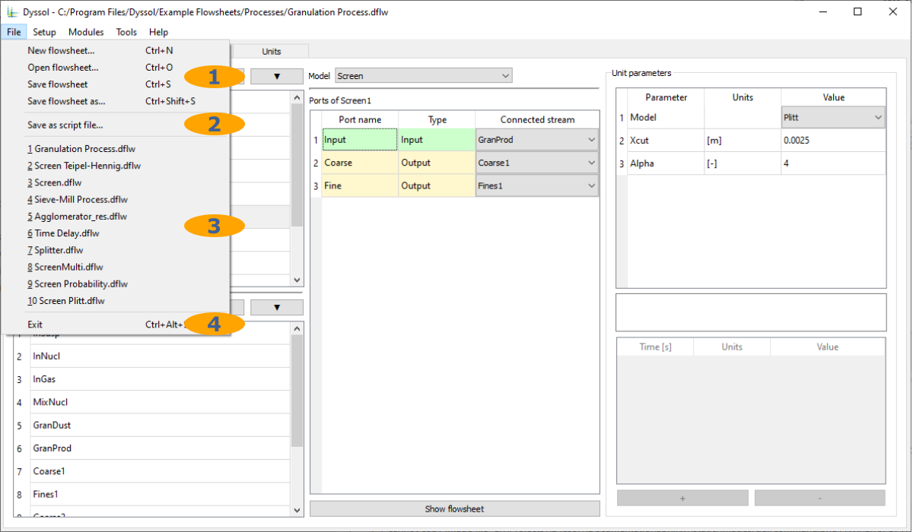
	
1. Standard file operations
2. Save flowsheet as a script file for :ref:`command line interface <sec.cli>` 
3. Quick access to previously opened flowsheets
4. Close the program

.. _sec.gui.menu_setup:

Setup
^^^^^

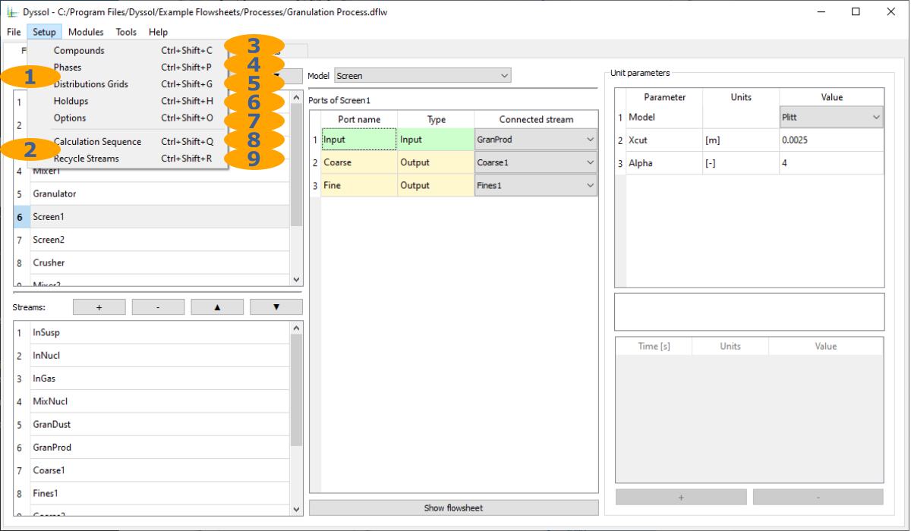

1. Main flowsheet setup
2. Additional flowsheet setup
3. :ref:`Compounds editor<sec.gui.menu_setup.compounds>`
4. :ref:`Phases editor<sec.gui.menu_setup.phases>`
5. :ref:`Grids editor<sec.gui.menu_setup.grids>`
6. :ref:`Holdups editor<sec.gui.menu_setup.holdups>`
7. :ref:`Options<sec.gui.menu_setup.options>`
8. :ref:`Calculation sequence editor<sec.gui.menu_setup.sequence>`
9. :ref:`Recycle streams editor<sec.gui.menu_setup.recycles>`

.. _sec.gui.menu_setup.compounds:

Compounds editor
~~~~~~~~~~~~~~~~

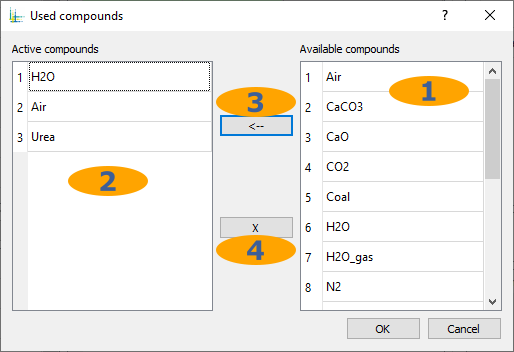

1. List of available compounds from :ref:`materials database<sec.gui.menu_tools.mdb>`
2. List of active compounds in the flowsheet
3. Add selected compound to the flowsheet
4. Remove selected compound from the flowsheet
	
.. _sec.gui.menu_setup.phases:

Phases editor
~~~~~~~~~~~~~

.. image:: ../images/001_ui/setup_phases.png
	:width: 206px
	:alt: phases.png
	:align: center

1. List of active phases
2. Phases names
3. Phases aggregation states
4. Add new phase to the flowsheet
5. Remove selected phase from the flowsheet

.. _sec.gui.menu_setup.grids:

Grids specification
~~~~~~~~~~~~~~~~~~~

.. image:: ../images/001_ui/setup_grids.png
	:width: 960px
	:alt: setup_grids.png
	:align: center

1. Distribution grids for the whole flowsheet
2. Distribution grids for every specific unit
3. Active distributed grids in the selected unit or whole flowsheet
4. Add distributed grid
5. Remove selected distributed grid
6. Default distribution by compounds
7. Distribution type
8. Number of classes
9. Entries type: numeric, symbolic
10. Grid function: equidistant, geometric, logarithmic, manual
11. Grid boundaries
12. Units for boundaries
13. Cells boundaries

.. _sec.gui.menu_setup.holdups:

Holdups editor
~~~~~~~~~~~~~~

Here, material in inlet streams and holdups can be configured.

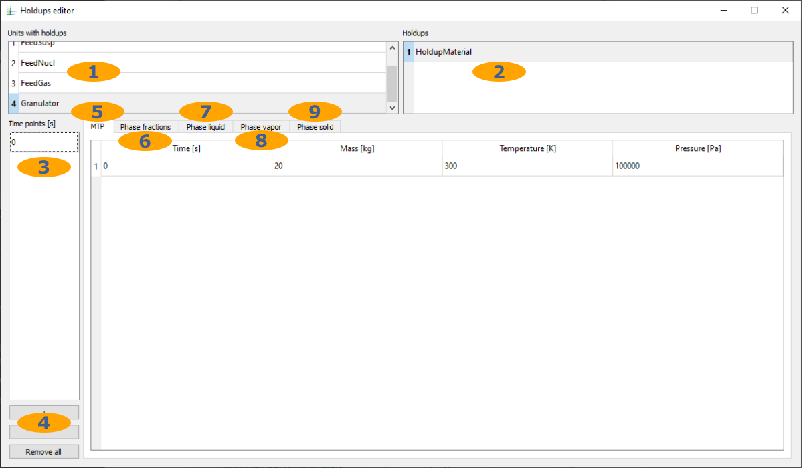
	
1. List of units with holdups/inlet streams
2. List of holdups/inlet streams in the selected unit
3. List of time points in the selected holdup/inlet stream
4. Add or remove time points
5. :ref:`Overall<sec.gui.menu_setup.holdups.overall>` holdup/stream properties
6. :ref:`Phase fractions<sec.gui.menu_setup.holdups.phases>` in the holdup/stream
7. Compound fractions of the :ref:`liquid phase<sec.gui.menu_setup.holdups.phase_l>`
8. Compound fractions of the :ref:`gas phase<sec.gui.menu_setup.holdups.phase_g>`
9. Compound fractions and distributed properties of the :ref:`solid phase<sec.gui.menu_setup.holdups.phase_s>`

.. _sec.gui.menu_setup.holdups.overall:

Overall stream properties:

.. image:: ../images/001_ui/setup_holdups_overall.png
	:width: 960px
	:alt: setup_holdups_overall.png
	:align: center
	
1. Time point
2. Mass or mass flow at the corresponding time point
3. Temperature at the corresponding time point
4. Pressure at the corresponding time point

.. _sec.gui.menu_setup.holdups.phases:

Phase fractions:
	
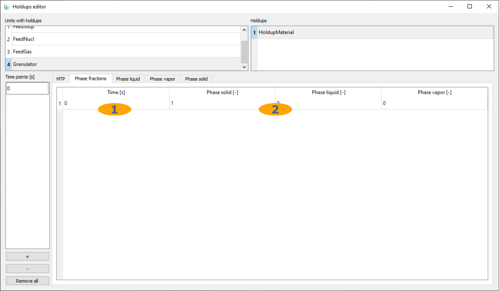

1. Time point
2. Mass fraction (0..1) of each defined phase at the corresponding time point

.. _sec.gui.menu_setup.holdups.phase_l:

Compound fractions of the liquid phase:

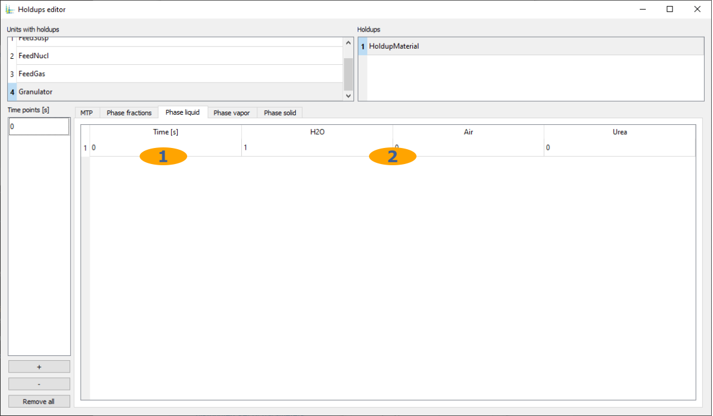

1. Time point
2. Mass fraction (0..1) of each defined compound at the corresponding time point

.. _sec.gui.menu_setup.holdups.phase_g:

Compound fractions of the gas phase:

.. image:: ../images/001_ui/setup_holdups_phase_gas.png
	:width: 960px
	:alt: setup_holdups_phase_gas.png
	:align: center

1. Time point
2. Mass fraction (0..1) of each defined compound at the corresponding time point

.. _sec.gui.menu_setup.holdups.phase_s:

Compound fractions and distributed properties of the solid phase:
	
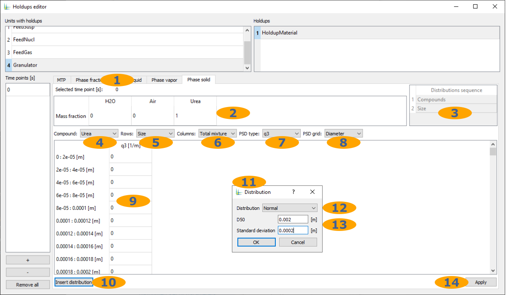

1. Selected time point from the list of time points
2. Mass fraction (0..1) of each defined compound at the corresponding time point
3. List of defined distributed properties
4. Compound or total mixture to set distributed properties
5. Distributed property to edit
6. Distributed property to edit
7. Additional setting for PSD: PSD type
8. Additional setting for PSD: PSD grid
9. Values of the distributed property
10. Insert functional distribution
11. Functional distribution editor
12. Function type
13. Parameters of the functional distribution
14. Apply all changes made 

.. _sec.gui.menu_setup.options:

Options
~~~~~~~ 

General options:

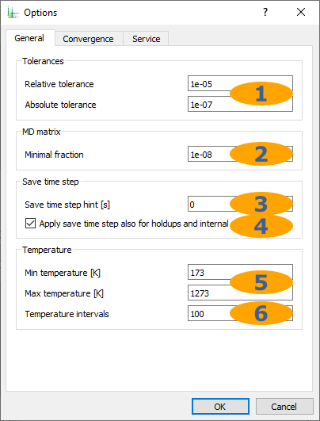

1. Absolute and relative tolerances for :ref:`convergence calculation<sec.theory.convergence>`
2. Minimal significant fraction of multidimensional distributed properties
3. Remove excessive time points from streams during the simulation
4. Also remove time points from holdups and internal streams
5. Temperature limits of the lookup table for calculating stream mixtures
6. Number of temperature intervals of the lookup table for calculating stream mixtures 

Options for :ref:`label-waveRelax`, :ref:`label-extrapolation` and :ref:`sec.theory.convergence`: 

.. image:: ../images/001_ui/setup_options_convergence.png
	:width: 324px
	:alt: setup_options_convergence.png
	:align: center

1. Initial size of the time window
2. Minimum allowed size of the time window
3. Maximum allowed size of the time window
4. Allowed number of iterations before stop
5. Window resizing factor
6. Upper critical limit of iterations before resizing the window
7. Lower critical limit of iterations before resizing the window
8. Upper critical limit of iterations before resizing the window, for the first time window
9. Settings for :ref:`sec.theory.convergence`
10. Settings for :ref:`label-extrapolation`

Additional options:
	
.. image:: ../images/001_ui/setup_options_service.png
	:width: 324px
	:alt: setup_options_service.png
	:align: center

1. Cache streams data on disk during simulation
2. Cache holdups data on disk during simulation
3. Cache internal streams data on disk during simulation
4. Number of time points to stay in RAM if caching is enabled
5. Split result ``*.dflw`` into 2GB files. 

.. _sec.gui.menu_setup.sequence:

Calculation sequence
~~~~~~~~~~~~~~~~~~~~

Here, one can adjust automatically calculated simulation sequence. See also :ref:`label-partition`.

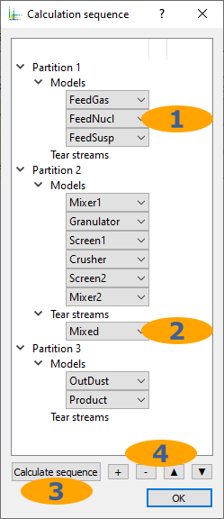

1. Calculation sequence in the partition
2. Tear streams in the partition
3. Automatically recalculate simulation sequence
4. Add/remove/rearrange partitions, models or tear streams

.. _sec.gui.menu_setup.recycles:

Recycle streams
~~~~~~~~~~~~~~~	

Here, one can adjust automatically calculated initial values of tear streams

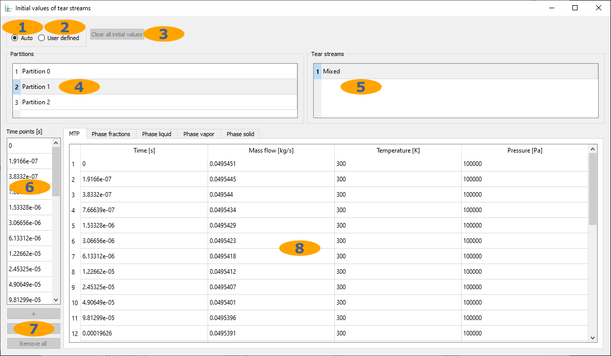

1. Calculate initial values automatically
2. Set initial values manually
3. Remove all current initial values
4. List of partitions
5. List of tear streams
6. List of time points in the selected tear stream
7. Add/remove time points
8. Initial values

.. _sec.gui.menu_modules:

Modules
^^^^^^^

.. image:: ../images/001_ui/menu_modules.png
	:width: 960px
	:alt: menu_modules.png
	:align: center

1. Dustiness formation tester

.. _sec.gui.menu_tools:

Tools
^^^^^

.. image:: ../images/001_ui/menu_tools.png
	:width: 960px
	:alt: menu_tools.png
	:align: center

1. Program-wide tools
2. :ref:`Models manager<sec.gui.menu_tools.models_manager>`
3. :ref:`Materials database<sec.gui.menu_tools.mdb>`
4. Program-wide :ref:`settings<sec.gui.menu_tools.settings>`

.. _sec.gui.menu_tools.models_manager:

Models manager
~~~~~~~~~~~~~~

Configuration of the models library 

.. image:: ../images/001_ui/tools_models.png
	:width: 960px
	:alt: tools_models.png
	:align: center

1. List of directories to look for models
2. Whether to look for models in this directory
3. Add/remove directory
4. Rearrange directories
5. List of available models

.. _sec.gui.menu_tools.mdb:

Materials database
~~~~~~~~~~~~~~~~~~

Configuration of compounds in the global :ref:`sec.mdb`.

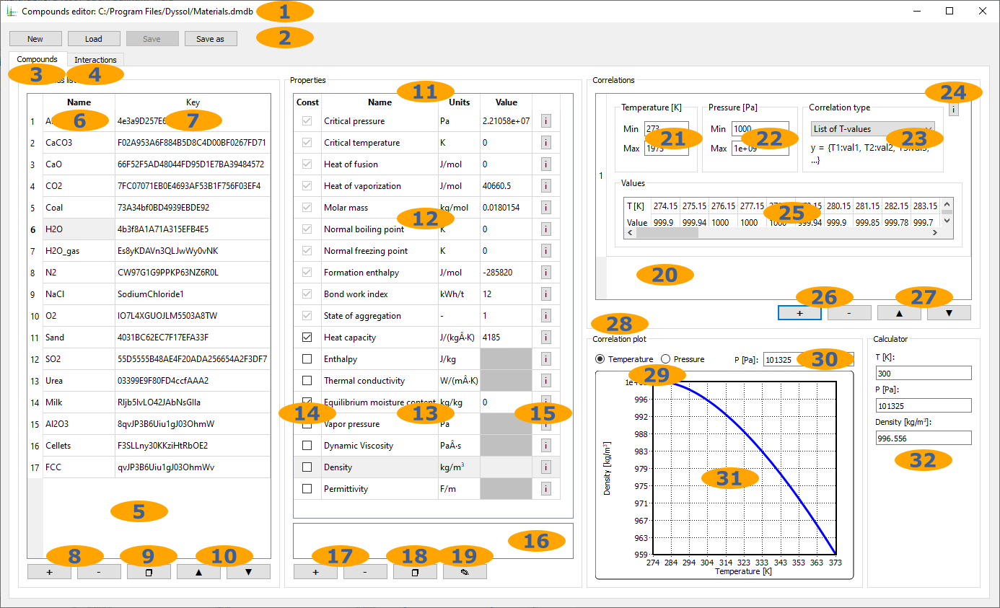

1. Current file with materials database
2. Standard operations with materials database file
3. Configuration of compounds properties
4. Configuration of interactions between compounds
5. List of compounds
6. Compound names
7. Unique keys of compounds
8. Add/remove compounds
9. Create a copy of a selected compound
10. Rearrange compounds
11. List of compound properties
12. :ref:`Constant<sec.mdb.const>` compound properties
13. :ref:`Temperature-/pressure-dependent<sec.mdb.tpd>` compound properties
14. Whether to treat a temperature-/pressure-dependent property as a constant
15. User-defined information about the property
16. Property description
17. Add/remove a user-defined compound property
18. Create a copy of a selected property 
19. Edit selected user-defined property
20. List of :ref:`correlations<sec.mdb.correlations>` defining values of a temperature-/pressure-dependent property
21. Temperature range of the correlation
22. Pressure range of the correlation
23. :ref:`Correlation function<sec.mdb.correlation_fun>`
24. User-defined information about the correlation
25. Correlation parameters
26. Add/remove correlation
27. Rearrange correlations
28. Visualization of correlations
29. First correlation parameter
30. Second correlation parameter
31. Correlation plot in 2D
32. Property calculator

.. _sec.gui.menu_tools.settings:

Settings
~~~~~~~~

Application-wide settings.

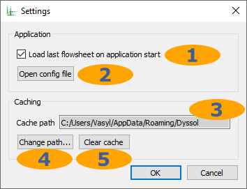

1. Whether to load last opened flowsheet at application start
2. Open application-wide configuration file
3. Path to store cache files
4. Change cache path
5. Delete all cache files

.. _sec.gui.menu_help:

Help
^^^^
	
.. image:: ../images/001_ui/menu_about.png
	:width: 960px
	:alt: menu_about.png
	:align: center

1. Links to online documentation
2. :ref:`Information about Dyssol<sec.gui.menu_help.about>` 

.. _sec.gui.menu_help.about:

About
~~~~~

.. image:: ../images/001_ui/help_about.png
	:width: 354px
	:alt: help_about.png
	:align: center

1. Version number
2. Build number
3. Link to updates
4. Dyssol license agreement 
5. List of developers and credits
6. List of used 3rd party libraries

.. _sec.gui.tabs:

Tabs
----

Tabs are used to build a flowsheet, run a simulation, and analyze the results. There are :ref:`Flowsheet<sec.gui.tabs.flowsheet>`, :ref:`Simulator<sec.gui.tabs.simulator>`, :ref:`Streams<sec.gui.tabs.streams>` and :ref:`Units<sec.gui.tabs.units>` tabs.
	
.. image:: ../images/001_ui/tabs.png
	:width: 960px
	:alt: tabs.png
	:align: center

1. Flowsheet tab: create flowsheet structure, specify unit parameters
2. Simulator tab: set simulation time, run and stop the simulation, calculation log and report
3. Streams tab: streams analysis after the simulation
4. Units tab: units analysis after the simulation

.. _sec.gui.tabs.flowsheet:

Flowsheet
^^^^^^^^^

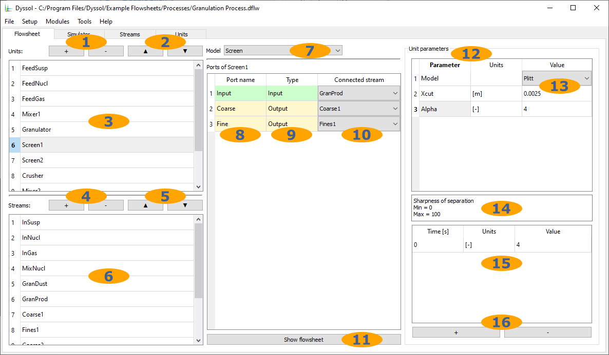

1. Add/remove units
2. Rearrange units
3. List of units
4. Add/remove streams
5. Rearrange streams
6. List of streams
7. Model selection for each unit
8. Names of units ports
9. Types of units ports
10. Streams connected to ports
11. Scheme of the assembled flowsheet
12. List of user-defined parameters of the selected unit
13. Values of constant unit parameters
14. Description of the selected parameter
15. Values of time-dependent unit parameters
16. Add/remove time point in the time-dependent unit parameter

.. _sec.gui.tabs.simulator:

Simulator
^^^^^^^^^

Here you can start your simulation based on your time input.

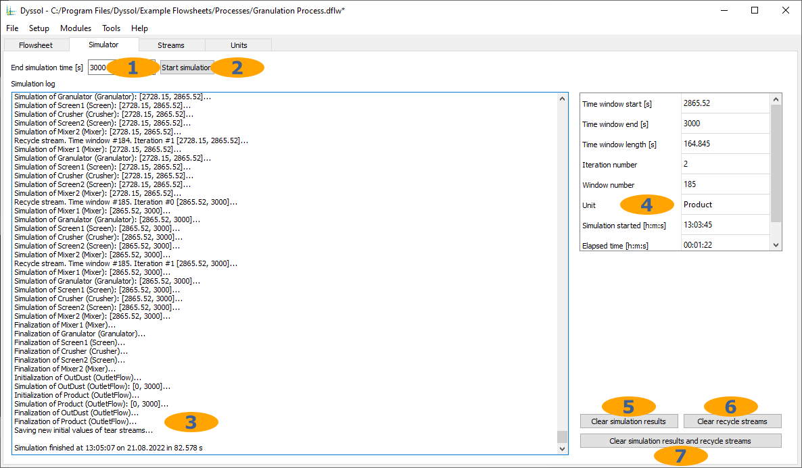

1. Last time point of the simulation interval
2. Run simulation
3. Simulation log and report
4. Simulation progress info
5. Remove simulated data
6. Clear initial values of tear streams
7. Clear simulated data and tear streams

.. _sec.gui.tabs.streams:

Streams
^^^^^^^

Here, parameters of streams can be found after simulation.

Table view:

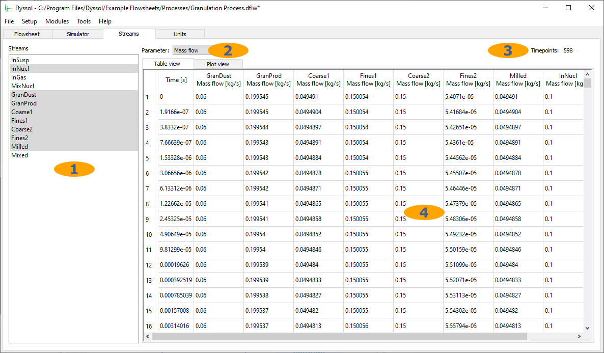

1. List of defined streams
2. List of available stream parameters
3. Number of time points in the selected stream
4. Simulation results

Plot view:

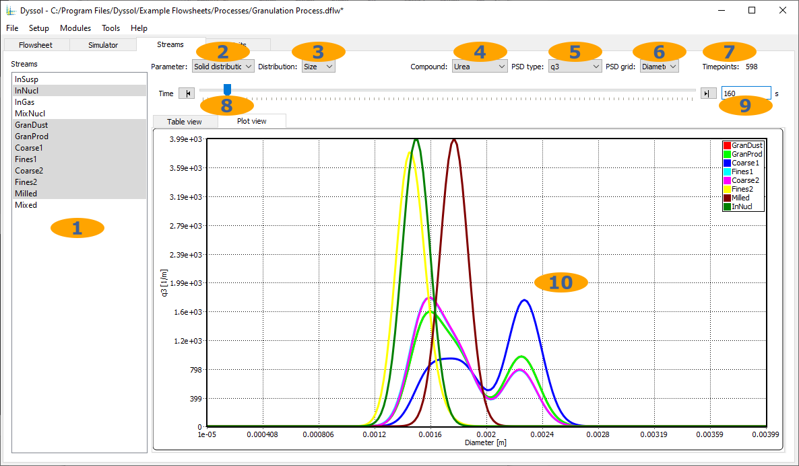

1. List of defined streams
2. List of available stream parameters
3. List of available distributed parameters
4. Specific compound or total mixture
5. PSD type for particle size distribution
6. PSD grid type for particle size distribution
7. Number of time points in the selected stream
8. Navigation through all time points in the selected stream
9. Currently selected time point
10. Simulation results

.. _sec.gui.tabs.units:

Units
^^^^^

Here, parameters of units can be found after simulation.

.. image:: ../images/001_ui/tab_units.png
	:width: 960px
	:alt: tab_units.png
	:align: center

1. List of defined units
2. List of holdups in the selected unit
3. List of state variables in the selected unit
4. List of plots in the selected unit
5. Parameters selection
6. Time slider
7. Table view
8. Plot view
9. Simulation results
