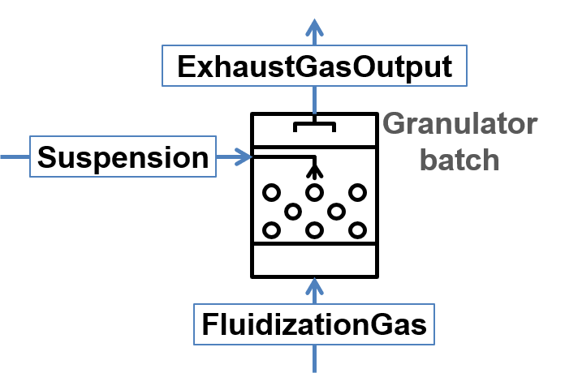

.. _sec.units.granulator:

Granulator
==========

This unit represents a simplified model of a fluidized bed granulation reactor.
The model does not take into account attrition of particles inside the apparatus and does not keep properly any secondary distributed properties except size.

Continuous granulator
^^^^^^^^^^^^^^^^^^^^^

.. image:: ../static/images/003_models/granulator.png
   :width: 500px
   :alt:
   :align: center

.. math::

	\frac{dq_{3,i}}{dt} = -G_e\,\frac{q_{3,i} - q_{3,i-1}\,\left(\frac{d_{p,i}}{d_{p,i-1}}\right)^3}{\Delta d_i} + \frac{\dot{m}_{in}}{M_{tot}}\,q_{3,i}^{in} - \frac{\dot{m}_{out}}{M_{tot}}\,q_{3,i}

.. math::

	G_e = \frac{2\dot{m}_e}{\rho_{s,susp} \cdot A_{tot}}

.. math::

	A_{tot} = \frac{6M_{tot}}{\rho_s} \sum\limits_{i} \frac{q_{3,i}\cdot \Delta d_i}{d_{p,i}}

.. math::

	\dot{m}_e = \dot{m}_{s,susp}\,(1 - K_{os})

.. math::

	\dot{m}_{out} = \dot{m}_{in} + \dot{m}_{e}

.. math:: 

	\dot{m}_{in,liq} = (1 - K_{os}) \cdot \dot{m}_{sus,liq} + \dot{m}_{nuc,liq} + \dot{m}_{gas,liq}

.. math::

	\dot{m}_{gran,liq} = 
	\begin{cases}
	u_{moist} \cdot \dot{m}_{out} & u_{moist} \cdot \dot{m}_{out} \leq \dot{m}_{in,liq} \\
	\dot{m}_{in,liq} & u_{moist} \cdot \dot{m}_{out} > \dot{m}_{in,liq} \\
	\end{cases}

.. math::

	\dot{m}_{dust} = \dot{m}_{s,susp}\cdot K_{os} + (\dot{m}_{susp} - \dot{m}_{s,susp} + \dot{m}_{fl,g} - \dot{m}_{gran,liq})

Batch granulator
^^^^^^^^^^^^^^^^^^^^^

.. math::

	\frac{d(M_{tot}q_{3,i})}{dt} = -G_e\,\frac{M_{tot}q_{3,i} - M_{tot}q_{3,i-1}\,\left(\frac{d_{p,i}}{d_{p,i-1}}\right)^3}{\Delta d_i}

.. math::

	G_e = \frac{2\dot{m}_{s,susp}}{\rho_{s,susp} \cdot A_{tot}}

.. math::

	A_{tot} = \frac{6M_{tot}}{\rho_s} \sum\limits_{i} \frac{q_{3,i}\cdot \Delta d_i}{d_{p,i}}

.. math::

	\frac{dM_{tot}}{dt} = \dot{m}_{s,susp}

.. math::

	\dot{m}_{exh} = \dot{m}_{l,susp} + \dot{m}_{fl,gas}

.. note:: Notations:

	:math:`q_3` – mass density distribution of particles inside apparatus

	:math:`q_3^{in}` – mass density distribution of external particles from **ExternalNuclei** stream

	:math:`\Delta d` – class size

	:math:`d_p` – particle diameter in a class

	:math:`\dot{m}_{in}` – mass flow of input nuclei

	:math:`\dot{m}_{out}` – output mass flow of the product

	:math:`\dot{m}_{dust}` – output mass flow from the **DustOutput**

	:math:`\dot{m}_{susp}` – total mass flow of the suspension

	:math:`\dot{m}_{s,susp}` – mass flow of the solid phase in the **Suspension** inlet

	:math:`\dot{m}_{fl,g}` – mass flow of the gas phase in the **FluidizationGas** inlet

	:math:`\dot{m}_{exh}` – output mass flow from the **ExhaustGasOutput**

	:math:`\dot{m}_{e}` – effective mass stream of the injected suspension

	:math:`\dot{m}_{gran,liq}` – liquid mass flow leaving the granulator with granules

	:math:`\dot{m}_{in,liq}` – total effective mass flow of liquid

	:math:`\dot{m}_{sus,liq}` – mass flow of the liquid phase in the **Suspension** inlet

	:math:`\dot{m}_{nuc,liq}` – mass flow of the liquid phase in the **ExternalNuclei** inlet

	:math:`\dot{m}_{gas,liq}` – mass flow of the liquid phase in the **FluidizationGas** inlet

	:math:`M_{tot}` – holdup mass

	:math:`u_{moist}` – moisture content of granules (dry basis)

	:math:`\rho_{s,susp}` – density of solids in the holdup

	:math:`G_{e}` – effective growth rate

	:math:`A_{tot}` – total surface of particles in the granulator

	:math:`K_{os}` – overspray part in the suspension

.. note:: particle size distribution is required for the simulation. This unit is applied for solid, liquid and gas phases.

.. note:: Input parameters needed for the simulation:

	+---------------------------+-------------------+------------------------------------------+-------+------------------------+
	| Name                      | Symbol            | Description                              | Units | Boundaries             |
	+===========================+===================+==========================================+=======+========================+
	| Kos                       | :math:`K_{os}`    | Overspray part in the suspension         | [--]  | 0 ≤ :math:`K_{os}` ≤ 1 |
	+---------------------------+-------------------+------------------------------------------+-------+------------------------+
	| Granules moisture content | :math:`u_{moist}` | Moisture content of granules (dry basis) | [--]  | 0 ≤ :math:`u_{moist}`  |
	+---------------------------+-------------------+------------------------------------------+-------+------------------------+
	| Relative tolerance        | --                | Relative tolerance for equation solver   | [--]  | 0 < RTol ≤ 1           |
	+---------------------------+-------------------+------------------------------------------+-------+------------------------+
	| Absolute tolerance        | --                | Absolute tolerance for equation solver   | [--]  | 0 < ATol ≤ 1           |
	+---------------------------+-------------------+------------------------------------------+-------+------------------------+

.. note:: State variables:

	+-------+-----------------------+-----------------------------------------------+-----------------+
	| Name  | Symbol                | Description                                   | Units           |
	+=======+=======================+===============================================+=================+
	| Atot  | :math:`A_{tot}`       | Total surface of particles in the granulator  | [:math:`m^2`]   |
	+-------+-----------------------+-----------------------------------------------+-----------------+
	| Mtot  | :math:`M_{tot}`       | Total mass of all particles in the granulator | [kg]            |
	+-------+-----------------------+-----------------------------------------------+-----------------+
	| Mout  | :math:`\dot{m}_{out}` | Output mass flow of the product               | [kg/s]          |
	+-------+-----------------------+-----------------------------------------------+-----------------+
	| Mdust | :math:`\dot{m}_{dust}`| Output mass flow of dust                      | [kg/s]          |
	+-------+-----------------------+-----------------------------------------------+-----------------+
	| G     | :math:`G_{e}`         | Effective growth rate                         | [m/s]           |
	+-------+-----------------------+-----------------------------------------------+-----------------+
	| PSDi  | :math:`q_{3,i}`       | Mass density distribution of particles        | [1/m]           |
	+-------+-----------------------+-----------------------------------------------+-----------------+

.. seealso::

	a demostration file at ``Example Flowsheets/Units/Granulator.dlfw``.

.. seealso::
	S.Heinrich, M. Peglow, M. Ihlow, M. Henneberg, L. Mörl, Analysis of the start-up process in continuous fluidized bed spray granulation by population balance modelling, Chem. Eng. Sci. 57 (2002) 4369-4390.

|
