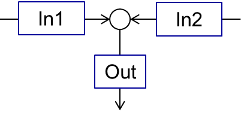

.. _sec.units.mixer:

Mixer
=====

A mixer mixes two input material streams (:math:`In1`, :math:`In2`) into the one output stream (:math:`Out`), as shown in the scheme below.

The output stream will be defined for all time points for which the streams :math:`In1` **and** :math:`In2` are defined. Mixing of more streams can be implemented by connecting of several mixers sequentially.

The parameters of output stream are calculated as:

.. math::

		\dot{m}_{out} &= \dot{m}_{in1} + \dot{m}_{in2}

		\dot{H}_{out} &= \dot{H}_{in1} + \dot{H}_{in2}

		T_{out} &= f(h_{out}) = f \left( \frac{\dot{H}_{out}}{\dot{m}_{out}} \right)

		P_{out} &= min( P_{in1},P_{in2} )

.. note:: Notations:

	:math:`\dot{m}` – mass flow

	:math:`\dot{H}` - enthalpy flow

	:math:`h` - specific enthalpy

	:math:`T` - temperature

	:math:`P` - pressure

All secondary attributes of output stream, such as phase fractions, compounds fractions and multidimensional distributions are calculated depending on mass fractions of input streams.

.. seealso::

	a demostration file at ``Example Flowsheets/Units/Mixer.dlfw``.

.. REMOVED CONTENTS ..
.. Input model parameters:

.. +---------------+-----------------------------------+-----------------------------------+
.. |               | Input 1                           | Input 2                           |
.. +---------------+-----------------+-----------------+-----------------+-----------------+
.. | Timepoint [s] | Massflow [kg/s] | Temperature [K] | Massflow [kg/s] | Temperature [K] |
.. +===============+=================+=================+=================+=================+
.. | 0             | 10              | 300             | 5               | 400             |
.. +---------------+-----------------+-----------------+-----------------+-----------------+
.. | 60            | 7.5             | 300             | 10              | 400             |
.. +---------------+-----------------+-----------------+-----------------+-----------------+

.. Simulation result for mass flows:

.. .. image:: ../images/003_models/mixer-egMass.png
   :width: 700px
   :alt: mixer example
   :align: center

.. Simulation result for temperatures:

.. .. image:: ../images/003_models/mixer-egTemp.png
   :width: 700px
   :alt: mixer example
   :align: center

|
