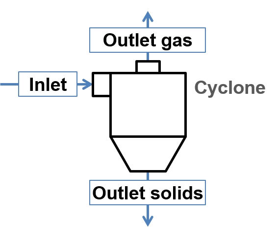

.. _sec.units.cyclone:

Cyclone
=======

Solids-gas separation according to Muschelknautz

|

Constant geometric parameters

.. math:: r_{o} = 0.5d_{o}

.. math:: r_{f} = 0.5d_{f}

.. math:: r_{exit} = 0.5d_{exit}

.. math::

   b_{e} = 
   \begin{cases}
   \text{user-defined} & \text{rect slot, full/half spiral entry} \\
   r_{o} - r_{core}    & \text{axial entry}
   \end{cases}

.. math::

   r_{e} = 
   \begin{cases}
   r_{o} - 0.5b_{e} & \text{rect slot, axial entry} \\
   r_{o} + 0.5b_{e} & \text{full spiral entry} \\
   r_{o} & \text{half spiral entry} \\
   \end{cases}

.. math:: {\overline{r}}_{con} = 0.5\left( r_{o} + r_{exit} \right)

.. math::

   r_{exit,eff} = 
   \begin{cases}
   r_{f} & r_{exit} \leq r_{f} \\
   r_{exit} & r_{exit} > r_{f} \\
   \end{cases}

.. math:: \beta = \frac{b_{e}}{r_{o}}

.. math:: h_{con} = h_{tot} - h_{cyl}

.. math:: h_{con,eff} = \left( \frac{r_{o} - r_{exit,eff}}{r_{o} - r_{exit}} \right)h_{con}

.. math:: h_{sep} = h_{cyl} + h_{con,eff} - h_{f}

.. math::

   a = 
   \begin{cases}
   \text{-} & \text{rect slot, full/half spiral entry} \\
   \sin(\delta)\frac{\pi\left( r_{o} + r_{core} \right)}{N_{b}} - d_{b} & \text{axial entry} \\
   \end{cases}

.. math:: A_{cyl} = 2\pi r_{o}h_{cyl}

.. math:: A_{con} = \pi\left( r_{o} + r_{exit,eff} \right)\sqrt{h_{con,eff}^{2} + \left( r_{o} - r_{exit,eff} \right)^{2}}

.. math:: A_{top} = \pi r_{o}^{2} - \pi r_{f}^{2}

.. math:: A_{f} = 2\pi r_{f}h_{f}

.. math::

   A_{tot} = 
   \begin{cases}
   A_{cyl} + A_{con} + A_{f} + A_{top} & \text{rect slot, axial entry} \\
   A_{cyl} + A_{con} + A_{f} + A_{top} - \varepsilon r_{o}h_{e} & \text{full/half spiral entry} \\
   \end{cases}

.. math:: A_{con/2} = \pi\left( r_{o} + {\overline{r}}_{con} \right)\sqrt{\left( \frac{h_{con}}{2} \right)^{2} + \left( r_{o} - {\overline{r}}_{con} \right)^{2}}

.. math:: A_{sed} = A_{cyl} + A_{con/2}

.. math:: A_{e1} = \frac{2\pi r_{o}h_{e}}{2}

.. math::

   A_{sp} = 
   \begin{cases}
   \text{-} & \text{rect slot, axial entry} \\
   \varepsilon\left( \frac{b + 2r_{o}}{2}\left( b_{e} + h_{e} \right) \right) & \text{full spiral entry} \\
   \varepsilon r_{o}\left( b_{e} + h_{e} \right) & \text{half spiral entry} \\
   \end{cases}

Operational parameters

.. math:: {\dot{V}}_{in,g} = \frac{{\dot{m}}_{in,g}}{\rho_{g}}

.. math:: \mu_{in} = \frac{{\dot{m}}_{in,s}}{{\dot{m}}_{in,g}}

.. math::

   \lambda_{s} = 
   \begin{cases}
   \lambda_{0}\left( 1 + 2\sqrt{\mu_{in}} \right) & \mu_{in} \leq 1 \\
   \lambda_{0}\left( 1 + 3\sqrt{\mu_{in}} \right) & \mu_{in} > 1 \\
   \end{cases}

.. math::

   \alpha = 
   \begin{cases}
   \frac{1}{\beta}\left( 1 - \sqrt{1 + 4\left\lbrack \left( \frac{\beta}{2} \right)^{2} - \left( \frac{\beta}{2} \right) \right\rbrack\sqrt{1 - \frac{1 - \beta^{2}}{1 + \mu_{in}}\left( 2\beta - \beta^{2} \right)}} \right) & \text{rect slot, full/half spiral entry} \\
   \begin{cases}
   0.85 & \text{simple straight blades} \\
   0.95 & \text{curved blades} \\
   1.05 & \text{curved and twisted blades} \\
   \end{cases} & \text{axial entry} \\
   \end{cases}

Geometric parameters

.. math:: {\overline{r}}_{e} = r_{o} - \frac{\alpha b_{e}}{2}

.. math:: {\overline{r}}_{z} = \sqrt{{\overline{r}}_{e}{\overline{r}}_{con}}

Velocities

.. math::

   v_{e} = 
   \begin{cases}
   {\dot{V}}_{in,g}/\left( b_{e}h_{e} \right) & \text{rect slot, full/half spiral entry} \\
   {\dot{V}}_{in,g}/\left( ab_{e}N_{b} \right) & \text{axial entry} \\
   \end{cases}

.. math:: w_{50} = \frac{0.5\left( 0.9{\dot{V}}_{in,g} \right)}{A_{sed}}

.. math::

   u_{o} = 
   \begin{cases}
   \frac{v_{e}\frac{r_{e}}{r_{o}}}{\alpha} & \text{rect slot entry} \\
   \frac{v_{e}\frac{r_{e}}{r_{o}}}{1 + \frac{\lambda_{s}}{2}\frac{A_{sp}}{{\dot{V}}_{in,g}}v_{e}\sqrt{\frac{r_{e}}{r_{o}}}\ } & \text{full/half spiral entry} \\
   \frac{v_{e}\cos(\delta)\frac{r_{e}}{r_{o}}}{\alpha} & \text{axial entry} \\
   \end{cases}

.. math:: u_{f} = \frac{u_{o}\frac{r_{o}}{r_{f}}}{1 + \frac{\lambda_{s}}{2}\frac{A_{tot}}{{\dot{V}}_{in,g}}u_{o}\sqrt{\frac{r_{o}}{r_{f}}}}

.. math:: u_{e} = \frac{u_{o}\frac{r_{o}}{{\overline{r}}_{e}}\ }{1 + \frac{\lambda_{s}}{2}\frac{A_{e1}}{0.9{\dot{V}}_{in,g}}u_{o}\sqrt{\frac{r_{o}}{{\overline{r}}_{e}}}}

.. math:: u_{con} = \frac{u_{o}\frac{r_{o}}{{\overline{r}}_{con}}\ }{1 + \frac{\lambda_{s}}{2}\frac{A_{sed}}{0.9{\dot{V}}_{in,g}}u_{o}\sqrt{\frac{r_{o}}{{\overline{r}}_{con}}}}

Mass separation between main and secondary streams

.. math:: n = \frac{\ln\frac{u_{f}}{u_{o}}}{\ln\frac{r_{o}}{r_{f}\ }}

.. math:: {\dot{V}}_{\sec} = {\dot{V}}_{in,g}\left( 0.0497 + 0.0684n + 0.0949n^{2} \right)

.. math:: w_{split} = 1 - \frac{{\dot{V}}_{\sec}}{{\dot{V}}_{in,g}}

Separation at wall due to exceeding the loading limit in main stream

.. math:: {\overline{z}}_{e} = \frac{u_{e}u_{con}}{{\overline{r}}_{z}}

.. math:: d_{main,l}^{*} = \sqrt{w_{50}\frac{18\eta_{visc}}{\left( \rho_{s} - \rho_{g} \right){\overline{z}}_{e}}}

.. math::

   k = 
   \begin{cases}
   0.81 & \mu_{in} < 2.2 \cdot 10^{- 5} \\
   0.15 + 0.66\exp\left( - \left( \frac{\mu_{in} - 2.2 \cdot 10^{- 5}}{0.015 - 2.2 \cdot 10^{- 5}} \right)^{0.6} \right) & 2.2 \cdot 10^{- 5} \leq \mu_{in} < 0.015 \\
   0.15 + 0.66\exp\left( - \left( \frac{0.1 - 0.015}{0.1 - \mu_{in}} \right)^{0.1}\left( \frac{\mu_{in}}{0.015} \right)^{0.6} \right) & 0.015 \leq \mu_{in} \leq 0.1 \\
   0.15 & \mu_{in} > 0.1 \\
   \end{cases}

.. math:: \mu_{main} = K_{main}\left( \frac{d_{main,l}^{*}}{d_{50}} \right)\left( 10\mu_{in} \right)^{k}

.. math:: \eta_{main,l} = 1 - \frac{\mu_{main}}{\mu_{in}}

Separation in the internal vortex of main stream

.. math:: d_{main,v}^{*} = \sqrt{\frac{18\eta_{visc}0.9{\dot{V}}_{in,g}}{\left( \rho_{s} - \rho_{g} \right)u_{f}^{2}2\pi h_{sep}}}

.. math::

   \eta_{main,v}(d) = 
   \begin{cases}
   0 & \frac{d}{d_{main,v}^{*}} < D^{- 1} \\
   0.5\left\{ 1 + \cos\left\lbrack 0.5\pi\left( 1 - \frac{\log\left( \frac{d}{d_{main,v}^{*}} \right)}{\log D} \right) \right\rbrack\  \right\} & D^{- 1} \leq \frac{d}{d_{main,v}^{*}} \leq D \\
   1 & \frac{d}{d_{main,v}^{*}} > D \\
   \end{cases}

Separation at wall due to exceeding the loading limit in secondary stream

.. math::

   \mu_{\sec} = 
   \begin{cases}
   6\mu_{main} & \mu_{in} \geq 6\mu_{main} \\
   \mu_{in} & \mu_{in} < 6\mu_{main} \\
   \end{cases}

.. math:: \eta_{sec,l} = 1 - \frac{\mu_{\sec}}{\mu_{in}}

Separation at vortex finder of secondary stream

.. math:: d_{sec,v}^{*} = \sqrt{\frac{18\eta_{visc}{\dot{V}}_{\sec}}{\left( \rho_{s} - \rho_{g} \right)\left( \frac{2}{3}u_{f} \right)^{2}2\pi h_{f}}}

.. math::

   \eta_{sec,v}(d) = 
   \begin{cases}
   0 & \frac{d}{d_{sec,v}^{*}} < D^{- 1} \\
   0.5\left\{ 1 + \cos\left\lbrack 0.5\pi\left( 1 - \frac{\log\left( \frac{d}{d_{sec,v}^{*}} \right)}{\log D} \right) \right\rbrack\  \right\} & D^{- 1} \leq \frac{d}{d_{sec,v}^{*}} \leq D \\
   1 & \frac{d}{d_{sec,v}^{*}} > D \\
   \end{cases}, \text{with } D = 3

Overall separation

.. math::

   \eta_{main}(d) = 
   \begin{cases}
   \eta_{main,l} + \left( 1 - \eta_{main,l} \right)\eta_{main,v}(d) & \mu_{in} > \mu_{main} \\
   \eta_{main,v}(d) & \mu_{in} \leq \mu_{main} \\
   \end{cases}

.. math::

   \eta_{\sec}(d) = 
   \begin{cases}
   \eta_{sec,l} + \left( 1 - \eta_{sec,l} \right)\eta_{sec,v}(d) & \mu_{in} > \mu_{\sec} \\
   \eta_{sec,v}(d) & \mu_{in} \leq \mu_{\sec} \\
   \end{cases}

.. math:: \eta_{tot}(d) = \eta_{adj}\left( w_{split}\eta_{main}(d) + \left( 1 - w_{split} \right)\eta_{\sec}(d) \right)

.. math:: {\dot{m}}_{s,out,s} = {\dot{m}}_{in,s}\sum_{d}^{}{R_{in}(d)\eta_{tot}(d)}

.. math:: {\dot{m}}_{s,out,g} = 0

.. math:: {\dot{m}}_{g,out,s} = {\dot{m}}_{in,s}\left( 1 - \sum_{d}^{}{R_{in}(d)\eta_{tot}(d)} \right)

.. math:: {\dot{m}}_{g,out,g} = {\dot{m}}_{in,g}

.. note:: Notations:

	+------------------------------+------------------+------+-----------------------------------------------------------------------------------------------------------------------------+
	|            Symbol            |      Units       | Type |                                                         Description                                                         |
	+==============================+==================+======+=============================================================================================================================+
	| :math:`\beta`                | [-]              |      | Relative width of cyclone gas entry                                                                                         |
	+------------------------------+------------------+------+-----------------------------------------------------------------------------------------------------------------------------+
	| :math:`\delta`               | [°]              | UP   | Angle of attack of blades in axial gas entry                                                                                |
	+------------------------------+------------------+------+-----------------------------------------------------------------------------------------------------------------------------+
	| :math:`\varepsilon`          | [°]              | UP   | Spiral angle in spiral gas entry                                                                                            |
	+------------------------------+------------------+------+-----------------------------------------------------------------------------------------------------------------------------+
	| :math:`\lambda_{0}`          | [-]              | UP   | Wall friction coefficient of pure gas                                                                                       |
	+------------------------------+------------------+------+-----------------------------------------------------------------------------------------------------------------------------+
	| :math:`\lambda_{s}`          | [-]              |      | Wall friction coefficient of solids-containing gas                                                                          |
	+------------------------------+------------------+------+-----------------------------------------------------------------------------------------------------------------------------+
	| :math:`\mu_{in}`             | [kg/kg]          |      | Solids loading at inlet                                                                                                     |
	+------------------------------+------------------+------+-----------------------------------------------------------------------------------------------------------------------------+
	| :math:`\mu_{main}`           | [kg/kg]          |      | Threshold for solids loading in main stream                                                                                 |
	+------------------------------+------------------+------+-----------------------------------------------------------------------------------------------------------------------------+
	| :math:`\mu_{\sec}`           | [kg/kg]          |      | Threshold for solids loading in secondary stream                                                                            |
	+------------------------------+------------------+------+-----------------------------------------------------------------------------------------------------------------------------+
	| :math:`\eta_{adj}`           | [-]              | UP   | Separation efficiency adjustment factor                                                                                     |
	+------------------------------+------------------+------+-----------------------------------------------------------------------------------------------------------------------------+
	| :math:`\eta_{main}`          | [-]              |      | Overall separation efficiency in main stream                                                                                |
	+------------------------------+------------------+------+-----------------------------------------------------------------------------------------------------------------------------+
	| :math:`\eta_{main,l}`        | [-]              |      | Separation efficiency due to exceeding of solids loading limit in main stream (from main stream to solids output)           |
	+------------------------------+------------------+------+-----------------------------------------------------------------------------------------------------------------------------+
	| :math:`\eta_{main,v}`        | [-]              |      | Separation efficiency in internal vortex (from internal vortex to solids output)                                            |
	+------------------------------+------------------+------+-----------------------------------------------------------------------------------------------------------------------------+
	| :math:`\eta_{\sec}`          | [-]              |      | Overall separation efficiency in secondary stream                                                                           |
	+------------------------------+------------------+------+-----------------------------------------------------------------------------------------------------------------------------+
	| :math:`\eta_{sec,l}`         | [-]              |      | Separation efficiency due to exceeding of solids loading limit in secondary stream (from secondary stream to solids output) |
	+------------------------------+------------------+------+-----------------------------------------------------------------------------------------------------------------------------+
	| :math:`\eta_{sec,v}`         | [-]              |      | Separation efficiency at vortex finder (from vortex finder to solids output)                                                |
	+------------------------------+------------------+------+-----------------------------------------------------------------------------------------------------------------------------+
	| :math:`\eta_{tot}`           | [-]              |      | Total separation efficiency of cyclone                                                                                      |
	+------------------------------+------------------+------+-----------------------------------------------------------------------------------------------------------------------------+
	| :math:`\eta_{visc}`          | [Pa s]           | MDB  | Dynamic viscosity of gas at inlet                                                                                           |
	+------------------------------+------------------+------+-----------------------------------------------------------------------------------------------------------------------------+
	| :math:`\rho_{g}`             | [kg/m\ :sup:`3`] | MDB  | Gas density at inlet                                                                                                        |
	+------------------------------+------------------+------+-----------------------------------------------------------------------------------------------------------------------------+
	| :math:`\rho_{s}`             | [kg/m\ :sup:`3`] | MDB  | Solids density at inlet                                                                                                     |
	+------------------------------+------------------+------+-----------------------------------------------------------------------------------------------------------------------------+
	| :math:`a`                    | [m]              |      | Height of blades channel in axial gas entry                                                                                 |
	+------------------------------+------------------+------+-----------------------------------------------------------------------------------------------------------------------------+
	| :math:`A_{con}`              | [m\ :sup:`2`]    |      | Lateral area of the conical part                                                                                            |
	+------------------------------+------------------+------+-----------------------------------------------------------------------------------------------------------------------------+
	| :math:`A_{con/2}`            | [m\ :sup:`2`]    |      | Lateral area of the top half of conical part                                                                                |
	+------------------------------+------------------+------+-----------------------------------------------------------------------------------------------------------------------------+
	| :math:`A_{cyl}`              | [m\ :sup:`2`]    |      | Lateral area of the cylindrical part                                                                                        |
	+------------------------------+------------------+------+-----------------------------------------------------------------------------------------------------------------------------+
	| :math:`A_{e1}`               | [m\ :sup:`2`]    |      | Average wall area considered for the first revolution after entry                                                           |
	+------------------------------+------------------+------+-----------------------------------------------------------------------------------------------------------------------------+
	| :math:`A_{f}`                | [m\ :sup:`2`]    |      | Lateral area of vortex finder                                                                                               |
	+------------------------------+------------------+------+-----------------------------------------------------------------------------------------------------------------------------+
	| :math:`A_{sed}`              | [m\ :sup:`2`]    |      | Sedimentation area                                                                                                          |
	+------------------------------+------------------+------+-----------------------------------------------------------------------------------------------------------------------------+
	| :math:`A_{sp}`               | [m\ :sup:`2`]    |      | Frictional area of the spiral in spiral gas entry                                                                           |
	+------------------------------+------------------+------+-----------------------------------------------------------------------------------------------------------------------------+
	| :math:`A_{top}`              | [m\ :sup:`2`]    |      | Area of upper wall                                                                                                          |
	+------------------------------+------------------+------+-----------------------------------------------------------------------------------------------------------------------------+
	| :math:`A_{tot}`              | [m\ :sup:`2`]    |      | Total wall friction area                                                                                                    |
	+------------------------------+------------------+------+-----------------------------------------------------------------------------------------------------------------------------+
	| :math:`b_{e}`                | [m]              | UP/  | Width of gas entry/blade channel                                                                                            |
	+------------------------------+------------------+------+-----------------------------------------------------------------------------------------------------------------------------+
	| :math:`d`                    | [m]              | SP   | Particle diameter                                                                                                           |
	+------------------------------+------------------+------+-----------------------------------------------------------------------------------------------------------------------------+
	| :math:`d_{50}`               | [m]              | SP   | Particle size median                                                                                                        |
	+------------------------------+------------------+------+-----------------------------------------------------------------------------------------------------------------------------+
	| :math:`d_{b}`                | [m]              | UP   | Thickness of blades in axial gas entry                                                                                      |
	+------------------------------+------------------+------+-----------------------------------------------------------------------------------------------------------------------------+
	| :math:`d_{exit}`             | [m]              | UP   | Diameter of particles exit                                                                                                  |
	+------------------------------+------------------+------+-----------------------------------------------------------------------------------------------------------------------------+
	| :math:`d_{f}`                | [m]              | UP   | Diameter of vortex finder                                                                                                   |
	+------------------------------+------------------+------+-----------------------------------------------------------------------------------------------------------------------------+
	| :math:`d_{o}`                | [m]              | UP   | Outer diameter of cyclone                                                                                                   |
	+------------------------------+------------------+------+-----------------------------------------------------------------------------------------------------------------------------+
	| :math:`d_{main,l}^{*}`       | [m]              |      | Cut size of separation on the first revolution due to exceeding the loading limit                                           |
	+------------------------------+------------------+------+-----------------------------------------------------------------------------------------------------------------------------+
	| :math:`d_{main,v}^{*}`       | [m]              |      | Cut size of separation in internal vortex of main stream                                                                    |
	+------------------------------+------------------+------+-----------------------------------------------------------------------------------------------------------------------------+
	| :math:`d_{sec,v}^{*}`        | [m]              |      | Cut size of separation at vortex finder in secondary stream                                                                 |
	+------------------------------+------------------+------+-----------------------------------------------------------------------------------------------------------------------------+
	| :math:`D`                    | [-]              | UP   | Coefficient for grid efficiency curve calculation according to Muschelknautz                                                |
	+------------------------------+------------------+------+-----------------------------------------------------------------------------------------------------------------------------+
	| :math:`h_{con}`              | [m]              |      | Height of the cone part of cyclone                                                                                          |
	+------------------------------+------------------+------+-----------------------------------------------------------------------------------------------------------------------------+
	| :math:`h_{con,eff}`          | [m]              |      | Effective height of the cone part of cyclone                                                                                |
	+------------------------------+------------------+------+-----------------------------------------------------------------------------------------------------------------------------+
	| :math:`h_{cyl}`              | [m]              | UP   | Height of the cylindrical part of cyclone                                                                                   |
	+------------------------------+------------------+------+-----------------------------------------------------------------------------------------------------------------------------+
	| :math:`h_{e}`                | [m]              | UP   | Height of gas entry                                                                                                         |
	+------------------------------+------------------+------+-----------------------------------------------------------------------------------------------------------------------------+
	| :math:`h_{f}`                | [m]              | UP   | Height (depth) of vortex finder                                                                                             |
	+------------------------------+------------------+------+-----------------------------------------------------------------------------------------------------------------------------+
	| :math:`h_{sep}`              | [m]              |      | Height of separation zone                                                                                                   |
	+------------------------------+------------------+------+-----------------------------------------------------------------------------------------------------------------------------+
	| :math:`h_{tot}`              | [m]              | UP   | Total height of cyclone                                                                                                     |
	+------------------------------+------------------+------+-----------------------------------------------------------------------------------------------------------------------------+
	| :math:`k`                    | [-]              |      | Exponent for solids loading threshold in main stream                                                                        |
	+------------------------------+------------------+------+-----------------------------------------------------------------------------------------------------------------------------+
	| :math:`K_{main}`             | [-]              | UP   | Constant for solids loading threshold in main stream                                                                        |
	+------------------------------+------------------+------+-----------------------------------------------------------------------------------------------------------------------------+
	| :math:`{\dot{m}}_{in,g}`     | [kg/s]           | SP   | Gas mass flow at inlet                                                                                                      |
	+------------------------------+------------------+------+-----------------------------------------------------------------------------------------------------------------------------+
	| :math:`{\dot{m}}_{in,s}`     | [kg/s]           | SP   | Solids mass flow at inlet                                                                                                   |
	+------------------------------+------------------+------+-----------------------------------------------------------------------------------------------------------------------------+
	| :math:`{\dot{m}}_{out,s,s}`  | [kg/s]           |      | Solids mass flow at solids outlet                                                                                           |
	+------------------------------+------------------+------+-----------------------------------------------------------------------------------------------------------------------------+
	| :math:`{\dot{m}}_{out,s,g}`  | [kg/s]           |      | Gas mass flow at solids outlet                                                                                              |
	+------------------------------+------------------+------+-----------------------------------------------------------------------------------------------------------------------------+
	| :math:`{\dot{m}}_{out,g,s}`  | [kg/s]           |      | Solids mass flow at gas outlet                                                                                              |
	+------------------------------+------------------+------+-----------------------------------------------------------------------------------------------------------------------------+
	| :math:`{\dot{m}}_{out,g,g}`  | [kg/s]           |      | Gas mass flow at gas outlet                                                                                                 |
	+------------------------------+------------------+------+-----------------------------------------------------------------------------------------------------------------------------+
	| :math:`n`                    | [-]              |      | Parameter for calculating secondary stream                                                                                  |
	+------------------------------+------------------+------+-----------------------------------------------------------------------------------------------------------------------------+
	| :math:`N_{b}`                | [#]              | UP   | Number of blades in axial gas entry                                                                                         |
	+------------------------------+------------------+------+-----------------------------------------------------------------------------------------------------------------------------+
	| :math:`{\overline{r}}_{con}` | [m]              |      | Mean radius of the conical part                                                                                             |
	+------------------------------+------------------+------+-----------------------------------------------------------------------------------------------------------------------------+
	| :math:`r_{core}`             | [m]              | UP   | Core radius of blades in axial gas entry                                                                                    |
	+------------------------------+------------------+------+-----------------------------------------------------------------------------------------------------------------------------+
	| :math:`r_{e}`                | [m]              |      | Radius of the middle gas streamline at gas entry                                                                            |
	+------------------------------+------------------+------+-----------------------------------------------------------------------------------------------------------------------------+
	| :math:`{\overline{r}}_{e}`   | [m]              |      | Mean radius of the gas streamline at gas entry                                                                              |
	+------------------------------+------------------+------+-----------------------------------------------------------------------------------------------------------------------------+
	| :math:`r_{exit}`             | [m]              |      | Radius of the particles exit                                                                                                |
	+------------------------------+------------------+------+-----------------------------------------------------------------------------------------------------------------------------+
	| :math:`r_{exit,eff}`         | [m]              |      | Effective radius of the particles exit                                                                                      |
	+------------------------------+------------------+------+-----------------------------------------------------------------------------------------------------------------------------+
	| :math:`r_{f}`                | [m]              |      | Radius of vortex finder                                                                                                     |
	+------------------------------+------------------+------+-----------------------------------------------------------------------------------------------------------------------------+
	| :math:`r_{o}`                | [m]              |      | Outer radius of cyclone                                                                                                     |
	+------------------------------+------------------+------+-----------------------------------------------------------------------------------------------------------------------------+
	| :math:`{\overline{r}}_{z}`   | [m]              |      | Reference mean radius                                                                                                       |
	+------------------------------+------------------+------+-----------------------------------------------------------------------------------------------------------------------------+
	| :math:`R_{in}(d)`            | [-]              |      | Mass fraction of particles with size :math:`d` at inlet                                                                     |
	+------------------------------+------------------+------+-----------------------------------------------------------------------------------------------------------------------------+
	| :math:`u_{con}`              | [m/s]            |      | Tangential velocity at mean cone radius                                                                                     |
	+------------------------------+------------------+------+-----------------------------------------------------------------------------------------------------------------------------+
	| :math:`u_{e}`                | [m/s]            |      | Tangential velocity at gas streamline radius at gas entry                                                                   |
	+------------------------------+------------------+------+-----------------------------------------------------------------------------------------------------------------------------+
	| :math:`u_{f}`                | [m/s]            |      | Tangential velocity at vortex finder                                                                                        |
	+------------------------------+------------------+------+-----------------------------------------------------------------------------------------------------------------------------+
	| :math:`u_{o}`                | [m/s]            |      | Tangential velocity at outer cyclone radius                                                                                 |
	+------------------------------+------------------+------+-----------------------------------------------------------------------------------------------------------------------------+
	| :math:`v_{e}`                | [m/s]            |      | Inlet velocity in the middle gas streamline at gas entry                                                                    |
	+------------------------------+------------------+------+-----------------------------------------------------------------------------------------------------------------------------+
	| :math:`{\dot{V}}_{in,g}`     | [m\ :sup:`3`/s]  |      | Gas volume flow at inlet                                                                                                    |
	+------------------------------+------------------+------+-----------------------------------------------------------------------------------------------------------------------------+
	| :math:`{\dot{V}}_{\sec}`     | [m\ :sup:`3`/s]  |      | Gas volume flow of secondary stream                                                                                         |
	+------------------------------+------------------+------+-----------------------------------------------------------------------------------------------------------------------------+
	| :math:`w_{50}`               | [m/s]            |      | Sinking speed at which 50% of particles are sedimented at wall                                                              |
	+------------------------------+------------------+------+-----------------------------------------------------------------------------------------------------------------------------+
	| :math:`w_{split}`            | [-]              |      | Fraction of material going to main stream                                                                                   |
	+------------------------------+------------------+------+-----------------------------------------------------------------------------------------------------------------------------+
	| :math:`{\overline{z}}_{e}`   | [m\ :sup:`2`/s]  |      | Mean centrifugal acceleration along streamline                                                                              |
	+------------------------------+------------------+------+-----------------------------------------------------------------------------------------------------------------------------+

	- UP: User-defined model parameters
	- MDB: Value from materials database
	- SP: Value from the input stream

.. note:: Model parameters:

	+-------------+---------------------+-------+------------------------------------------------------------------------------+------------------------------------------------+
	| Name        | Symbol              | Units | Description                                                                  | Values                                         |
	+=============+=====================+=======+==============================================================================+================================================+
	| d_o         | :math:`d_{o}`       | [m]   | Outer diameter of cyclone                                                    | ≥0.01                                          |
	+-------------+---------------------+-------+------------------------------------------------------------------------------+------------------------------------------------+
	| h_tot       | :math:`h_{tot}`     | [m]   | Total height of cyclone                                                      | ≥0.01                                          |
	+-------------+---------------------+-------+------------------------------------------------------------------------------+------------------------------------------------+
	| h_cyl       | :math:`h_{cyl}`     | [m]   | Height of the cylindrical part of cyclone                                    | ≥0.01                                          |
	+-------------+---------------------+-------+------------------------------------------------------------------------------+------------------------------------------------+
	| d_f         | :math:`d_{f}`       | [m]   | Diameter of vortex finder                                                    | ≥0.01                                          |
	+-------------+---------------------+-------+------------------------------------------------------------------------------+------------------------------------------------+
	| h_f         | :math:`h_{f}`       | [m]   | Height (depth) of vortex finder                                              | ≥0.01                                          |
	+-------------+---------------------+-------+------------------------------------------------------------------------------+------------------------------------------------+
	| d_exit      | :math:`d_{exit}`    | [m]   | Diameter of particle exit                                                    | ≥0.01                                          |
	+-------------+---------------------+-------+------------------------------------------------------------------------------+------------------------------------------------+
	| Entry shape |                     |       | Gas entry shape                                                              | Rectangular slot/Full spiral/Half spiral/Axial |
	+-------------+---------------------+-------+------------------------------------------------------------------------------+------------------------------------------------+
	| b_e         | :math:`b_{e}`       | [m]   | Width of gas entry                                                           | ≥0.01                                          |
	+-------------+---------------------+-------+------------------------------------------------------------------------------+------------------------------------------------+
	| h_e         | :math:`h_{e}`       | [m]   | Height of gas entry                                                          | ≥0.01                                          |
	+-------------+---------------------+-------+------------------------------------------------------------------------------+------------------------------------------------+
	| epsilon     | :math:`\varepsilon` | [°]   | Spiral angle in spiral gas entry                                             | [0...360]                                      |
	+-------------+---------------------+-------+------------------------------------------------------------------------------+------------------------------------------------+
	| N_b         | :math:`N_{b}`       | [#]   | Number of blades in axial gas entry                                          | ≥1                                             |
	+-------------+---------------------+-------+------------------------------------------------------------------------------+------------------------------------------------+
	| d_b         | :math:`d_{b}`       | [m]   | Thickness of blades in axial gas entry                                       | ≥0                                             |
	+-------------+---------------------+-------+------------------------------------------------------------------------------+------------------------------------------------+
	| r_core      | :math:`r_{core}`    | [m]   | Core radius of blades in axial entry                                         | ≥0                                             |
	+-------------+---------------------+-------+------------------------------------------------------------------------------+------------------------------------------------+
	| Blade shape |                     |       | Blades shapes in axial gas entry                                             | Simple straight/Curved/Curved and twisted      |
	+-------------+---------------------+-------+------------------------------------------------------------------------------+------------------------------------------------+
	| delta       | :math:`\delta`      | [°]   | Angle of attack of blades in axial gas entry                                 | [15...30]                                      |
	+-------------+---------------------+-------+------------------------------------------------------------------------------+------------------------------------------------+
	| lambda_0    | :math:`\lambda_{0}` | [-]   | Wall friction coefficient of pure gas                                        | ≥0                                             |
	+-------------+---------------------+-------+------------------------------------------------------------------------------+------------------------------------------------+
	| D           | :math:`D`           | [-]   | Coefficient for grid efficiency curve calculation according to Muschelknautz | [2...4]                                        |
	+-------------+---------------------+-------+------------------------------------------------------------------------------+------------------------------------------------+
	| K_main      | :math:`K_{main}`    | [-]   | Constant for solids loading threshold in main stream                         | [0.02...0.03]                                  |
	+-------------+---------------------+-------+------------------------------------------------------------------------------+------------------------------------------------+
	| eta_adj     | :math:`\eta_{adj}`  | [-]   | Separation efficiency adjustment factor                                      | [0...1]                                        |
	+-------------+---------------------+-------+------------------------------------------------------------------------------+------------------------------------------------+
	| Plot        |                     |       | Whether to generate plots                                                    | YES/NO                                         |
	+-------------+---------------------+-------+------------------------------------------------------------------------------+------------------------------------------------+

.. seealso::

	- Muschelknautz, U. (2019). L3.4 Zyklone zum Abscheiden fester Partikel aus Gasen. In: Stephan, P., Kabelac, S., Kind, M., Mewes, D., Schaber, K., Wetzel, T. (eds) VDI-Wärmeatlas. Springer Reference Technik. Springer Vieweg, Berlin, Heidelberg. https://doi.org/10.1007/978-3-662-52989-8_91
	- A demostration file at ``Example Flowsheets/Units/Cyclone Muschelknautz.dlfw``.

|