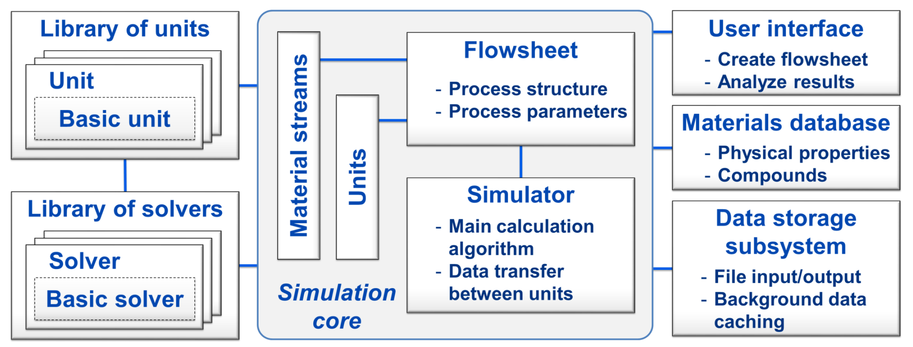

Overview
===========

Here you will get a brief overview of the program's architecture and used methods.

|

Flowsheet simulation of solids
------------------------------
One of the main challenges in simulation of solids processes is associated with the dispersity of granular materials: the solid phase can be distributed along several interdependent parameters, such as size, shape, moisture content or density. 

In Dyssol, an approach with :ref:`label-TM` is used for correct handling of solids in this case. This concept allows preserving information about all parameters, even those which are not considered or not changed in a particular apparatus.

|

Approaches and methods
----------------------

The new system in Dyssol is based on the :ref:`label-seqModule`, where each model is calculated separately. This allows the simultaneous use of multiple specialized solvers for the calculation of a flowsheet and simplifies extension of the unit library with new models. 

To increase the computational efficiency, dynamic calculations of flowsheets with recycle streams are based on the :ref:`label-waveRelax`: the total simulation time is divided into smaller intervals, and models are solved separately on them, using some initial guess for the solution.

|

Software system architecture
----------------------------

To implement the Dyssol system, the C++ programming language and the object oriented paradigm are applied. 

You can get an overview of the Dyssol system structure in the figure below.

To maximize the modularity of the simulation environment, models of units and solvers are not directly integrated into the framework, but may be implemented as separate objects and then added to the units library using standardized interfaces and templates.

For a detailed explanation about important elements in the structure, please refer to :ref:`label-solver`, :ref:`label-simulation`, :ref:`label-materialDat`, :ref:`label-dataStor` and :ref:`label-multiDim`.

|