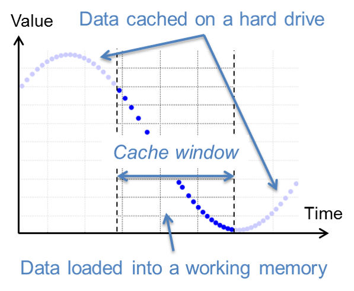

.. _label-dataStor:

======================
Data storage subsystem
======================

The data storage subsystem is responsible for file input, output and background data caching. Dyssol uses HDF5 to store all data. 

|

HDF5 data format
================

HDF5 is a hierarchical data format, library and data model for storing and organizing of large amounts of numerical data. External programs can access saved data via HDF5 interfaces.

.. image:: ./pics/dataStorage/hdf5.png
   :width: 900px
   :alt: screen
   :align: center

|

.. seealso::

	`The HDF5® Library & File <https://www.hdfgroup.org/solutions/hdf5/>`_

|

Data caching
============

Only several time points of material stream are kept in memory at every moment, the rest are temporary on disk. This reduces memory consumption and slightly increases computation time (at default settings).

.. seealso::

	V. Skorych et al. Novel system for dynamic flowsheet simulation of solids processes (2017).
