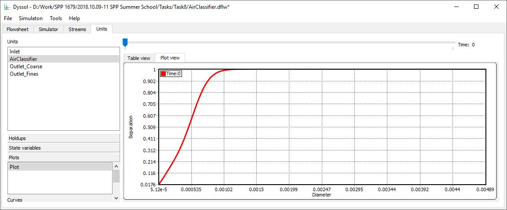
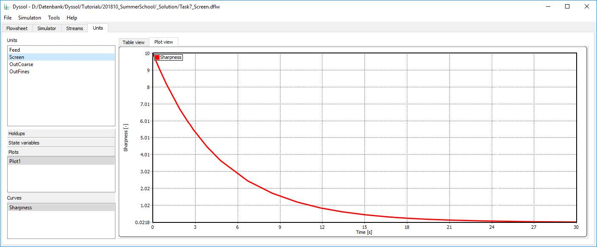

.. _label-develop:

==============
For developers
==============

In Dyssol, you can develop and debug new steady-state or dynamic **units** as well as your own external modules (**solvers**). 

The installation package of Dyssol contains all necessary components for the development of such modules. It is provided with a pre-configured solution for IDE Microsoft Visual Studio 2015 (or its `Community edition <https://go.microsoft.com/fwlink/?LinkId=615448&clcid=0x409>`_).

The development of modules for Dyssol can be done in three following steps:

	1.	Copy template project with necessary header files and libraries from Dyssol installation path to desired folder and configure project. 
	
	2.	Copy template of the necessary unit (dynamic or steady-state) or solver, rename it and add this module to the previously copied template project.
	
	3.	Reimplement all necessary functions. In the case of dynamic units the internal DAE/NL solver can be used to solve DAE/NL systems automatically. For detailed information about implementation of units and solvers, please refer to :ref:`label-unitDev` and :ref:`label-solverDev`.

|

.. _label-VCconfig:

Configuration of Visual Studio project template
===============================================

1.	Open directory where Dyssol has been installed (for example ``C:\Program Files (x86)\Dyssol``) and copy folder ``VCProject`` to the desired location on your hard drive (further as ``<PathToSolution>``).

2.	Open the copied folder ``VCProject`` and run file ``Dyssol.sln`` to open solution in Microsoft Visual Studio, which should be previously installed. 

3.	Select startup project: 

	Select project *ModelsAPI* in *solution explorer*, then choose *Project → Set as StartUp Project*.

4.	Select paths to executable files: 

	- Select project ModelsAPI in solution explorer, then choose *Project → Properties → Configuration Properties → Debugging*
	
	- Set combo box Configuration in the top of the window to position Debug, and provide the property Command with the path to debug version of executable, which is located at 
	
		``<PathToSolution>\VCProject\ExecutableDebug\Dyssol.exe``
	
	- Set combo box *Configuration* in the top of the window to position *Release*, and provide the property *Command* with the path to release version of executable, which is located in the directory where Dyssol has been installed: 
	
		``C:\Program Files (x86)\Dyssol\Dyssol.exe``

5.	Set combo box *Configuration* in the top of the window to position *Debug*. Press F7 (or *Build → Build project* in program menu) to build core project and wait until the solution is built.

6.	Press :kbd:`F5` (or *Debug → Run debug* in program menu) to run program in debug mode. New window of Dyssol should now be opened.

7.	Close Dyssol window.

Visual Studio solution is now ready to create and debug your own modules. 

|

.. _label-unitDev:

Unit development
================

You must do the following in order to develop your new solver (plese refer to :ref:`label-VCconfig`):

	1.	Install Microsoft Visual Studio 2015 (Community). 
	
	2.	Configure template project ``VCProject``.

There are 4 different pre-defined templates of units available:

	1.	``SteadyState``: performs steady-state calculation; current state of such unit does not depend on the previous state, but only on the input parameters.
	
	2.	``SteadyStateWithNLSolver``: steady-state unit with connected internal solver of non-linear equations.
	
	3.	``Dynamic``: performs dynamic calculation; current state of this unit depends not only on the input parameters as well as on the previous state of the unit.
	
	4.	``DynamicWithDAESolver``: dynamic unit with connected internal solver of differential-algebraic equations.

Please also refer to :ref:`label-baseUnit` for detailed informaiton on functions applied in unit development.

|

Add new unit to the template project
------------------------------------

1.	Copy the desired template of the unit from ``<PathToSolution>\VCProject\UnitsTemplates`` to the folder ``Units`` in solution (``<PathToSolution>\VCProject\Units``).

2.	Rename template’s folder according to the name of your new unit (further ``<MyUnitFolder>``). The name can be chosen freely.

3.	Rename project files in template’s folder (``*.vcxproj``, ``*.vcxproj.filters``) according to the name of your new unit.

4.	Run the solution file (``<PathToSolution>\VCProject\Dyssol.sln``) to open it in Visual Studio.

5.	Add project with your new unit to the solution. To do this, select in Visual Studio *File → Add → Existing Project* and specify path to the project file (``<PathToSolution>\VCProject\Units\<MyUnitFolder>\<*.vcxproj>``).

6.	Rename added project in Visual Studio according to the name of your unit. 

Now you can implement functionality of your new unit. To build your solution press :kbd:`F7`, to run it in debug mode press :kbd:`F5`. Files with new units will be placed to ``<PathToSolution>\VCProject\Debug``.

As debug versions of compiled and built units contain a lot of additional information, which is used by Visual Studio to perform debugging, their calculation efficiency can be dramatically low. Thus, for the simulation purposes, units should be built in *Release* mode.

|

Configure Dyssol to work with implemented units
-----------------------------------------------

1.	Build your units in *Release* mode. To do this, open your solution in Visual Studio (run file ``<PathToSolution>\VCProject.sln``), switch *Solution configuration* combo box from the toolbox of Visual Studio from *Debug* to *Release* and build the project (press :kbd:`F7` or choose *Build → Build project* in program menu).

2.	Configure Dyssol by adding the path to new units: run Dyssol, choose *Tools → Models Manager* and add path to your models (``<PathToSolution>\VCProject\Release``).

Now, all newly developed units will be available in Dyssol.

In general, usual configuration of *Models Manager* should include following path for units:

	-	``<InstallationPath>\Units``: list of standard units;

	-	``<PathToSolution>\VCProject\UnitsDebugLibs``: debug versions of standard units;

	-	``<PathToSolution>\VCProject\Debug``: debug versions of developed units;

	-	``<PathToSolution>\VCProject\Release``: release versions of developed units.

|

Development of steady-state units
---------------------------------

.. code-block:: cpp

	Unit::CUnit() 
	
**Constructor** of the unit: called only once when unit is added to the flowsheet. In this function a set of parameters should be specified:

1.	Basic info:

	-	``m_sUnitName``: Name of the unit that will be displayed in Dyssol.
	
	-	``m_sAuthorName``: Unit’s author
	
	-	``m_sUniqueID``: Unique identificator of the unit. Simulation environment distinguishes different units with the help of this identificator. 
	
	You must ensure that ID of your unit is unique. This ID can be created manually or using *GUID-generator* of Visual Studio (*Tools → GUID Genarator*).
	
2.	Specify ports for stream in- and outlet(s): add new, rename or delete existing.

3.	Additional internal material streams can be defined here.
	
4.	Sepcify unit parameters.
	
5.	All other operations, which should take place only once during the unit’s creation.
	
|
	
.. code-block:: cpp

	Unit::~CUnit()
	
**Destructor** of the unit: called only once when unit is removed from the flowsheet. Here all memory which has been previously allocated in the constructor should be freed.

|

.. code-block:: cpp

	void CUnit::Initialize(double _dTime)
	
Unit‘s **initialization**. This function is called only once at the start of the simulation at time point ``dTime``. Starting from this point, information about defined compounds, phases, distributions, etc. are available for the unit. Here you can create state variables and initialize some additionaly objects (e.g. additional material streams, state variables or plots).

|

.. code-block:: cpp

	void CUnit::Simulate(double _dTime) 
	
**Steady-state calculation** for a specified time point ``dTime``. This function is called iteratively for all time points for which this unit should be calculated. All main calculations should be implemented here.

|

.. code-block:: cpp

	void CUnit::Finalize()
	
Unit‘s **finalization**. This function is called only once at the end of the simulation. Here one can perform closing and cleaning operations to prepare for the next possible simulation run. Implementation of this function is not obligatory and can be skipped.

|

.. _label-mySplitter:

Application example
"""""""""""""""""""

Now you want to develop a new steady-state model of splitter with one input stream and three output streams, as the figure shown below. The splitting factors for the first and second outlets are :math:`k_1` and :math:`k_2` respectively.

.. image:: ./pics/tutorials/task5-1.jpg
   :width: 300px
   :alt: 
   :align: center 

You need the following steps:

1. Copy the directory with the template unit ``<PathToSolution>\VCProject\UnitsTemplates\SteadyStateUnit`` to the directory for new units ``<PathToSolution>\VCProject\Units\``.

2. Rename the copied template’s directory ``SteadyStateUnit`` to ``MySplitter``. Open the directory ``MySplitter`` and rename file ``SteadyState.vcxproj`` to ``MySplitter.vcxproj``.

3. Open the template solution ``<PathToSolution>\VCProject\Dyssol.sln`` in Visual Studio.

4. Add project with your new unit to the solution: select in Visual Studio *File → Add → Existing Project* and specify path to the project file ``<PathToSolution>\VCProject\Units\MySplitter\MySplitter.vcxproj``.

5. Rename added project in Visual Studio from ``UnitT_SteadyState`` to ``Unit_MySplitter``.

6. Open ``Unit_MySplitter`` → ``Unit.cpp`` in the Visual Studio’s *Solution Explorer* and extend the unit with the following functionality (please refer to :ref:`label-baseUnit`, :ref:`label-stream` and :ref:`label-PSD` when necessary):

- Modify constructor ``CUnit()``:

	- Specify unit’s name by changing value of variable ``m_sUnitName`` to ``My Splitter``. This name will appear in the drop-down list for unit types in Dyssol simulation.
	
	- Specify author’s name by changing value of variable ``m_sAuthorName``.
	
	- Set new unique key of the unit by changing value of variable ``m_sUniqueID`` to some random string. To generate such a string *GUID generator* of Visual Studio can be used *Tools → Create GUID*.
	
	- Add two additional output ports and rename all of them.

	.. code-block:: cpp
	
		CUnit::CUnit() { 
		
		// Basic unit's info 
		m_sUnitName = "MySplitter"; 
		m_sAuthorName = "MyName"; 
		m_sUniqueID = "B59F8349A7014AC294D6580C0D8E21FE"; 
		
		// Add ports
		AddPort("In", INPUT_PORT); 
		AddPort("Out1", OUTPUT_PORT); 
		AddPort("Out2", OUTPUT_PORT); 
		AddPort("Out3", OUTPUT_PORT); 
		
		// Add unit parameters - splitting factors
		AddConstParameter("k1", 0, 1, 0, "k1"); 
		AddConstParameter("k2", 0, 1, 0, "k2"); 
		
		}

- Modify function ``Initialize()``: remove all codes in it.

- Modify function ``Simulate()``:

	Here you should perform all steps which are needed in the simulaition, including get port streams, set mass flow of inlet streams and the calculation of output streams. Also don't forget to give user warning if some streams becomes minus.	

	.. code-block:: cpp
	
		void CUnit::Simulate(double _dTime) { 
		
		// Get streams of all ports and assign them to corresponding material streams
		CMaterialStream* pInStream = GetPortStream("In"); 
		CMaterialStream* pOutStream1 = GetPortStream("Out1"); 
		CMaterialStream* pOutStream2 = GetPortStream("Out2"); 
		CMaterialStream* pOutStream3 = GetPortStream("Out3"); 
		
		// Copy inlet stream to all outlet streams
		pOutStream1->CopyFromStream(pInStream, _dTime); 
		pOutStream2->CopyFromStream(pInStream, _dTime); 
		pOutStream3->CopyFromStream(pInStream, _dTime); 
		
		// Set mass flow rate of inlet stream
		double dMassFlowIn = pInStream->GetMassFlow(_dTime); 
		
		// Add splitting factors 
		double dSplitFactor1 = GetConstParameterValue("k1"); 
		double dSplitFactor2 = GetConstParameterValue("k2"); 
		
		// Give warning if sum of splitting factors is greater than 1
		if (dSplitFactor1 + dSplitFactor2 > 1) 
			RaiseError("Warning about minus outlet 3..."); 
		
		// Set calculated mass flow rate to corresponding outlet streams
		pOutStream1->SetMassFlow(_dTime, dMassFlowIn * dSplitFactor1); 
		pOutStream2->SetMassFlow(_dTime, dMassFlowIn * dSplitFactor2);
		pOutStream3->SetMassFlow(_dTime, dMassFlowIn * (1 - dSplitFactor1 - dSplitFactor2)); 
		
		}

- Perform test simulation:

	Now you have your complete code for the splitter. Build the solution and then run Dyssol in debug mode. Add material streams and the unit, choose the unit type "MySplitter", set inlet mass flow and splitting factors according to the table below, and finally check if the results are correct. Finally, save the simulation file for the :ref:`example of developing a dynamic unit <label-Basics>`.
	
	+-------------------------------------+
	| **General**                         |
	+--------------------------+----------+
	| Materials                | Sand     |
	+--------------------------+----------+
	| Phases                   | Solid    |
	+--------------------------+----------+
	| **Inlet**                           |
	+--------------------------+----------+
	| Time points              | 0 s      |
	+--------------------------+----------+
	| Mass stream              | 1 kg/s   |
	+--------------------------+----------+
	| Phase mass fractions     | Solid: 1 |
	+--------------------------+----------+
	| Compounds mass fractions | Sand: 1  |
	+--------------------------+----------+
	| **Options**                         |
	+--------------------------+----------+
	| Simulation time          | 60 s     |
	+--------------------------+----------+

|

.. _label-NLSolver:

Development of steady-state units with internal non-linear solver
-----------------------------------------------------------------

You can solve nonlinear equation systems automatically in Dyssol system. In this case, the unit should contain one or several additional objects of ``CNLModel`` class. This class is used to describe non-linear systems and can be automatically solved with ``CNLSolver`` class. 

|

.. code-block:: cpp
   
	Unit::Unit()
	
**Constructor** of the unit: called only once when unit is added to the flowsheet. In this function a set of parameters should be specified:

1.	Basic info:

	-	``m_sUnitName``: Name of the unit that will be displayed in Dyssol.
	
	-	``m_sAuthorName``: Unit’s author
	
	-	``m_sUniqueID``: Unique identificator of the unit. Simulation environment distinguishes different units with the help of this identificator. 
	
	You must ensure that ID of your unit is unique. This ID can be created manually or using *GUID-generator* of Visual Studio (*Tools → GUID Genarator*).
	
2.	Specify ports for stream in- and outlet(s): add new, rename or delete existing.

3.	Additional internal material streams can be defined here.
	
4.	Sepcify unit parameters.
	
5.	All other operations, which should take place only once during the unit’s creation.

|

.. code-block:: cpp

	Unit::~Unit()
	
**Destructor** of the unit: called only once when unit is removed from the flowsheet. Here all memory which has been previously allocated in the constructor should be freed.

|

.. code-block:: cpp

	Unit::Initialize(double _dTime)
	
Unit‘s **initialization**. This function is called only once at the start of the simulation at time point ``dTime``. Starting from this point, information about defined compounds, phases, distributions, etc. are available for the unit. Here you can create state variables and initialize some additionaly objects (for example holdups, material streams, state variables or plots).

In this function, variables of all ``NLModels`` should be specified by using function ``NLModel::AddNLVariable()``; connection between ``NLModel`` and ``NLSolver`` classes should be created by calling function ``NLSolver::SetModel()``.

|

.. code-block:: cpp

	Unit::Simulate(double _dTime)
	
**Steady-state calculation** for a specified time point ``dTime``. This function is called iteratively for all time points for which this unit should be calculated. All main calculations should be implemented here. Calculation of the defined NL-system can be run here by calling function ``NLSolver::Calculate()``.

|

.. code-block:: cpp
	
	Unit::SaveState()
	
For flowsheets containing **recycled streams**, ``SaveState()`` function is called when the convergence on the current time interval is reached, this also ensures the return to the previous state of the unit if convergence fails during the calculation. Here all internal time-dependent variables which weren’t added to the unit by using :ref:`AddStateVariable <label-AddStateVariable>` and :ref:`AddMaterialStream <label-AddMaterialStream>` functions should be manually saved. Implementation of this function is not obligatory and can be skipped.

|

.. code-block:: cpp

	Unit::LoadState()
	
**Load last state** of the unit which has been saved with ``SaveState()`` function. Implementation of this function is not obligatory and can be skipped.

|

.. code-block:: cpp

	Unit::Finalize()

Unit‘s **finalization**. This function is called only once at the end of the simulation. Here one can perform closing and cleaning operations to prepare for the next possible simulation run. Implementation of this function is not obligatory and can be skipped.

|

.. code-block:: cpp

	NLModel::CalculateFunctions(double* _pVars, double* _pFunc, void* _pUserData)
	
Here the non-linear system should be specified. This function will be called by solver automatically.

|

.. code-block:: cpp

	NLModel::ResultsHandler(double _dTime, double* _pVars, void* pUserData)

Handling of results, which are returned from ``NLSolver`` on each time point. Called by solver every time when the solution in a new time point is ready. 

|

Application example
"""""""""""""""""""

In this example, you need to develop a steady-state unit for a simple air classifying process, which separates particles according to their sinking velocity in a fluid stream. Additionally, the time and particle size dependence of separation efficiency should be plotted.

The separation depends on the relative velocity between the fluid and the particles :math:`v_{rel,i} = u_G - v_{P,i}`. Floating particles with no velocity, i.e. :math:`v_{rel,i} = u_G`, will be divided evenly to coarse and fines stream.

The separation efficiency and cut-off velocity are defined as in the formulas below. 

.. _label-eq-sepEff:

.. math::

	\xi_{C,i} = 1 / \left(  1 + \dfrac{w_{cut}}{v_{rel,i}} \cdot e^{x \left[ 1 - \left(\dfrac{v_{rel,i}}{w_{cut}}\right)^3 \right]}	\right)

.. _label-eq-wCut:

.. math::
	
	w_{cut} = u_G = \dfrac{\dot{m}_G}{\rho_G \cdot A}

.. _label-eq-sys:
	
To complete the simulation, you need to solve the following implicit equation system:

.. math::

	Re_{P,i} = \dfrac{|v_{rel,i}|\cdot d_{P,i}\cdot \rho_G}{\eta_G}

.. math::
	
	C_{W,P,i} = \dfrac{24}{Re_{P,i}} + \dfrac{4}{\sqrt{Re_{P,i}}} + 0.4

.. math::
	
	v_{rel,i} = \sqrt{\dfrac{4\,\rho_P\,d_{P,i}\,g}{3\,\rho_G\,C_{W,P,i}}}
	

.. note:: Notations:
	
	:math:`v_{rel,i}` – Relative velocity of particle of size class :math:`i` [m/s]
	
	:math:`v_{P,i}` – Velocity of particle of size class :math:`i` [m/s]
	
	:math:`u_G` – Velocity of gas [m/s]
	
	:math:`\xi_{C,i}` – Separation efficiency of size class :math:`i` [-]
	
	:math:`w_{cut}` – Cut-off velocity [m/s]

	:math:`\dot{m}_G` – Gas mass flow [kg/s]

	:math:`Re_{P,i}` – Reynolds number of size class :math:`i` [-]

	:math:`d_{P,i}` – Particle diameter of size class :math:`i` [m]

	:math:`C_{W,P,i}` – Drag coefficient of size class :math:`i` [-]

	:math:`\rho_G` – Gas density [:math:`kg/m^3`]

	:math:`\rho_P` – Particle / solid density [:math:`kg/m^3`]

	:math:`\eta_G` – Gas dynamic viscosity [Pa·s]

	:math:`x` – Sharpness factor [-]

	:math:`A` – Cross-sectional area [:math:`m^2`]

	:math:`g` – Gravitational acceleration [:math:`m/s^2`]

Now you need the following steps:

1. Copy the directory with the template unit ``<PathToSolution>\VCProject\UnitsTemplates\SteadyStateWithNLSolver\`` to the directory for new units ``<PathToSolution>\VCProject\Units\``. Rename the folder to ``AirClassifierTemplate`` and the file ``SteadyStateWithNLSolver.vcxproj`` to ``AirClassifier.vcxproj``.

2. Along with this application example, you obtain a pre-configured template folder of the air classifier unit ``...\Task8\AirClassifierTemplate\``, in which you find the source file ``Unit.cpp`` and header file ``Unit.h``. Copy the contents of them to the corresponding ``Unit.cpp`` and ``Unit.h`` files in your template folder ``<PathToSolution>\VCProject\Units\AirClassifierTemplate\``.

3. Open the template solution ``<PathToSolution>\VCProject\Dyssol.sln`` in Visual Studio.

4. Add project with your new unit to the solution: select *File → Add → Existing Project* and specify path to the project file ``<PathToSolution>\VCProject\Units\AirClassifierTemplate\``. Rename the unit to ``Unit_AirClassifier``.

5. Open ``Unit_AirClassifier`` → ``Unit.cpp`` in the Visual Studio’s and extend the unit with the following functionality:

- Edit the unit ``CUnit``:

	- Modify constructor ``CUnit()``:
	
		- Specify unit’s name by changing value of variable ``m_sUnitName`` to ``Air classifier``. This name will appear in the drop-down list for unit types in Dyssol simulation.
			
		- Specify author’s name by changing value of variable ``m_sAuthorName``.
			
		- For ``m_sUniqueID``, unlike the examples in steady-state unit, DO NOT change the ID, because the given ID is connected with the simulation file provided. If you change the ID, the parameter in simulation file would not be read by Dyssol and you can't carry out your simulaiton.
		
		- Add 2 unit parameters using function ``AddConstParameter``: the cross-sectional area A ranging between 0.01 and 100, and the sharpness factor x ranging between 0.01 and 10. You can set inital value to 1 for both parameters.
		
		You find the example code below:
		
		.. code-block:: cpp
			
			CUnit::CUnit() {
			
				// Basic unit's info
				m_sUnitName = "Air classifier"; 
				m_sAuthorName = "Your name"; 
				m_sUniqueID = "211D0E54C80A4F3EB464671EEA222932"; // DO NOT change this ID
				
				// Add ports
				AddPort("Input", INPUT_PORT); 
				AddPort("Coarse", OUTPUT_PORT); 
				AddPort("Fines", OUTPUT_PORT); 
				
				// Add unit parameters
				AddConstParameter("A", 0.01, 100, 1, "Area"); // A 
				AddConstParameter("x", 0.01, 10, 1, "Sharpness"); // x 
				
				// Add user data to model 
				m_NLModel.SetUserData(this);
			
			}
			
	- Modify function ``Initialize()``:
	
		- Get the number of size classes (``GetClassesNumber(DISTR_SIZE)``) and save them to variable ``num_classes``.

		- For each particle size class add a non-linear variable to the model (``AddNLVariable``) with initial value 1 and no constraints.

		- Add a plot to the unit for the separation efficiency: Separation (Y axis is “Separation”) against diameter (X axis is “Diameter”) and time (Z axis is “Time”).
		
		The finished code of the function is shown below.
		
		.. code-block:: cpp
		
			void CUnit::Initialize(double _dTime) { 
				
				// Check Simulation Setup 
				if (!IsPhaseDefined(SOA_VAPOR)) {	
					RaiseError("Gas phase not defined."); // Check for gas phase
				}	
				if (!IsPhaseDefined(SOA_SOLID)) {	
					RaiseError("Solid phase not defined."); // Check for solid phase
				}				
				if (!IsDistributionDefined(DISTR_SIZE)) {	 
					RaiseError("Particle size distribution not defined."); // Check for size distribution
				}
				
				// Clear all state variables in model 
				m_NLModel.ClearVariables(); 
				
				// Get number of diameter classes 
				unsigned num_classes = GetClassesNumber(DISTR_SIZE); 
				
				// Add variable to the model of nonlinear equation system
				for(unsigned i = 0; i < num_classes; ++i) {
					m_NLModel.AddNLVariable(1.0, 0.0); 
					// v_rel_i (relative velocity for each particle size class) 
				}
				
				// Set model to the solver
				if (!m_NLSolver.SetModel(&m_NLModel)) {
					RaiseError(m_NLSolver.GetError());
				}	
				
				// Add Plot 
				AddPlot("Plot", "Diameter", "Separation", "Time");

			}

..	- For function ``Simulate(double _dTime)``, just keep it as given.

- Edit the solver ``CMyNLModel``:

	- Implement function ``CalculateFunctions(double* _pVars, double* _pFunc, void* _pUserData)``: in this funciton, the updated values ``_pFunc`` of the non-linear variables ``_pVars`` is computed until the residual between ``_pFunc`` and ``_pVar`` reaches a certain tolerance.
	
		- Get pointer to the output streams to enable calculation with stream properties.
		
		- Get vector with particle diameters (``GetClassesMeans(DISTR_SIZE)``) and store them to variable ``d``.
		
		- Get gas properties (``GetPhaseTPDProp()`` for ``DENSITY`` and ``VISCOSITY``) at the time point ``time``.

		- Save current values of ``_pVars`` and save them to variable ``v_rel``.

		- Calculate variables ``Re_i``, ``Cwp_i``, ``v_rel_update_i`` according to the :ref:`equation system described above <label-eq-sys>` and save the value of the relative velocity to ``_pFunc``.
		
		The example code for this function looks like this:
		
		.. code-block:: cpp
		
			void CMyNLModel::CalculateFunctions(double* _pVars, double* _pFunc, void* _pUserData) { 
			
				// Get pointer to air classifier unit
				auto unit = static_cast<CUnit*>(_pUserData); 
				
				// Get pointers to streams
				CMaterialStream* inStream = unit->GetPortStream("Input"); 
				CMaterialStream* outStreamC = unit->GetPortStream("Coarse"); 
				CMaterialStream* outStreamF = unit->GetPortStream("Fines"); 
				
				// Overall parameter
				
				double g = 9.81; // graviational acceleration 
				// Get diameter classes and their number
				unsigned num_classes = unit->GetClassesNumber(DISTR_SIZE); 
				std::vector<double> d = unit->GetClassesMeans(DISTR_SIZE); 
				
				// Get stream parameters
				double rho_solid = inStream->GetPhaseTPDProp(time, DENSITY, SOA_SOLID); 
				double rho_gas = inStream->GetPhaseTPDProp(time, DENSITY, SOA_VAPOR); 
				double eta_gas = inStream->GetPhaseTPDProp(time, VISCOSITY, SOA_VAPOR); 
				
				// Get value of variables (v_rel_i) at current iteration of solver
				std::vector<double> v_rel; 
				for (unsigned i = 0; i < num_classes; ++i) {
					v_rel.push_back(_pVars[i]); 
				}
				
				// Calculation of new function values of relative velocity
				for (unsigned i = 0; i < num_classes; ++i) { 
					// Reynolds number of particle classes Re_i
					double Re_i = (fabs(v_rel[i]) * d[i] * rho_gas) / eta_gas; 
					// Drag coefficient of particle classes Cwp_i
					double Cwp_i = 24. / Re_i + 4. / std::sqrt(Re_i) + 0.4; 
					// Relative velocity 
					double v_rel_update_i = sqrt((4. * rho_solid * d[i] * g) / (3. * rho_gas * Cwp_i)); 
					// Update function value
					_pFunc[i] = v_rel_update_i; 
				} 
			}
			
	- Implement function ``ResultsHandler(double _dTime, double* _pVars, void* _pUserData)``: this function processes the results returned by the solver, after convergence is reached.
	
		- Initialize output streams for fines by copying the information from input and afterwards setting the total mass flows to zero.
		
		- Get unit parameters for ``A`` and ``x`` (``GetConstParameterValue``).
		
		- Get stream properties from input stream: solid and gas mass flows (``GetPhaseMassFlow``) as well as particle size distribution (``GetPSD``).
		
		- Calculate cut-velocity ``w_cut`` according to the :ref:`equation for it <label-eq-wCut>`.
		
		- Caculate the separation to the coarse stream ``xiC_i``:
			
			- Save the value of the relative velocity to ``v_rel_i``.
			
			- Calculate ``xiC_i`` according to the :ref:`equation for it <label-eq-sepEff>`.
			
			- Calculate the accumulated mass fraction of coarse stream by adding up ``xiC_i`` multiplied by incoming mass fraction of class :math:`i`, ``wIn[i]``.
			
			- Update the Transformation matrices.
			
			- Save ``xiC_i`` to vector for later plotting purposes.
			
		- Apply :ref:`transformation matrices <label-TM>` to output streams and set the phase mass flows. You need 2 matrices, one for coarse stream and the other for fine stream. Please also notice that all gases must leave with fine stream.
		
			The matrices contain the separatiom efficiency ``xiC_i`` of all size classes :math:`i`.

			``TInputToCoarse``: all elements NOT on diagonal are zero. ``xiC_i`` of classe :math:`i` locates at position :math:`(i,i)`.
			
			``TInputToFine``: all elements NOT on diagonal are zero. ``1 - xiC_i`` of classe :math:`i` locates at position :math:`(i,i)`.
		
		- Plotting: Add a new curve to the plot (``AddCurveOnPlot``) at time ``_dTime`` and then add the points for separation (``AddPointOnCurve``).
		
		You can find the example code for this function below:
		
		.. code-block:: cpp
		
			void CMyNLModel::ResultsHandler(double _dTime, double* _pVars, void* _pUserData) {
				
				// Get pointer to air classifier unit
				auto unit = static_cast<CUnit*>(_pUserData); 
				
				// Get pointers to streams
				CMaterialStream* inStream = unit->GetPortStream("Input"); 
				CMaterialStream* outStreamC = unit->GetPortStream("Coarse"); 
				CMaterialStream* outStreamF = unit->GetPortStream("Fines"); 
				
				// Get diameter classes and their number
				std::vector<double> d = unit->GetClassesMeans(DISTR_SIZE); 
				unsigned num_classes = unit->GetClassesNumber(DISTR_SIZE); 
				
				// Initialize output streams:
				// Setting total mass flow to zero allows only for ...
				// ... setting phase mass flows at the end of the unit 
				// (total mass flow will be calculated automatically) 
				outStreamC->CopyFromStream(inStream, _dTime); 
				outStreamC->SetMassFlow(_dTime, 0); 
				outStreamF->CopyFromStream(inStream, _dTime); 
				outStreamF->SetMassFlow(_dTime, 0);
			
				// Setup transformation matrices 
				CTransformMatrix TInputToCoarse(DISTR_SIZE, num_classes); 
				CTransformMatrix TInputToFines(DISTR_SIZE, num_classes); 
				
				// Get parameters
				double A = unit->GetConstParameterValue("A"); 
				double x = unit->GetConstParameterValue("x"); 
				
				// Get stream parameters 
				double dm_solid = inStream->GetPhaseMassFlow(_dTime, SOA_SOLID); 
				double rho_solid = inStream->GetPhaseTPDProp(_dTime, DENSITY, SOA_SOLID); 
				double dm_gas = inStream->GetPhaseMassFlow(_dTime, SOA_VAPOR); 
				double rho_gas = inStream->GetPhaseTPDProp(_dTime, DENSITY, SOA_VAPOR); 
				std::vector<double> wIn = inStream->GetPSD(_dTime, PSD_MassFrac); 
				
				// Calculate cut velocity
				double w_cut = dm_gas / (rho_gas * A);
			
				// Calculate separation efficiency:
				// Fraction of mass in coarse stream 
				double wC_acc = 0; 
				// Separation efficiency for each particle class 
				std::vector<double> xiC; 
				for (unsigned i = 0; i < num_classes; ++i) { 
					// Get value of variables (v_rel_i) after convergence of solver 
					double v_rel_i = _pVars[i]; 
					// Temporary value for separation of particle class to coarse stream
					double xiC_i; 
					// Check values of relative velocity:
					// If v_rel_i < 0, particles are faster than fluid, i.e. they will go to fines 
					// Else calculate separation based on functions
					if (v_rel_i < 0) { 
						xiC_i = 0; 
					}
					else {
						double temp_exp = exp( x * (1 - pow(v_rel_i / w_cut, 3))); 
						xiC_i = 1. / (1 + w_cut / v_rel_i * temp_exp);
					}
					
					// Update fraction of mass that goes to coarse stream
					wC_acc += wIn[i] * xiC_i; 
					// Update transformation matrices of the separation 
					TInputToCoarse.SetValue(i, i, xiC_i); 
					TInputToFines.SetValue(i, i, 1 - xiC_i); 
					// Save temporary separation value to vector 
					xiC.push_back(xiC_i);
				}
			
				// Set properties of coarse stream:
				// Apply transformation matrix to coarse stream 
				outStreamC->ApplyTM(_dTime, TInputToCoarse); 
				// Set coarse solid mass flow 
				outStreamC->SetPhaseMassFlow(_dTime, SOA_SOLID, wC_acc * dm_solid); 
				
				// Set properties of fine stream:
				// Apply tranformation matrix to fines stream 
				outStreamF->ApplyTM(_dTime, TInputToFines); 
				// Set gas mass flow 
				outStreamF->SetPhaseMassFlow(_dTime, SOA_VAPOR, dm_gas); 
				// Set solid mass flow 
				outStreamF->SetPhaseMassFlow(_dTime, SOA_SOLID, (1 - wC_acc) * dm_solid); 
				
				// Plotting separation efficiency for coarse stream
				unit->AddCurveOnPlot("Plot", _dTime); 
				unit->AddPointOnCurve("Plot", _dTime, d, xiC);
			
			}

6. Test the unit in Dyssol: 

- Build the solution and run Dyssol: *Build → Build Solution*, and then *Debug → Start Debugging*.

- Use exemplary flowsheet ``...\Tasks8\AirClassifier.dflw`` to test your unit. Compare your results with the expected ones below.

|

.. image:: ./pics/tutorials/task8-2.jpg
   :width: 800px
   :alt: 
   :align: center

|

|

Development of dynamic units
----------------------------

.. code-block:: cpp

	Unit::Unit() 
	
**Constructor** of the unit: called only once when unit is added to the flowsheet. In this function a set of parameters should be specified:

1.	Basic info:

	-	``m_sUnitName``: Name of the unit that will be displayed in Dyssol.

	-	``m_sAuthorName``: Unit’s author

	-	``m_sUniqueID``: Unique identificator of the unit. Simulation environment distinguishes different units with the help of this identificator. You must ensure that ID of your unit is unique. This ID can be created manually or using *GUID-generator* of Visual Studio (*Tools → GUID Genarator*).

2.	Specify ports for stream in- and outlet(s): add new, rename or delete existing.

3.	Specify unit parameters.

4.	Define internal holdups and additional material streams.

5.	Define all other operations, which should take place only once during the unit’s creation.

|

.. code-block:: cpp

	Unit::~Unit()
	
**Destructor** of the unit: called only once when unit is removed from the flowsheet. Here all memory which has been previously allocated in the constructor should be freed.

|

.. code-block:: cpp

	Unit::Initialize(double _dTime)
	
Unit‘s **initialization**. This function is called only once at the start of the simulation at ``dTime``. Starting from this point, information about defined compounds, phases, distributions, etc. are available for the unit. Here you can create state variables and initialize some additionaly objects (e.g. holdups, material streams or state variables).

|

.. code-block:: cpp

	Unit::Simulate(double _dStartTime, double _dEndTime)
	
**Dynamic calculation** of the unit on a specified time interval from ``dStartTime`` to ``dEndTime``. All logic of the unit’s model must be implemented here.

|

.. code-block:: cpp

	Unit::SaveState()
	
For flowsheets containing **recycled streams**, ``SaveState()`` function is called when the convergence on the current time interval is reached, this also ensures the return to the previous state of the unit if convergence fails during the calculation. Here all internal time-dependent variables which weren’t added to the unit by using :ref:`AddStateVariable <label-AddStateVariable>`, :ref:`AddMaterialStream <label-AddMaterialStream>` or :ref:`AddHoldup <label-AddHoldup>` functions should be manually saved. Implementation of this function is not obligatory and can be skipped.

|

.. code-block:: cpp

	Unit::LoadState()

**Load last state** of the unit which has been saved with the SaveState() function. Implementation of this function is not obligatory and can be skipped.

|

.. code-block:: cpp

	Unit::Finalize()

Unit‘s **finalization**. This function is called only once at the end of the simulation. Here one can perform closing and cleaning operations to prepare for the next possible simulation run. Implementation of this function is not obligatory and can be skipped.

|

.. _label-Basics:

Application example
"""""""""""""""""""

You will learn to implement a simple dynamic unit (however without any physical meaning), where the basic functionality of classes ``CBaseUnit``, ``CMaterialStream`` and ``CHoldup`` can be tested.

Do the following steps:

1. Copy a directory with the template unit ``<PathToSolution>\VCProject\UnitsTemplates\DynamicUnit`` to the directory for new units ``<PathToSolution>\VCProject\Units\``.

2. Rename the copied template’s directory ``DynamicUnit`` to ``Basics``. Open the directory ``Basics`` and rename the file `Dynamic.vcxproj`` to ``Basics.vcxproj``.

3. Open the template solution (``<PathToSolution>\Dyssol.sln``) in Visual Studio.

4. Add project with your new unit to the solution: select in Visual Studio *File → Add → Existing Project* and specify path to the project file ``<PathToSolution>\VCProject\Units\Basics\Basics.vcxproj``.

5. Rename added project in Visual Studio from ``UnitT_Dynamic`` to ``Unit_Basics``.

6. Open ``Unit_Basics`` → ``Unit.cpp`` in the Visual Studio’s *Solution Explorer* and develop your unit as shown follows. You can use :ref:`label-baseUnit`, :ref:`label-stream` and :ref:`label-PSD` for references.

- Modify constructor ``CUnit()``:
	
	- Specify unit’s name by changing value of variable ``m_sUnitName`` to ``Basics``. This name will appear in the drop-down list for unit types in Dyssol simulation.

	- Specify author’s name by changing value of variable ``m_sAuthorName``.

	- Set new unique key of the unit by changing value of variable ``m_sUniqueID`` to some random string. To generate such a string, you can use *GUID generator* of Visual Studio (*Tools → Create GUID*).
	
	Now your code for constructor should look like this:
	
	.. code-block:: cpp
	
		CUnit::CUnit() { 
			
			// Basic unit's info 
			m_sUnitName = "Basics"; 
			m_sAuthorName = "Your name"; 
			m_sUniqueID = "30D8887B8E5F4BF5B91B98342684E707"; 
			
			// Add ports
			AddPort("InPort", INPUT_PORT); 
			AddPort("OutPort", OUTPUT_PORT); 
			
			// Add unit parameters 
			AddTDParameter("ParamTD", 0, 1e+6, 0, "Unit parameter description"); 
			AddConstParameter("ParamConst", 0, 1e+6, 0, "Unit parameter description");
			AddStringParameter("ParamString", "Initial value", "Unit parameter description"); 
			
			// Add holdups 
			AddHoldup("HoldupName"); 
			
		}
	
- Modify function ``Initialize(double _dTime)``:
	
	- Add warnings if liquid or vapor phases are not defined. Use functions ``IsPhaseDefined`` and ``RaiseWarning``.

	- Add an internal material stream named “BufStream” using the function ``AddMaterialStream``.

	- Add new plot with the name “Plot1” to show dependency of holdup’s mass (Y axis is “Mass”) over time (X axis is “Time”). Add a curve on this plot with the name “Curve1”. Use the functions ``AddPlot`` and ``AddCurveOnPlot``.
	
	An example for this section is shown below.
	
	.. code-block:: cpp
	
		void CUnit::Initialize(double _dTime) { 
		
			/// Add state variables /// 
			AddStateVariable("VarName", 0, true); 
			if (!IsPhaseDefined(SOA_LIQUID)) {
				RaiseWarning("Liquid phase has not been defined");
			}	
			if (!IsPhaseDefined(SOA_VAPOR)) {
				RaiseWarning("Vapor phase has not been defined"); 
			}
			
			// Add buffer stream
			AddMaterialStream("BufStream"); 
			
			// Add plot
			AddPlot("Plot1", "Mass", "Time"); 
			AddCurveOnPlot("Plot1", "Curve1"); 
		
		}
	
- Modify funciton ``Simulate(double _dStartTime, double _dEndTime)``:

	- Obtain pointer to the ``BufStream`` into the new variable ``CMaterialStream *bufStream`` (with the function ``GetMaterialStream``).
	
	- Add new time point ``_dStartTime`` to ``BufStream`` with ``bufStream->AddTimePoint``.
	
	- Copy inlet into BufStream at ``_dEndTime`` with the function ``bufStream->CopyFromStream``.
	
	- Set mass flow to 12.5 kg/s of the liquid phase in BufStream at t = 10s (``bufStream->SetPhaseMassFlow``).
	
	- Add inlet to the holdup on entire time interval from _dStartTime to _dEndTime (``pHoldup->AddStream``).
	
	- Copy the holdup into the outlet for ``_dStartTime`` time point with mass flow 1 kg/s (``pOutStream->CopyFromHoldup``).
	
	- Set new temperature T = 320 K to the outlet at t = 15 s (``pOutStream->SetTemperature``).
	
	- Plot mass of the holdup for all defined time points. Use the functions ``GetAllDefinedTimePoints``, ``AddPointOnCurve`` and ``pHoldup->GetMass``.
	
	The example code looks like follows:
	
	.. code-block:: cpp
	
		void CUnit::Simulate(double _dStartTime, double _dEndTime) {
			
			// Get pointers to streams
			CMaterialStream* pInStream = GetPortStream("InPort");
			CMaterialStream* pOutStream = GetPortStream("OutPort");
			CMaterialStream* bufStream = GetMaterialStream("bufStream");

			// Get pointers to holdups
			CHoldup* pHoldup = GetHoldup("Holdup");

			// Add start time point to bufStream
			bufStream->AddTimePoint(_dStartTime);

			// Copy inlet stream into bufStream
			bufStream->CopyFromStream(pInStream, _dEndTime);

			// Set mass flow 12.5 kg/s of liquid phase in bufStream at time point 10 s
			bufStream->SetPhaseMassFlow(10, SOA_LIQUID, 12.5, BASIS_MASS);
			
			// Add inlet to the holdup on entire time interval
			pHoldup->AddStream(pInStream, _dStartTime, _dEndTime);

			// Copy the holdup into outlet stream at end time point with mass flow 1 kg/s
			pOutStream->CopyFromHoldup(pHoldup, _dStartTime, 1);

			// Set new temperature 320 K to outlet at time point 15 s
			pOutStream->SetTemperature(15, 320);

			// Plot holdup mass for all defined time points
			std::vector<double> times = GetAllDefinedTimePoints(_dStartTime, _dEndTime);
			for (int i = 0; i < times.size(); i++) {
				double x = times[i];
				double y = pHoldup->GetMass(times[i], BASIS_MASS);
				AddPointOnCurve("Time dependence of holdup mass", "Curve1", x, y);
			}

			// Data acquisition:
			// Get unit parameters
			double TDParameter = GetTDParameterValue("ParamTD", 5);
			double ConstParameter = GetConstParameterValue("ParamConst");
			std::string StringParameter = GetStringParameterValue("ParamString");
			// Get common compound information
			std::vector<std::string> compounds = GetCompoundsList(); //only one compound in task6, so only one element in compounds array
			double molarMass = GetCompoundConstant(compounds[0], MOLAR_MASS);
			double critTemp = GetCompoundConstant(compounds[0], CRITICAL_TEMPERATURE);
			double density = GetCompoundTPDProp(compounds[0], DENSITY, 273, 1e5);
			// Get tolerance
			double absTol = GetAbsTolerance();
			double relTol = GetRelTolerance();
			// Get overall properties of streams and holdups
			double massFlow = pInStream->GetMassFlow(2, BASIS_MASS);
			double massHoldup = pHoldup->GetMass(5, BASIS_MASS);
			double outTemp = pOutStream->GetTemperature(15);
			double molarMassHoldup = pHoldup->GetOverallProperty(1, MOLAR_MASS);
			// Get solid distribution information
			std::vector<double> PSD_b3 = pHoldup->GetPSD(50, PSD_Q3);
			std::vector<double> PSD_s3 = pHoldup->GetPSD(50, PSD_q3);
			
		}	

7. Test your unit in Dyssol:

	- Build the solution by *Build → Build Solution* and run Dyssol by *Debug → Start Debugging*. 
	
		- Change the flowsheet from :ref:`example of steady-state unit <label-mySplitter>` to be able to test new unit: remove units *Out2*, *Out3* and streams *Out2*, *Out3*. 
		
		- Change unit model *MySplitter* to *Basics*. Set unit parameters as *ParamTD* = ``1.2``, *ParamConst* = ``1e-8``. 
		
		- Run the simulation, make sure the simulation is finished and save the obtained flowsheet as *Task6*. Close Dyssol.

8. Extend the ``Simulate`` function with the code to obtain values of unit’s and streams’ parameters, which are specified in the table at the end of this section.

9. Use breakpoints in debug mode of Visual Studio to obtain values of variables at runtime. To do this, place a breakpoint at the end of the function ``Simulate`` (select desired line of code, then choose *Debug → Toggle Breakpoint* or press :kbd:`F9`) and start debugging (*Debug → Start Debugging* or :kbd:`F5`). After pressing the *Simulate* button in Dyssol, the program stops at the breakpoint. Values of all previously calculated variables will be available on mouse hover in Visual Studio. Compare your results with expected values below.

	- Unit parameters:
		
		+---------------------------------------------------------------------+-----------------------------------------------+----------------------+
		| Parameter                                                           |                     Function                  | Expected value       |
		+=====================================================================+===============================================+======================+
		| Value of Time-dependent unit parameter *ParamTD* at time point 5s   | ``GetTDParameterValue()``                     | 1.2                  |
		+---------------------------------------------------------------------+-----------------------------------------------+----------------------+
		| Value of constant unit parameter *ParamConst*                       | ``GetConstParameterValue()``                  | 1E-8                 |
		+---------------------------------------------------------------------+-----------------------------------------------+----------------------+
		| Value of string unit parameter *ParamString*                        | ``GetStringParameterValue()``                 | Initial value        |
		+---------------------------------------------------------------------+-----------------------------------------------+----------------------+
	
	- Common compounds information:
	
		+---------------------------------------------------------------------+-----------------------------------------------+----------------------+
		| Parameter                                                           | Function                                      | Expected value       |
		+=====================================================================+===============================================+======================+
		| List of defined compounds                                           | ``GetCompoundsList()``                        | 4031BC62EC7F17EFA33F |
		+---------------------------------------------------------------------+-----------------------------------------------+----------------------+
		| Molar mass of the first defined compound                            | ``GetCompoundConstant(… MOLAR_MASS)``         | 0.06                 |
		+---------------------------------------------------------------------+-----------------------------------------------+----------------------+
		| Critical temperature of the first defined   compound                |``GetCompoundConstant(… CRITICAL_TEMPERATURE)``| 3500                 |
		+---------------------------------------------------------------------+-----------------------------------------------+----------------------+
		| Density of the first compound by T = 273 K, P = 1e+5 Pa             | ``GetCompoundTPDProp(… DENSITY, …)``          | 1600                 |
		+---------------------------------------------------------------------+-----------------------------------------------+----------------------+
		
	- Tolerances:
	
		+---------------------------------------------------------------------+-----------------------------------------------+----------------------+
		| Parameter                                                           | Function                                      | Expected value       |
		+=====================================================================+===============================================+======================+
		| Global absolute tolerance                                           | ``GetAbsTolerance()``                         | 1E-6                 |
		+---------------------------------------------------------------------+-----------------------------------------------+----------------------+
		| Global relative tolerance                                           | ``GetRelTolerance()``                         | 0.001                |
		+---------------------------------------------------------------------+-----------------------------------------------+----------------------+
	
	- Overall properties of streams and holdups:
	
		+---------------------------------------------------------------------+-----------------------------------------------+----------------------+
		| Parameter                                                           | Function                                      | Expected value       |
		+=====================================================================+===============================================+======================+
		| Mass flow of the inlet at t = 2 s                                   | ``pInStream->GetMassFlow()``                  | 1                    |
		+---------------------------------------------------------------------+-----------------------------------------------+----------------------+
		| Mass of the holdup at t = 5 s                                       | ``pHoldup->GetMass()``                        | 5                    |
		+---------------------------------------------------------------------+-----------------------------------------------+----------------------+
		| Temperature of the outlet at t = 15 s                               | ``pOutStream->GetTemperature()``              | 300                  |
		+---------------------------------------------------------------------+-----------------------------------------------+----------------------+
		| Molar mass of the holdup at t = 1 s                                 | ``pHoldup->GetOverallProperty()``             | 0.06                 |
		+---------------------------------------------------------------------+-----------------------------------------------+----------------------+
		
		.. note::
			
			You will see the outlet temperature at 15 s is not changed to 320 K. In this process, only ``_dStartTime`` and ``_dEndTime`` are defined in the simulation (due to the simulation file of a :ref:`steady-state process <label-mySplitter>`), the time point t = 15 s is not defined and thus no change will take place. If you add a time point for the outlet stream,
				
				.. code-block:: cpp
				
					pOutStream->AddTimePoint(15);
					
			the temperature will change to 320 K at t = 15 s. 
				
			Therefore, please pay attention to your time points during the dynamic simulation. **A time point must be defined in advance, at which your simulation is performed.** However, in most cases, the time points during a simulation are calculated by the solvers and you don't need to define them extra.
			
		.. note::
		
			You can also observe the temperature change at ``_dEndTime`` to 320 K, like the code below:
				
				.. code-block:: cpp
				
					pOutStream->CopyFromHoldup(pHoldup, _dStartTime, 1);
					pOutStream->SetTemperature(_dEndTime, 320);
					// ... intermediate code ... //
					double outTemp = pOutStream->GetTemperature(_dEndTime);
					
			In this case, the outlet temperature is still 300 K. The reason is that the default value of variable ``DeleteDataAfter`` in ``CopyFromHoldup``	is ``true``, which means the information at copied time (here ``_dStartTime``) is kept and those afterwards are deleted. Since there is no information at ``_dEndTime``, the program returns the temperature at ``_dStartTime``.
			
			If you set the value of variable ``DeleteDataAfter`` to ``false``, the outlet temperature doesn't change either, because only the holdup information at ``_dStartTime`` is copied, which has nothing to do with that at ``_dEndTime``. You must also copy the holdup info at the end in order to change the temperature at the end. 
				
				.. code-block:: cpp
				
					pOutStream->CopyFromHoldup(pHoldup, _dStartTime, 1, false);
					pOutStream->CopyFromHoldup(pHoldup, _dEndTime, 1);
					pOutStream->SetTemperature(_dEndTime, 320);
					// ... intermediate code ... //
					double outTemp = pOutStream->GetTemperature(_dEndTime);
			
			**For developing dynamic units in Dyssol, don't forget to treat your parameter at different time points separately.**

	- Solid distributed properties and PSD of streams and holdups:
	
		+---------------------------------------------------------------------+-----------------------------------------------+----------------------+
		| Parameter                                                           | Function                                      | Expected value       |
		+=====================================================================+===============================================+======================+
		| :math:`Q_3` distribution of the holdup at t = 50 s                  | ``pHoldup->GetPSD(… PSD_Q3)``                 | (not applicable)     |
		+---------------------------------------------------------------------+-----------------------------------------------+----------------------+
		| :math:`q_3` distribution of the holdup at t = 50 s                  | ``pHoldup->GetPSD(… PSD_q3)``                 | (not applicable)     |
		+---------------------------------------------------------------------+-----------------------------------------------+----------------------+

|

Development of dynamic units with internal DAE solver
-----------------------------------------------------

You can solve systems of :abbr:`DAE (Differential-algebraic equations)` automatically in Dyssol system. In this case, the unit should contain one or several additional objects of ``CDAEModel`` class. This class is used to describe :abbr:`DAE (Differential-algebraic equations)` systems and can be automatically solved by class ``CDAESolver``.  

|

.. code-block:: cpp
  
	Unit::Unit()

**Constructor** of the unit: called only once when unit is added to the flowsheet. In this function a set of parameters should be specified:

1.	Basic info:

	-	``m_sUnitName``: Name of the unit that will be displayed in Dyssol.
	
	-	``m_sAuthorName``: Unit’s author.
	
	-	``m_sUniqueID``: Unique identificator of the unit. Simulation environment distinguishes different units with the help of this identificator. You must ensure that ID of your unit is unique. This ID can be created manually or using *GUID-generator* of Visual Studio (*Tools → GUID Genarator*).
	
2.	Specify ports: add new, rename or delete existing.

3.	If unit has some additionally parameters, than specify them here.

4.	Internal holdups and additional material streams can be defined here.

5.	All other operations, which should take place only once during the unit’s creation.

|

.. code-block:: cpp

	Unit::~Unit()

**Destructor** of the unit: called only once when unit is removed from the flowsheet. Here all memory which has been previously allocated in the constructor should be freed.

|

.. _label-DynamicUnitInitialize:

.. code-block:: cpp

	Unit::Initialize(double _dTime)

Unit‘s **initialization**. This function is called only once at the start of the simulation. Starting from this point, information about defined compounds, phases, distributions, etc. are available for the unit. Here you can create state variables and initialize some additionaly objects (e.g. holdups, material streams or state variables).

In this function, variables of all DAEModels should be specified by using function :ref:`AddDAEVariable  <label-AddDAEVariable>`; connection between ``CDAEModel`` and ``CDAESolver`` classes should be created by calling function :ref:`SetModel <label-setModel>`.

|

.. _label-DynamicUnitSimulate:

.. code-block:: cpp

	Unit::Simulate(double _dStartTime, double _dEndTime)
	
**Dynamic calculation** for a specified time interval. Is called for each time window on simulation interval. Calculation of the defined DAE-system can be run here by calling function ``DAESolver::Calculate()``.

|

.. code-block:: cpp

	Unit::SaveState()
	
For flowsheets containing **recycled streams**, ``SaveState()`` function is called when the convergence on the current time interval is reached, this also ensures the return to the previous state of the unit if convergence fails during the calculation. Here all internal time-dependent variables which weren’t added to the unit by using :ref:`AddStateVariable <label-AddStateVariable>`, :ref:`AddMaterialStream <label-AddMaterialStream>` or :ref:`AddHoldup <label-AddHoldup>` functions should be manually saved. Implementation of this function is not obligatory and can be skipped.

|

.. code-block:: cpp

	Unit::LoadState()

**Load last state** of the unit which has been saved with ``SaveState()`` function. Implementation of this function is not obligatory and can be skipped.

|

.. code-block:: cpp

	Unit::Finalize()
	
Unit‘s **finalization**. This function is called only once at the end of the simulation. Here one can perform closing and cleaning operations to prepare for the next possible simulation run. Implementation of this function is not obligatory and can be skipped.

|

.. code-block:: cpp

	DAEModel::CalculateResiduals(double _dTime, double* _pVars, double* _pDers, double* _pRes, void* _pUserData)
	
Here the DAE system should be **specified in implicit form**. This function will be called by solver automatically.

|

.. code-block:: cpp

	DAEModel::ResultsHandler(double _dTime, double* _pVars, double* _pDers, void* _pUserData)
	
**Handling of results**, which are returned from ``DAESolver`` on each time point. Called by solver every time when the solution in a new time point is ready. 

|

Application example
"""""""""""""""""""

In this example, you will learn how to develop a dynamic screen model with a holdup, wherein the screening efficiency reduces with time and also depends on the holdup‘s mass. Additionally, the time dependency of screening efficiency should be plotted.

The screening efficiency is calculated according to the equation below:

.. math::

	G(x_i) = \left [ 1 + \left( \dfrac{x_{cut}}{x_i} \right )^2 \cdot e^{\alpha \cdot \left( 1 - (x_i / x_{cut})^2 \right ) }   \right ]^{-1}
	
To complete the simulation, you need to solve the following dynamic equation system:

.. math::

	\dot{m}_c + \dot{m}_f =
	\begin{cases}
		\dot{m}_{out} & \text{sufficient holdup mass} \\
		\dot{m}_{in} & \text{insufficient holdup mass} \\
	\end{cases}

.. math::

	\dfrac{dM_h}{dt} = \dot{m}_{in} - \dot{m}_{out}

.. math::

	\dfrac{d\alpha}{dt} = -\alpha \cdot k_1 - \alpha \cdot M_h \cdot k_2

.. note:: Notations:

	:math:`\alpha` – separation sharpness (specified by user)

	:math:`x_{cut}` – cut size (specified by user)

	:math:`\dot{m}_{out}` – output mass flow (specified by user)

	:math:`k_1` – time-dependent sharpness reduction factor [:math:`s^{-1}`] (specified by user)

	:math:`k_2` – mass-dependent sharpness reduction factor [:math:`kg^{-1}`] (specified by user)

	:math:`G(x_i)` – screening efficiency for particle of size class :math:`i`

	:math:`\dot{m}_c` – mass flow of coarse particles

	:math:`\dot{m}_f` – mass flow of fines particles

	:math:`\dot{m}_{in}` – input mass flow

	:math:`M_h` – holdup mass

	:math:`x_i` – particle diameter
	
Now you need the following steps:

1. Copy the directory with the template unit ``<PathToSolution>\VCProject\UnitsTemplates\DynamicWithDAESolver\`` to the directory for new units ``<PathToSolution>\VCProject\Units\``. Rename the folder to ``ScreenTemplate`` and the file ``DynamicWithDAESolver.vcxproj`` to ``Screen.vcxproj``.

2. Along with this application example, you obtain a pre-configured template folder of the air classifier unit ``...\Task7\ScreenTemplate\``, in which you find the source file ``Unit.cpp`` and header file ``Unit.h``. Copy the contents of them to the corresponding ``Unit.cpp`` and ``Unit.h`` files in your template folder ``<PathToSolution>\VCProject\Units\ScreenTemplate\``.

3. Open the template solution ``<PathToSolution>\VCProject\Dyssol.sln`` in Visual Studio.

4. Add project with your new unit to the solution: select *File → Add → Existing Project* and specify path to the project file ``<PathToSolution>\VCProject\Units\ScreenTemplate\``. Rename the unit to ``Unit_Screen``.

5. Open ``Unit_AirClassifier`` → ``Unit.cpp`` and extend the unit with the following functionality:

- Edit the unit ``CUnit``:

	- Modify constructor ``CUnit()``:
	
		- Specify unit’s name by changing value of variable ``m_sUnitName`` to ``Dynamic screen``. This name will appear in the drop-down list for unit types in Dyssol simulation.
		
		- Specify author’s name by changing the value of the variable ``m_sAuthorName``.
		
		- For ``m_sUniqueID``, unlike the examples in steady-state unit, DO NOT change the ID, because the given ID is connected with the simulation file provided. If you change the ID, the parameter in simulation file would not be read by Dyssol and you can’t carry out your simulaiton.
				
		- Add unit parameters: add 5 constant unit parameters using ``AddConstParameter`` and set their initial values according to your wish:
		
			- 0 ≤ ``alpha`` ≤ 100
			
			- 0 ≤ ``Xcut`` ≤ 1
			
			- 0 ≤ ``Mout`` ≤ 100
			
			- 0 ≤ ``k1`` ≤1
			
			- 0 ≤ ``k2`` ≤ 1
			
		Now your constructor code looks like this:
		
		.. code-block:: cpp
		
			CUnit::CUnit() { 
			
				// Basic unit's info  
				m_sUnitName = "Dynamic Screen"; 
				m_sAuthorName = "Your name"; 
				m_sUniqueID = "C7755DAF619C448D863D1CBCC13648BC"; // DO NOT change this ID
				
				// Add ports 
				AddPort("Input", INPUT_PORT); 
				AddPort("Coarse", OUTPUT_PORT); 
				AddPort("Fines", OUTPUT_PORT); 
				
				// Add unit parameters
				AddConstParameter("alpha", 0, 100, 1, "Separation sharpness"); // alpha
				AddConstParameter("Xcut", 0, 1, 0, "Cut size [m]"); // Xcut 
				AddConstParameter("Mout", 0, 100, 0, "Output mass flow [kg/s]"); // Mout
				AddConstParameter("k1", 0, 1, 0, "Time-dependent sharpness reduction factor [1/s]"); // k1 
				AddConstParameter("k2", 0, 1, 0.001, "Mass-dependent sharpness reduction factor [1/kg]"); // k2
				
				// Add holdups  
				AddHoldup("Holdup"); 
				
				// Set this unit as user data of model
				m_Model.SetUserData(this); 
			
			}

	- Modify function ``Initialize(double _dTime)``:
	
		- Check flowsheet parameters: raise errors (``RaiseError``) if distribution by size (``IsDistributionDefined``) and the solid phase (``IsPhaseDefined``) are not defined.
		
		- Add plots: add a plot with the name “Plot1” to show dependency of the separation sharpness (Y axis is “Sharpness”) over time (X axis is “Time”). Add a curve on this plot with the name “Sharpness”. Use functions ``AddPlot``, ``AddCurveOnPlot``.
		
		- Add state variables to the model: add differential and algebraic variables (``AddDAEVariable``), which will be calculated by the internal DAE solver (see equations above). Set all initial values to 0.
		
			- Differential variable for the holdup mass ``Holdup`` (already defined);
			
			- Differential variable for the separation sharpness ``alpha``;
			
			- Algebraic variable for the output mass flow ``Mout``.
	
		The example code for this function is shown below.
		
		.. code-block:: cpp
		
			void CUnit::Initialize(double _dTime) { 
			
				// Check flowsheet parameters 
				if (!IsDistributionDefined(DISTR_SIZE)) {
					RaiseError("Size distribution has not been defined!"); 
				}	
				if (!IsPhaseDefined(SOA_SOLID)) {
					RaiseError("Solid phase has not been defined!"); 
				}	
					
				// Add plots
				AddPlot("Plot1", "Time [s]", "Sharpness [-]"); 
				AddCurveOnPlot("Plot1", "Sharpness"); 
				
				// Clear all state variables in model
				m_Model.ClearVariables(); 
				
				// Add state variables to a model
				m_Model.AddDAEVariable(true, GetHoldup("Holdup")->GetMass(_dTime), 0); // holdup mass
				m_Model.AddDAEVariable(true, GetConstParameterValue("alpha"), 0); // separation sharpness
				m_Model.AddDAEVariable(false, GetConstParameterValue("Mout"), 0); // output mass flow 
				
				// Set tolerances to model			
				m_Model.SetTolerance(GetRelTolerance() * 10, GetAbsTolerance() * 10); 
				
				// Set model to a solver
				if (!m_Solver.SetModel(&m_Model)) {
					RaiseError(m_Solver.GetError()); 
				}

			}
	

- Edit the solver ``CMyDAEModel``:

	- Modify function ``CalculateResiduals(double _dTime, double* _pVars, double* _pDers, double* _pRes, void* _pUserData)``: this function computes the problem residual for given values of the independent variable ``_dTime``, state vector ``_pVars`` (defined variables from 7.3), and their derivatives ``_pDerivs``. Here the DAE system itself must be specified in implicit form.
	
		- Get pointers to streams: obtain pointer to holdup for further work with its parameters: ``GetHoldup``.
		
		- Get values of input and internal parameters: obtain current values of: 
		
			- unit parameters :math:`k_1`, :math:`k_2`, :math:`\dot{m}_{out}` (``unit->GetConstParameterValue()``)
			
			- mass flow of the inlet at current time point (``inStream->GetMassFlow()``)
			
			- mass in the holdup at current time point (``holdup->GetMass()``)
			
		- Calculate and set residuals: calculate residuals of all variables from 7.2 according to equations above:
			
			- ``_pVars[0]`` – calculated value of the holdup mass :math:`M_h`
			
			- ``_pVars[1]`` – calculated value of the separation sharpness :math:`\alpha`
			
			- ``_pVars[2]`` – calculated value of the output mass flow :math:`\dot{m}_{out}`.
		
		The example code is shown below.
		
		.. code-block:: cpp
		
			void CMyDAEModel::CalculateResiduals(double _dTime, double* _pVars, double* _pDers, double* _pRes, void* _pUserData) { 
			
				// Get pointers to streams 
				CUnit *unit = static_cast<CUnit*>(_pUserData); 
				CMaterialStream *inStream = unit->GetPortStream("Input"); // Input 
				CHoldup *holdup = unit->GetHoldup("Holdup"); // Holdup 
				
				// Get time parameters 
				double prevTime = holdup->GetLastTimePoint(); 
				double dTime = _dTime - prevTime; 
				
				// Get values of input and internal parameters 
				double k1 = unit->GetConstParameterValue("k1"); // k1 
				double k2 = unit->GetConstParameterValue("k2"); // k2 
				double mOut = unit->GetConstParameterValue("Mout"); // Mout 
				double mIn = inStream->GetMassFlow(_dTime); // Mass flow in inlet 
				double MhPrev = holdup->GetMass(prevTime); // Mass in holdup 
				
				// Calculate and set residuals 
				double derMassHoldup = mIn - mOut; 
				double derAlpha = (-_pVars[1] * k1 - _pVars[1] * (MhPrev + derMassHoldup)*k2); 
				double valMassFlowOut; 
				if (mOut * dTime < _pVars[0]) {
					valMassFlowOut = mOut; 
				}
				else {
					valMassFlowOut = mIn; 
				}
				
				_pRes[0] = _pDers[0] - derMassHoldup; 
				_pRes[1] = _pDers[1] - derAlpha; 
				_pRes[2] = _pVars[2] - valMassFlowOut; 
				
			}
	
	
	- Modify function ``ResultsHandler(double _dTime, double* _pVars, double* _pDerivs, void *_pUserData)``: this function processes the results returned by the solver at each calculated step. Is called by solver every time, when the solution in the new time point is ready.
	
		- Get pointers to streams: obtain pointers to streams ``Input``, ``Coarse`` and ``Fines``, as well as to holdup ``Holdup`` for further work with their parameters (use functions ``GetPortStream`` and ``GetHoldup``).
		
		- Add points on plot: put value of the separation sharpness :math:`\alpha` (calculated by the :abbr:`DAE (Differential-algebraic equation)` solver in ``_pVars[1]``) on the curve "Sharpness" of the plot "Plot1". Use the function ``AddPointOnCurve()``.
		
		- Mix the input stream with the holdup: use the function ``AddStream`` to add the content of the inlet between  time points ``holdup->GetLastTimePoint()`` and ``_dTime`` to the holdup.
		
		- Calculate :ref:`transformation matrices <label-TM>`: calculate values of the screening efficiency :math:`G(x_i)` to fill in two transformation matrices:
		
			``THoldupToFines`` – to transform holdup into the output of fines material. All elements NOT on diagonal are zero. :math:`G(x_i)` of classe :math:`i` locates at position :math:`(i,i)`. 
		
			``THoldupToCoarse`` – to transform holdup into the output of coarse material. All elements NOT on diagonal are zero. The value :math:`1-G(x_i)` of classe :math:`i` locates at position :math:`(i,i)`.
	
			Here also fractions of mass streams of coarse and fines outlets must be calculated according to the grade efficiency :math:`G(x_i)`. The :ref:`screen unit of Plitt's model <label-screenPlitt>` can be used as a reference.

		- Copy the holdup to the output streams: copy all parameters of the holdup into the both outlet streams using function ``CopyFromHoldup`` and set their new mass flows, calculated by the :abbr:`DAE (Differential-algebraic equation)` solver in ``_pVars[2]``. This calculated mass must be previously scaled according to the grade efficiency :math:`G(x_i)`.

		- Apply transformation matrices: apply transformation of the :abbr:`PSD (Particle size distribution)` to the outputs, using the function ``ApplyTM``.

		- Set new mass to the holdup, using the function ``SetMass``. It is calculated by the :abbr:`DAE (Differential-algebraic equation)` solver in ``_pVars[0]``.
		
		The example code looks like this:
		
		.. code-block:: cpp
		
			void CMyDAEModel::ResultsHandler(double _dTime,double* _pVars, double* _pDerivs, void *_pUserData) {
			
				// Get pointers to streams 
				CUnit *unit = static_cast<CUnit*>(_pUserData); 
				CMaterialStream *inStream = unit->GetPortStream("Input"); // Input
				CMaterialStream *outStreamC = unit->GetPortStream("Coarse"); // Coarse 
				CMaterialStream *outStreamF = unit->GetPortStream("Fines"); // Fines 
				CHoldup *holdup = unit->GetHoldup("Holdup"); // Holdup
			
				// Get values of unit parameters at current time point 
				double xCut = unit->GetConstParameterValue("Xcut"); 
				double Mh = _pVars[0]; 
				double alpha = _pVars[1]; 
				double mFlowOut = _pVars[2];
			
				// Add points on plot 
				unit->AddPointOnCurve("Plot1", "Sharpness", _dTime, alpha); 
				
				// Mix input stream with holdup 
				holdup->AddStream(inStream, holdup->GetLastTimePoint(), _dTime);
				
				// Obtain parameters for PSD calculation 
				unsigned classesNum = unit->GetClassesNumber(DISTR_SIZE);
				std::vector<double> x = unit->GetPSDMeanDiameters(); 
				std::vector<double> holdupPSD = holdup->GetPSD(_dTime, PSD_MassFrac); 
				
				// Setup transformation matrices 
				CTransformMatrix THoldupToCoarse(DISTR_SIZE, classesNum); 
				CTransformMatrix THoldupToFines(DISTR_SIZE, classesNum);
				
				// Calculate transformation matrices 
				double massFactor = 0; 
				for (unsigned i = 0; i < classesNum; i++) { 
					for (unsigned j = 0; j < classesNum; j++) { 
						if (i == j)  { // if this is a diagonal element 
							double val = 1 / (1 + std::pow(xCut / x[i], 2.0) * std::exp(alpha * (1 - (std::pow(x[i] / xCut, 2.0))))); 
							THoldupToCoarse.SetValue(i, j, val); 
							THoldupToFines.SetValue(i, j, 1 - val); 
							massFactor = massFactor + holdupPSD[i] * val; 
						} 
					}
				}
			
				// Copy holdup to output streams 
				outStreamC->CopyFromHoldup(holdup, _dTime, mFlowOut*massFactor); 
				outStreamF->CopyFromHoldup(holdup, _dTime, mFlowOut*(1 - massFactor)); 
				
				// Apply transformation matrix 
				outStreamC->ApplyTM(_dTime, THoldupToCoarse);
				outStreamF->ApplyTM(_dTime, THoldupToFines); 
				
				// Set new mass to the holdup 
				holdup->SetMass(_dTime, Mh);

			}
	

6. Test your unit in Dyssol: 

- Build the solution and run Dyssol: *Build → Build Solution*, and then *Debug → Start Debugging*.

- Use exemplary flowsheet ``...\Task7\DynamicScreen.dflw`` to test your unit. Compare your results with the expected ones in the figures below.

.. image:: ./pics/tutorials/task7-1.jpg
   :width: 800px
   :alt: 
   :align: center

|

.. image:: ./pics/tutorials/task7-2.jpg
   :width: 800px
   :alt: 
   :align: center

|

	
|

Configure unit to work with MATLAB
----------------------------------

You can use MATLAB Engine API in Dyssol during the development of solvers. It requires an installed 32-bit version of MATLAB. For API description please refer to `C Matrix API <http://de.mathworks.com/help/matlab/cc-mx-matrix-library.html>`_.

To enable interaction with MATLAB configure template project with your unit, do as follows:

1.	Add a new environment variable in Windows with the path to the MATLAB installation directory: 

	*Computer → Properties → Advanced system settings → Environment variables → System variables → New*
	
	Variable Name: ``MATLAB_PATH``.
	
	Variable value: path to installed 32-bit version of MATLAB (e.g. ``C:\Program Files (x86)\MATLAB\R2014b``). It may require restarting the Visual Studio or computer to apply changes.
	
2.	Provide the main project of template solution with path to MATLAB libraries: 

	Select project ``ModelsAPI`` in *solution explorer*, then choose *Project → Properties → Configuration Properties → Environment*, set combo box *Configuration* in the top of the window to position *All Configurations* and provide the *Environment* field with parameter ``PATH=$(MATLAB_PATH)\bin\win32``.
	
3.	Provide unit’s project with the path to MATLAB libraries: 

	Select project with your unit in *solution explorer*, then choose *Project → Properties → Configuration Properties → Environment*, set combo box *Configuration* in the top of the window to position *All Configurations* and provide the *Environment* field with parameter ``PATH=$(MATLAB_PATH)\bin\win32``.
	
4.	Add MATLAB libraries to the unit’s project: 

	Select project with your unit in solution explorer, then choose *Project → Properties → Configuration Properties → Linker → Input → Additional Dependencies*, set combo box *Configuration* in the top of the window to position *All Configurations* and add following four libraries at the beginning of the input field: ``libmx.lib``, ``libmat.lib``, ``libeng.lib``, ``libmex.lib``.
	
5.	Insert MATLAB’s header in ``Unit.h``: add the line ``#include "engine.h"`` to the include section at the top of your ``Unit.h`` file.

|

.. _label-solverDev:

Solver development
==================

You must do the following in order to develop your new solver (plese refer to :ref:`label-VCconfig`):

	1.	Install Microsoft Visual Studio 2015 (Community). 
	
	2.	Configure template project ``VCProject``.

After builiding your own new solvers, the functionality of them can be applied in all units by adding them as :ref:`unit parameters <label-unitParameters>`. 

Basically, all solvers have a set of constant functions and parameters, which are available in each new solver (:ref:`label-externalSolver`). and a set of specific ones, which depend on the solver’s type. New types of solvers can be added upon request and will include a set of parameters and functions that are needed to solve a specific problem.

You can implement several solvers of one type (e.g. with different models) and then choose a specific one to use it in unit by user interface, please refer to section :ref:`label-unitParameters` in :ref:`label-class`.

.. There is also detailed information about :ref:`label-DAE`, with which you can solve systems of differential-algebraic equations automatically.

Please notice that in the current version of Dyssol, only :ref:`label-agg-solvers` is available for solver development. The following solvers are implemented by means of :ref:`open-source libraries <label-equationSolvers>` connected to Dyssol and thus cannot be developed by yourself.

	- :ref:`label-externalSolver`
	
	- :ref:`label-DAEsolver` for dynamic units
	
	- :ref:`Non-linear solver <label-NLSolver>` for steady-state units

|

Add new solver to the template project
--------------------------------------

1.	Copy the desired template of the unit from ``<PathToSolution>\VCProject\SolversTemplates`` to the folder ``Solvers`` in solution (``<PathToSolution>\VCProject\Solvers``).

2.	Rename template’s folder according to the name of your new solver (further ``<MySolverFolder>``). The name can be chosen freely.

3.	Rename project files in template’s folder (``*.vcxproj``, ``*.vcxproj.filters``) according to the name of the new solver.

4.	Run the solution file (``<PathToSolution>\Dyssol.sln``) to open it in Visual Studio.

5.	Add project with your new solver to the solution. To do this, select in Visual Studio *File → Add → Existing Project* and specify path to the project file: ``<PathToSolution>\VCProject\Solvers\<MySolverFolder>\<*.vcxproj>``.

6.	Rename added project in Visual Studio according to the name of your solver. 

Now you can implement functionality of your new solver. The list of available functions depends on type of selected solver. 

To build your solution press :kbd:`F7`, to run it in debug mode press :kbd:`F5`. Files with new solvers will be placed to ``<PathToSolution>\VCProject\Debug``.

As debug versions of compiled and built solvers contain a lot of additional information, which is used by Visual Studio to perform debugging, their calculation efficiency can be dramatically low. Thus, for the simulation purposes, solvers should be built in *Release* mode.

|

Configure Dyssol to work with implemented solvers
-------------------------------------------------

1.	Build your solvers in *Release* mode. To do this, open your solution in Visual Studio (run file ``<PathToSolution>\VCProject.sln``), switch *Solution* configuration combo box from the toolbox of Visual Studio from *Debug* to *Release* and build the project (press F7 or choose *Build → Build project* in program menu).

2.	Configure Dyssol by adding the path to new solvers: run Dyssol, choose *Tools → Options → Model manager* and add path to your solvers (``<PathToSolution>\VCProject\Release``).

Now all new developed units will be available in Dyssol.

In general, usual configuration of *Model manager* should include following path for solvers:

	-	``<InstallationPath>\Solvers\``: list of standard solvers;
	
	-	``<PathToSolution>\VCProject\SolversDebugLibs\``: debug versions of standard solvers;
	
	-	``<PathToSolution>\VCProject\Debug\``: debug versions of developed solvers;
	
	-	``<PathToSolution>\VCProject\Release\``: release versions of developed solvers.

|

Development of agglomeration solver
-----------------------------------

Please refer to the background information :ref:`label-agg` and :ref:`label-agg-solvers` when necessary.

|

.. code-block:: cpp

	Solver::Solver() 

**Constructor** of the solver: called only once when solver is added to the unit. In this function, a set of parameters should be specified:

1.	Basic info:

	-	``m_solverName``: Name of the solver that will be displayed in Dyssol.

	-	``m_authorName``: Solver’s author.

	-	``m_solverUniqueKey``: Unique identificator of the solver. Simulation environment distinguishes different solvers with the help of this identificator. You must ensure that ID of your solver is unique. This ID can be created manually or using *GUID-generator* of Visual Studio (*Tools → GUID Genarator*).

2.	All operations, which should take place only once during the solver’s creation.

|

.. code-block:: cpp

	Solver::~Solver()

**Destructor** of the solver: called only once when solver is removed from the unit. Here all memory which has been previously allocated in the constructor should be freed.

|

.. code-block:: cpp

	Solver::Initialize(vector<double> grid, double betta0, EKernels kernel, size_t rank, vector<double> params)

Solver‘s **initialization**. This function is called only once for each simulation during the initialization of unit. All operations, which should take place only once after the solver’s creation should be implemented here. Implementation of this function is not obligatory and can be skipped.

|

.. code-block:: cpp

	Solver::Calculate(vector<double> N, vector<double> BRate, vector<double> DRate) 

**Calculation** of birth and death rates depending on particle size distribution. All logic of the solver must be implemented here.

|

.. code-block:: cpp

	Solver::Finalize()

Solver‘s **finalization**. This function is called only once for each simulation during the finalization of unti. Here one can perform closing and cleaning operations to prepare for the next possible simulation run. Implementation of this function is not obligatory and can be skipped.

|

Configure solver to work with MATLAB
------------------------------------

You can use MATLAB Engine API in Dyssol during the development of solvers. It requires an installed 32-bit version of MATLAB. For API description please refer to `C Matrix API <http://de.mathworks.com/help/matlab/cc-mx-matrix-library.html>`_.

To enable interaction with MATLAB configure template project with your solver, do as follows:

	1.	Add a new environment variable in Windows with the path to the MATLAB installation directory: 
	
		*Computer → Properties → Advanced system settings → Environment variables → System variables → New*
		
		Variable Name: ``MATLAB_PATH``.
		
		Variable value: path to installed 32-bit version of MATLAB (e.g. ``C:\Program Files (x86)\MATLAB\R2014b``). It may require restarting the Visual Studio or computer to apply changes.
	
	2.	Provide the main project of template solution with path to MATLAB libraries: 
		
		Select project ``ModelsAPI`` in *solution explorer*, then choose *Project → Properties → Configuration Properties → Environment*, set combo box *Configuration* in the top of the window to position *All Configurations* and provide the *Environment* field with parameter ``PATH=$(MATLAB_PATH)\bin\win32``.

	3.	Provide solver’s project with the path to MATLAB libraries: 
		
		Select project with your solver in *solution explorer*, then choose *Project → Properties → Configuration Properties → Environment*, set combo box *Configuration* in the top of the window to position *All Configurations* and provide the *Environment* field with parameter ``PATH=$(MATLAB_PATH)\bin\win32``.
	
	4.	Add MATLAB libraries to the solver’s project: 
	
		Select project with your solver in *solution explorer*, then choose *Project → Properties → Configuration Properties → Linker → Input → Additional Dependencies*, set combo box *Configuration* in the top of the window to position *All Configurations* and add following four libraries at the beginning of the input field: ``libmx.lib``, ``libmat.lib``, ``libeng.lib``, ``libmex.lib``.

	5.	Insert MATLAB’s header in ``Solver.h``: add the line :code:`#include "engine.h"` to the include section at the top of your ``Solver.h`` file.

