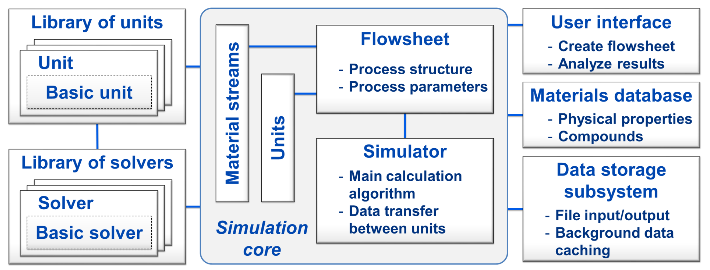

.. DyssolHelpDoc documentation master file, created by
   sphinx-quickstart on Wed Mar 27 14:25:30 2019.
   You can adapt this file completely to your liking, but it should at least
   contain the root `toctree` directive.

Welcome
=======

Dyssol, the **dy**\namic **s**\imulation of **sol**\ids processes, is a novel dynamic flowsheet modelling system designed to simulate the time-dependent behaviour of complex production processes in solids processing technology. Key features including:

* Dynamic simulation of flowsheets to reflect the time-dependent behaviour of processes and to take into account the accumulation of mass and energy;
	
* Proper calculation of multidimensional distributed parameters of the solid phase, considering their possible interdependence;

* Flexibility and extensibility of the system for adding new models of apparatuses and solvers.

And distinctive features including:

* Dynamic simulation of complex process structures;

* Advanced calculation algorithm for dynamic simulations;

* Consideration of solid, liquid, gas phases and their mixtures;

* Proper handling of multidimensional interdependent distributed parameters of solids;

* Providing standardized interfaces and templates for implementation of new units;

* High modularity and extensibility.

:ref:`label-develop`, Dyssol provides information about how to customize your own operation units and solvers.

This documentation helps you to get familiar with simulating solid processes using Dyssol. You can also find the introduction of the Dyssol system structure. 

.. toctree::
   :maxdepth: 2
   :caption: The structure of this help documentation includes:

   first
   units
   simulation
   data
   materials
   multiDim
   time
   solver
   developer
   class
   theory

|

Flowsheet simulation of solids
------------------------------
One of the main challenges in simulation of solids processes is associated with the dispersity of granular materials: the solid phase can be distributed along several interdependent parameters, such as size, shape, moisture content or density. 

In Dyssol, an approach with :ref:`label-TM` is used for correct handling of solids in this case. This concept allows preserving information about all parameters, even those which are not considered or not changed in a particular apparatus.

|

Approaches and methods
----------------------

The new system in Dyssol is based on the :ref:`label-seqModule`, where each model is calculated separately. This allows the simultaneous use of multiple specialized solvers for the calculation of a flowsheet and simplifies extension of the unit library with new models. 

To increase the computational efficiency, dynamic calculations of flowsheets with recycle streams are based on the :ref:`label-waveRelax`: the total simulation time is divided into smaller intervals, and models are solved separately on them, using some initial guess for the solution.

|

Software system architecture
----------------------------

To implement the Dyssol system, the C++ programming language and the object oriented paradigm are applied. 

You can get an overview of the Dyssol system structure in the figure below.

To maximize the modularity of the simulation environment, models of units and solvers are not directly integrated into the framework, but may be implemented as separate objects and then added to the units library using standardized interfaces and templates.

For a detailed explanation about important elements in the structure, please refer to :ref:`label-solver`, :ref:`label-simulation`, :ref:`label-materialDat`, :ref:`label-dataStor` and :ref:`label-multiDim`.

|

Further information
===================

Dyssol project is funded by German Research Foundation (DFG) via SPP 1679 ''Dyn-Sim-FP''.

.. seealso::

	1. Skorych, V., Dosta, M., Hartge, E.-U., Heinrich, S.: Novel system for dynamic flowsheet simulation of solids processes. Powder Technology 314 (2017), 665-679.

	2. Skorych, V., Dosta, M., Hartge, E.-U., Heinrich, S., Ahrens, R., Le Borne, S.: Investigation of an FFT-based solver applied to dynamic flowsheet simulation of agglomeration processes. Advanced Powder Technology  30 (2019), 555-564.

If you need help, please contact...

|
   
Indices and tables
==================

* :ref:`genindex`
* :ref:`modindex`
* :ref:`search`

