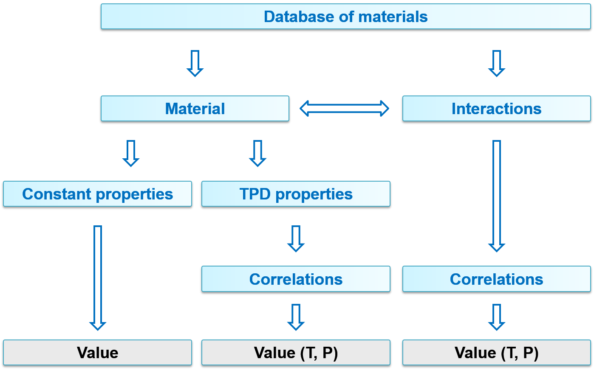
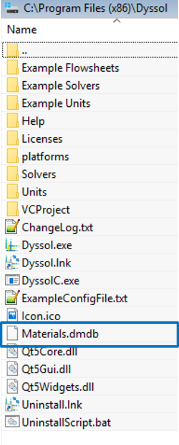
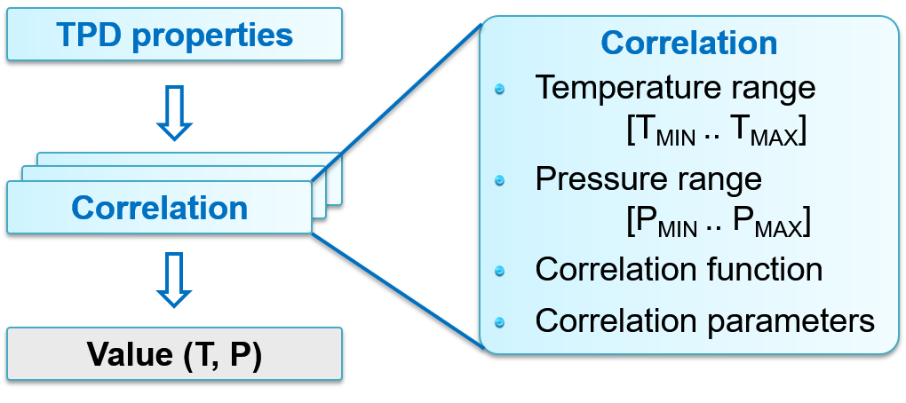

.. _label-materialDat:

=================
Material database
=================

The material database in Dyssol stores physical properties and compound information. 

You can find the database structure in the figure below. The compound properties can be constant or T(temperature), P(pressure)-dependent. The dependent properties can be calculated using correlations.

|

DMDB file
---------

You can find the file ``Materials.dmdb`` in your installation folder, which stores global list of **materials** and their **parameters**. Typical examples in current database are air, coal, sand, urea and water. 

You can extend this database by defining your own new materials using the *Tools* menu bar → *Materials database*, which opens the *compounds editor* and enables you to set new compounds.

|

.. _label-materialDataDetailed:

Constant parameters
-------------------

Not all properties have influence on internal calculations. State of aggregation can be used to define several aggregation states of the same material. These parameters can be accessed through units and material streams.

Constant parameters in Dyssol consist of:

	- Critical pressure
	
	- Critical temperature
	
	- Heat of fusion
	
	- Heat of vaporization
	
	- Molar mass: mandatory for simulation, since many parameters are calculated based on it
	
	- Normal boiling point
	
	- Normal freezing point
	
	- Reactivity type
	
	- Formation enthalpy
	
	- State of aggregation: represented by different numbers. 0 for solid, 1 for liquid, 2 for gas, 3 for unknown
	
	- User defined properties

For more information, please refer to :ref:`definition of constant properties <label-defConstProp>`.

|

Dependent parameters
--------------------

Like constant parameters, temperature- and/or pressure-dependent (TPD) parameters can also be accessed through units and material streams.

Dependent parameters in Dyssol consist of:

	- Density: mandatory for simulation, since it participates in :abbr:`PSD (Particle size distribution)` transformations and T-equilibrium
		
	- Enthalpy: mandatory for simulation, since it participates in T-equilibrium
	
	- Thermal conductivity
	
	- Viscosity
	
	- Permittivity
	
	- Use defined properties

For more information, please refer to :ref:`definition of temperature-dependent properties <label-defDepProp>`.

|

Correlation search
""""""""""""""""""

The algorithm for calculating :abbr:`TPD (Temperature- and/or pressure-dependent)` properties is shown as follows.

For each T or P range (given in the literature), it consists of 3 steps:

	1. Find the correlation with T & P within the first T or P-range. Calculate value according to the correlation function for this range.

	2. Find the correlation with only T within the first T or P-range. Calculate value according to the correlation function for this range.

	3. Find the nearest correlation, taking only T into account. Perform nearest neighbour extrapolation.

|

Correlation functions
"""""""""""""""""""""

The correlation functions :math:`y = f(T,P)` in Dyssol are listed below. The letters :math:`a ... f` are constants. For different temperatur and pressure ranges, different functions should be applied.

- Constant:
	
	:math:`y = a`
	
- Linear:
	
	:math:`y = aT + bP + c`

- Exponential:

	:math:`y = a\,b^{c+dT+\frac{eT + f}{gT + h}} + i`

- Power function

	:math:`y = a\,T^b` 
	
- Polynomial:	
	
	:math:`y = a + bT + cT^2 + dT^3 + eT^4 + fT^5 + gT^6 + hT^7` 
	
- Shomate heat capacity:	
	
	:math:`y = a + bT + cT^2 + dT^3 + \frac{e}{T^2}` 
	
- Shomate standard enthalpy:	
	
	:math:`y = aT + b\frac{T^2}{2} + c\frac{T^3}{3} + d\frac{T^4}{4} - \frac{e}{T} + f - g` 
	
- Shomate standard entropy:	
	
	:math:`y = a + \ln T + bT + c\frac{T^2}{2} + d\frac{T^3}{3} - \frac{e}{2T^2} + f` 
	
- List of T-values (user defined): 	
	
	:math:`y = \{T1:val1, T2:val2, T3:val3, ...\}` 

- List of P-values (user defined):

	:math:`y = \{P1:val1, P2:val2, P3:val3, ...\}` 
