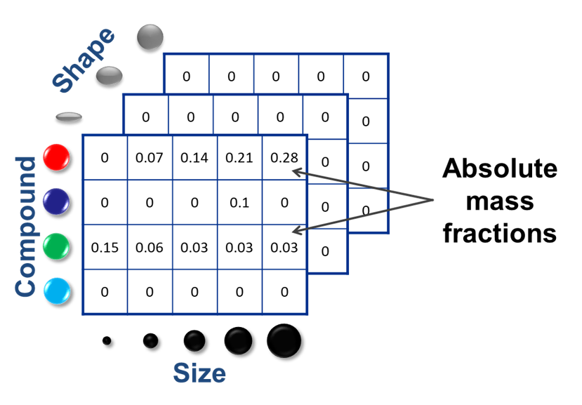
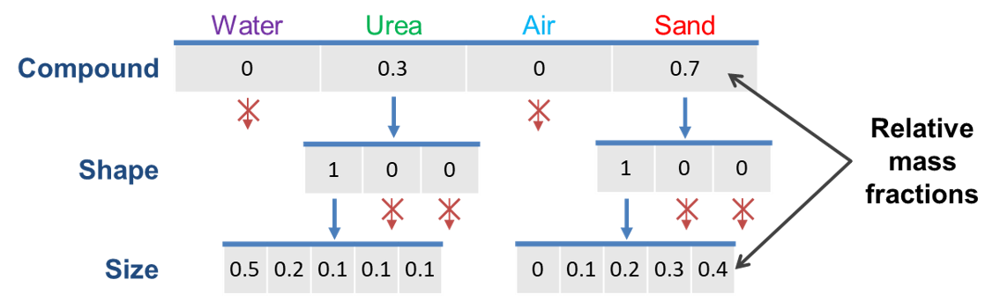
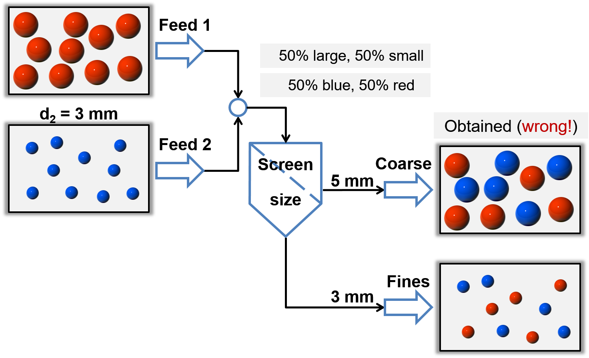
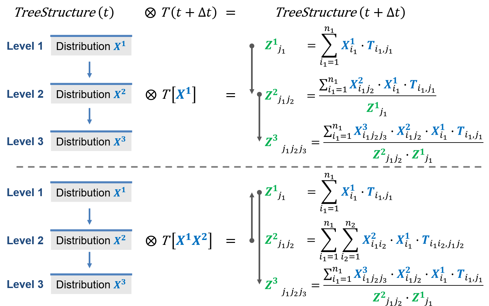
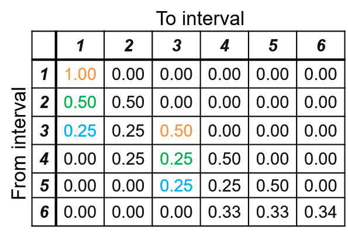
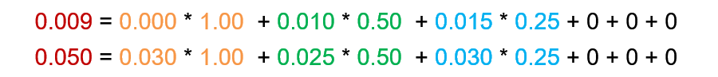
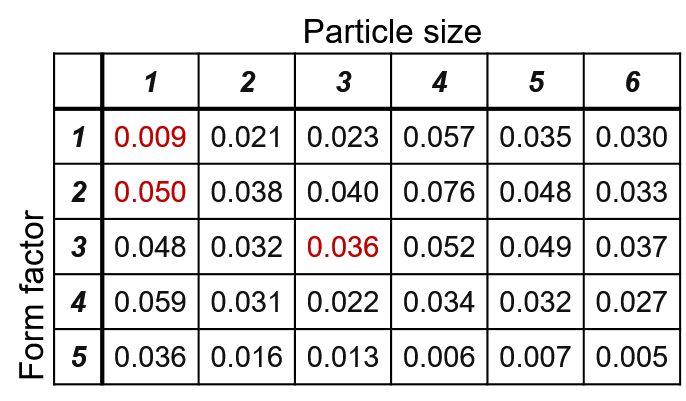

.. _label-multiDim:

=================================================
Multidimentional distributed parameters of solids
=================================================

Tree data structures
====================

Normally, solid phase is described with a set of **distributed parameters**, which can be **interdependent** (more parameters depend on each other). All interdependent distributed parameters form a multidimensional matrix and each entry of the matrix describes mass fractions of the solid material with the specified combination of parameters.

Currently, following distrubution parameters are available in Dyssol:

	- Compound
	
	- Size
	
	- Porosity
	
	- Form factor
	
	- Color
	
	- Other user-defined parameters

In the example below, you can find how the particle parameter distribution is described with 3-dimensional (size, compound and shape) matrices.

|

We can find many entries of these matrices are equal to zero. Therefore, in Dyssol, the multidimensional distribution is represented with a **tree data structure** instead. The parameters are analyzed level by level, if an element is zero, it will not be considered further (sparse data formats), as you can see in the example below. 

By using the tree data structure, the amount of data and the memory consumption can be reduced, leading to the improvement the computational efficiency.

.. seealso:: Skorych et al., Novel system for dynamic flowsheet simulation of solids processes, Powder Technology 314 (2017).

|

Treatment of dependent parameters
=================================

.. _label-TM:

Transformation matrices
-----------------------

Let's first see an example of a screening process with **explicit calculation**, which is illustrated in the figure below. 

   
In this example, large red and small blue particles are fed into the screen unit, which only considers partical size distribution. The two multidimensional parameters (color and size) are interconnected (only the combinations large/red and small/blue are allowed). If the secondary dependent parameter - color - was not explicitly considered, it would be lost or mixed (small/red and large/blue appear mistakenly).

|

To avoid such mistake, the **transformation matrices (TM)** is applied for calculation of unit outlets. TM describe laws of material transition between classes. Each entry of TM describes a fraction of material that passes from one operation unit to another. The calculation of TM is based on different model functions. 

You can find another example for the screen unit showing the application of TM in Dyssol. 

.. image:: ./pics/mult/transMat.png
   :width: 800px
   :alt: approach with transformation matrices
   :align: center
 
You may applie TM to get distributions in holdups (material storage) and unit outlets. All dependent parameters of solids are calculated automatically. Meanwhile, information about secondary distributions (in this example the moisture content) is kept.
 

.. seealso::

	1. Skorych et al., Novel system for dynamic flowsheet simulation of solids processes, Powder Technology 314 (2017).
	
	2. M.Dosta., Techn. Univ. Hamburg-Harburg, Diss., 2012.

  
   
|   

Application of transformation matrices
""""""""""""""""""""""""""""""""""""""

The output is calculated by the tensor product of input and :abbr:`TM (Transformation matrix)`.

.. math::

	Output = TM \otimes Input
	
Transformation matrix is written in tree structure form. ...	

|

Application example
"""""""""""""""""""

As an example, the calculation of the particle size distribution in outlet stream from a :ref:`label-crusher` is shown below. 

The input stream information - particle size and form factor distribution - is listed in the table below. The form factor and size values are reprensented by indices from 1 to 5 and 1 to 6, respectively.

Form factor is not influenced during the crush process. Only the particle size disstribution is considered. The transformation matrix below shows the size reduction. For example, a size reduction fractinon from index 1 to 1 is 1.00 means all size-1-particles remains the same; the size reduction fraction from index 2 to 1 is 0.50, indicating half of size-2-particles will be crushed in to size 1, and the other half remains the same.

The output result are listed in the same way as input, i.e. by the form factor and particle size indices. 

For example, in the input stream, 5% of all particles has a form factor of 3 and a size of 3. During the crushing process, the size reduction to 3 are:

	- 50% of size-3-particles remains the same;
	
	- 25% of size-4-particles are comminuted to size 3;
	
	- 25% of size-5-particles are comminuted to size 3;
	
	- there are no particles of sizes 1, 2 or 6 reduced to size 3.

The corresponding result considers all particles of size 3 after crushing, meanwhile with the same form factor 3. In another way it is written as:

.. math::

	output(size\,3, form\,factor\,3) = input(size\,1, form\,factor\,3) \times TM(1\,to\,3) + 
	
									input(size\,2, form\,factor\,3) \times TM(2\,to\,3) + 
									
									... + 
									
									input(size\,6, form\,factor\,3) \times TM(6\,to\,3)

In the similar way, we can calculate the output result for :math:`input(size\,1, form\,factor\,1)` and :math:`input(size\,1, form\,factor\,2)`:

The overall output result is shown below.

