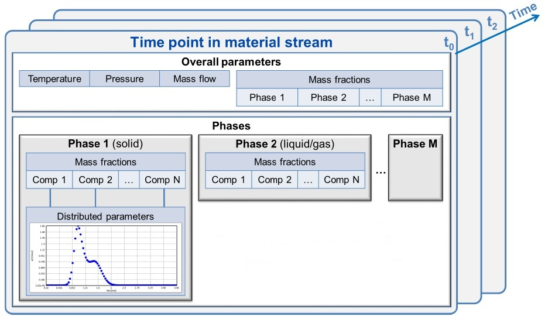

.. _label-simulation:

===============
Simulation core
===============

In simulation core, all data are processed discretely on the time scale. Different material streams and operation units are combined into the flowsheet, which is then simulated in the simulator.

.. image:: ./pics/simulator.png
   :width: 400px
   :alt: screen
   :align: center

|

Material streams
----------------

All units in Dyssol are connected by material streams, which are described by a set of time points (time discretisation).

Overall properties define parameters for all selected phases. Three phases - solid, liquid and gas phases - are available. Each phase is distributed along compounds content.

Solid phase can be distributed along several multidimensional properties. Each stream on the flowsheet has the same set of compounds, phases and multidimensional properties.

All variables in material streams are time-dependent.

The structure of material streams is illustrated in the figure below. The information is transferred between operation units.

|

.. seealso::

	:ref:`label-stream` for program interface of material streams.

|

Units
-----

A basic unit provides interfaces to the simulation system. It contains program interfaces to material streams, equation solvers and material database. 

Moreover, you can develope your own units using the template for creating custom units and then add them to the :ref:`label-unitsLib`. Please refer to :ref:`label-unitDev` for more information.

|

Simulator
---------

In this section, you can find the information about the main calculation algorithm.

.. image:: ./pics/algorithm.png
   :width: 900px
   :alt: screen
   :align: center

|

Main method and approaches
""""""""""""""""""""""""""

Following methods are applied in Dyssol for simulation. Click the corresponding names for more background theoretical information.

- :ref:`label-seqModule`: each model is solved separately.

- Dividing of a flowsheet into :ref:`label-partition`.

- :ref:`label-waveRelax` (WRM) for dynamic calculation of recycle streams: dividing simulation time into shorter intervals.

- :ref:`label-extrapolation` to initialize each time window.

- :ref:`label-convergence` to initialize each iteration of WRM.

.. seealso:: V. Skorych et al., Novel system for dynamic flowsheet simulation of solids processes, 2017.

|

.. _label-equationSolvers:

Built-in equation solvers
"""""""""""""""""""""""""

Dyssol uses IDA and KINSOL solvers in `SUNDIALS package <https://computation.llnl.gov/projects/sundials>`_.

.. image:: ./pics/solver.png
   :width: 400px
   :alt: 
   :align: center 

`IDA solver <https://computing.llnl.gov/projects/sundials/ida>`_ is used for automatic calculation of **dynamic differential-algebraic equation systems** inside the units, which applies variable-order, variable-coefficient backward differentiation formulas, in fixed-leading-coefficient form.

`KINSOL solver <https://computing.llnl.gov/projects/sundials/kinsol>`_ is used for automatic calculation of **nonlinear algebraic systems**, which applies a fixed-point iteration with Anderson acceleration.

.. seealso:: Skorych et al., Investigation of an FFT-based solver applied to dynamic flowsheet simulation of agglomeration processes, Advanced Powder Technology, 30 (2019).

|

