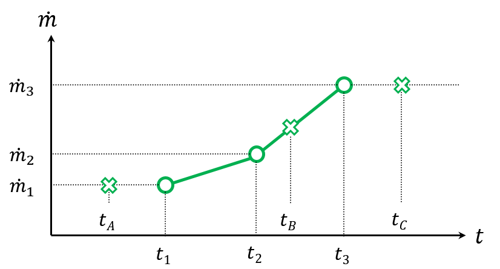
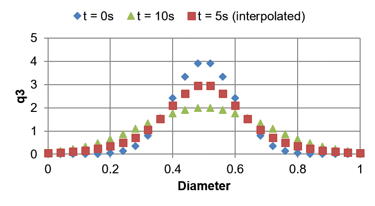
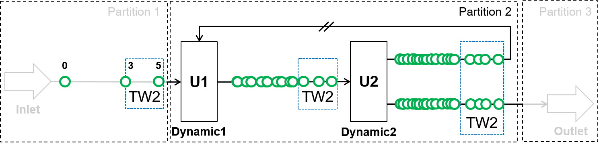
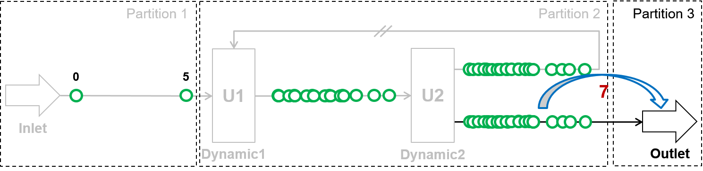

=====================
Time point management
=====================

In Dyssol, stream inlets, dynamic units and unit parameters are time-dependent and have unique combination of time points. As simulation process goes, new time points are generated. 

  
|
  
Data interpolation
------------------

Linear interpolation is applied between existing time points. Nearest-neighbor extrapolation is applied outside of existing interval. If only one time point is defined, it is assumed to be constant on the whole interval.

As an example, the mass flow at different time points are illustrated in the diagram below.
 

The values :math:`\dot{m}(t_1) = \dot{m}_1`, :math:`\dot{m}(t_2)  = \dot{m}_2` and :math:`\dot{m}(t_3)  = \dot{m}_3` are given. Therefore, the mass flow at time points :math:`t_A`, :math:`t_B` and :math:`t_C` are calculated using the methods mentioned above.

.. math::

	\dot{m}(t_A) = \dot{m}(t_1) = \dot{m}_1

.. math::
	
	\dot{m}(t_B) = \dot{m}_2 + \frac{\dot{m}_3 - \dot{m}_2}{t_3 - t_2}\,(t_B - t_2)

.. math::
	
	\dot{m}(t_C) = \dot{m}(t_3) = \dot{m}_3

|

Interpolation of distributed parameters
---------------------------------------   

Distributed parameters are represented as a set of classes. For each class, interpolation (linear interpolation and nearest-neighbor extrapolation 
) is applied.

Let's take the particle size distribution :math:`q_3` as an example. Interpolation is applied for each class.

.. math::

	PSD_i = Interpol(PSD_{i-1}, PSD_{i+1})

The :abbr:`PSD (Particle size distribution)` changes during 10 seconds; the states at :math:`t = 0\,s` and :math:`t = 10\,s` are given. For different cases, the PSD at :math:`t = 5\,s` can be interpolated, as the diagrams shown below.

  
|
  
.. image:: ./pics/time/PSD2.png
   :width: 400px
   :alt: 
   :align: center

|

Steady state units
------------------

In Dyssol, steady state unit is calculated on a union of time points from all its inlets. This unit does not produce new time points, and data extrapolation is used to obtain values from time points which are not given.

.. image:: ./pics/time/ss.png
   :width: 500px
   :alt: 
   :align: center

|

Dynamic units with recycle
--------------------------

In case of simulation with recycled streams for 5 seconds, the following example is analyzed. This process consists of several material streams and 2 dynamic operation units U1 and U2. The recycle stream is identified and the process is splitted into 3 partitions.

First, partition 1 is simulated on the whole time interval (from 0 to 5 s), as shown in the pseudo-code below. The red numbers shows the simulation steps.

	.. code-block:: cpp

		Inlet::Simulate(0, 5)

.. image:: ./pics/time/simu1.png
   :width: 700px
   :alt: 
   :align: center

Then, for partition 2, the :ref:`label-waveRelax` is applied and an intermediate time point is calculated as 3 s. Therefore, the whole time interval is divided into 0 - 3 s and 3 - 5 s.

.. image:: ./pics/time/simu2.png
   :width: 700px
   :alt: 
   :align: center

The simulation of partition 2 is first implemented on the time interval from 0 to 3 s. Based on the values obtained in partitioin 1, more inter mediate points after U1 are calculated by interpolation. This calculation continues for the streams after U2 based on the data points for U1, gaining more data points for U2.

	.. code-block:: cpp
	
		Dynamic1::Simulate(0, 3)

		Dynamic2::Simulate(0, 3)

This repeats until convergence takes place. Afterwards, partition 2 is simulated on the time interval from 3 to 5 s.

	.. code-block:: cpp
	
		Dynamic1::Simulate(3, 5)

		Dynamic2::Simulate(3, 5)

This repeats until convergence takes place.

Finally, partition 3 is simulated on the whole time interval from 0 to 5 s.

	.. code-block:: cpp

		Outlet::Simulate(0, 5)

