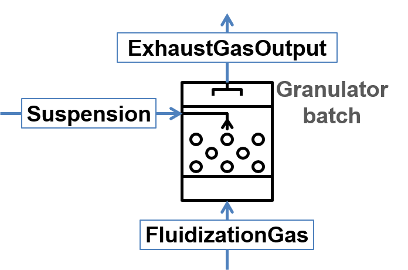
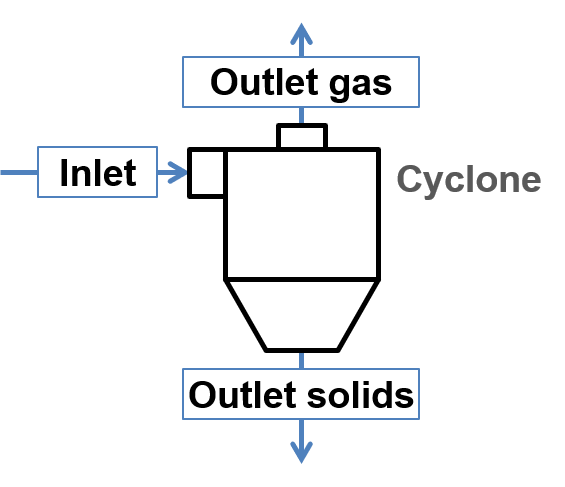

.. _label-unitsLib:

============
Unit library
============

An operation unit performs one of the following tasks:

- Streams processing: examples are Inlet flow, Outlet flow, Mixer and Splitter.

- Steady-state simulation: example is Screen.

- Dynamic simulation: examples are Granulator, Agglomerator and Bunker.

You can also develope your own operation unit and refer to :ref:`label-unitDev` for more information.

|

Inlet flow
==========

This unit allows defining the parameters of the input material, showing in the figure below.

|

Outlet flow
===========

This unit serves to connect the output material flows, as shown in the figure below.

.. image:: ./static/images/units/outletflow.png
   :width: 200px
   :alt: mixer example
   :align: center

|

Mixer
=====

A mixer mixes two input material streams (:math:`In1`, :math:`In2`) into the one output stream (:math:`Out`), as shown in the scheme below.

.. image:: ./static/images/units/mixer.png
   :width: 300px
   :alt: mixer
   :align: center

The output stream will be defined for all time points for which the streams :math:`In1` **and** :math:`In2` are defined. Mixing of more streams can be implemented by connecting of several mixers sequentially.

The parameters of output stream are calculated as:

.. math::

		\dot{m}_{out} &= \dot{m}_{in1} + \dot{m}_{in2}

		\dot{H}_{out} &= \dot{H}_{in1} + \dot{H}_{in2}

		T_{out} &= f(h_{out}) = f \left( \frac{\dot{H}_{out}}{\dot{m}_{out}} \right)

		P_{out} &= min( P_{in1},P_{in2} )

.. note:: Notations:

	:math:`\dot{m}` – mass flow

	:math:`\dot{H}` - enthalpy flow

	:math:`h` - specific enthalpy

	:math:`T` - temperature

	:math:`P` - pressure

All secondary attributes of output stream, such as phase fractions, compounds fractions and multidimensional distributions are calculated depending on mass fractions of input streams.

.. seealso::

	a demostration file at ``Example Flowsheets/Units/Mixer.dlfw``.

.. REMOVED CONTENTS ..
.. Input model parameters:

.. +---------------+-----------------------------------+-----------------------------------+
.. |               | Input 1                           | Input 2                           |
.. +---------------+-----------------+-----------------+-----------------+-----------------+
.. | Timepoint [s] | Massflow [kg/s] | Temperature [K] | Massflow [kg/s] | Temperature [K] |
.. +===============+=================+=================+=================+=================+
.. | 0             | 10              | 300             | 5               | 400             |
.. +---------------+-----------------+-----------------+-----------------+-----------------+
.. | 60            | 7.5             | 300             | 10              | 400             |
.. +---------------+-----------------+-----------------+-----------------+-----------------+

.. Simulation result for mass flows:

.. .. image:: ./static/images/units/mixer-egMass.png
   :width: 700px
   :alt: mixer example
   :align: center

.. Simulation result for temperatures:

.. .. image:: ./static/images/units/mixer-egTemp.png
   :width: 700px
   :alt: mixer example
   :align: center

|

Splitter
========

A splitter divides input stream (:math:`In`) into two output streams (:math:`Out1` and :math:`Out2`), as shown in the figure below.

.. image:: ./static/images/units/splitter.png
   :width: 300px
   :alt: mixer
   :align: center

Both output streams are defined for the same set of time points for which the input stream has been defined. The splitting of input stream into more than two fractions can be done by sequential connection of several splitter units.

You can specify the splitting factor :math:`K_{splitt}`, which is defined in following equations. Here :math:`\dot{m}` is a mass flow.

.. math::

	\dot{m}_{out1} &= K_{splitt} \cdot \dot{m}_{in}

	\dot{m}_{out2} &= (1-K_{splitt} ) \cdot \dot{m}_{in}

.. note:: Notations:

	:math:`\dot{m}` - mass flow

	:math:`K_{splitt}` - Splitting factor

.. note:: Input parameters needed for the simulation:

	+---------+------------------+-------+-----------------+
	| Name    | Description      | Units | Boundaries      |
	+=========+==================+=======+=================+
	| Ksplitt | Splitting factor | [--]  | 0 ≤ Ksplitt ≤ 1 |
	+---------+------------------+-------+-----------------+

.. seealso::

	a demostration file at ``Example Flowsheets/Units/Splitter.dlfw``.

|

.. _label-screen:

Screen
======

Screen unit is designed for classification of input material into two fractions according to particle size distribution (PSD), as shown below.

.. image:: ./static/images/units/screen.png
   :width: 300px
   :alt: screen
   :align: center

In Dyssol, 4 models are available to describe the screen grade efficiency:

	- Plitt's model
	- Molerus & Hoffmann model
	- Probability model
	- Teipel / Hennig model

In the following figure, several grade efficiency curves for different parameters of separations sharpness are shown.

.. note:: This figure only applies to the Plitt's model and Molerus & Hoffmann model.

.. image:: ./static/images/units/splitter-alpha.png
   :width: 500px
   :alt: splitter
   :align: center

|

.. _label-screenPlitt:

Plitt's model
^^^^^^^^^^^^^

This model is described using the following equation:

.. math::

	G(x_i) = 1 - exp\left(-0.693\,\left(\frac{x_i}{x_{cut}}\right)^\alpha\right)

.. note:: Notations applied in the models:

	:math:`G(x_i)` – grade efficiency: mass fraction of material within the size class :math:`i` in the feed (:math:`\dot{m}_{i,input}`) that leaves the screen in the coarse stream (:math:`\dot{m}_{i,coarse}`)

	:math:`x_{cut}` – cut size of the classification model in meter

	:math:`\alpha` – sharpness of separation

	:math:`x_i` – size of a particle

.. note:: Input parameters needed for the simulation:

	+-------+----------------+--------------------------------------+-------+-----------------+
	| Name  |Symbol          | Description                          | Units | Boundaries      |
	+=======+================+======================================+=======+=================+
	| Xcut  |:math:`x_{cut}` | Cut size of the classification model | [m]   | Xcut > 0        |
	+-------+----------------+--------------------------------------+-------+-----------------+
	| Alpha |:math:`\alpha`  | Sharpness of separation              | [--]  | 0 ≤ Alpha ≤ 100 |
	+-------+----------------+--------------------------------------+-------+-----------------+

.. seealso::

	a demostration file at ``Example Flowsheets/Units/Screen Plitt.dlfw``.

.. seealso::

	Plitt, L.R.: The analysis of solid–solid separations in classifiers. CIM Bulletin 64 (708), p. 42–47, 1971.

|

Molerus & Hoffmann model
^^^^^^^^^^^^^^^^^^^^^^^^

This model is described using the following equation:

.. math::

	G(x_i) = \dfrac{1}{1 + \left( \dfrac{x_{cut}}{x_i} \right)^2 \cdot exp\left( \alpha \,\left( 1 - \left(\dfrac{x_i}{x_{cut}}\right)^2 \right)\right)}

.. note:: Notations applied in the models:

	:math:`G(x_i)` – grade efficiency: mass fraction of material within the size class :math:`i` in the feed that leaves the screen in the coarse stream

	:math:`x_{cut}` – cut size of the classification model

	:math:`\alpha` – sharpness of separation

	:math:`x_i` – size of a particle

.. note:: Input parameters needed for the simulation:

	+-------+-----------------+--------------------------------------+-------+-----------------+
	| Name  | Symbol          | Description                          | Units | Boundaries      |
	+=======+=================+======================================+=======+=================+
	| Xcut  | :math:`x_{cut}` | Cut size of the classification model | [m]   | Xcut > 0        |
	+-------+-----------------+--------------------------------------+-------+-----------------+
	| Alpha | :math:`\alpha`  | Sharpness of separation              | [--]  | 0 < Alpha ≤ 100 |
	+-------+-----------------+--------------------------------------+-------+-----------------+

.. seealso::

	a demostration file at ``Example Flowsheets/Units/Screen Molerus-Hoffmann.dlfw``.

.. seealso::

	Molerus, O.; Hoffmann, H.: Darstellung von Windsichtertrennkurven durch ein stochastisches Modell, Chemie Ingenieur Technik, 41 (5+6), 1969, pp. 340-344.

|

Probability model
^^^^^^^^^^^^^^^^^

This model is described using the following equation:

.. math::

	G(x_i) = \dfrac{ \sum\limits^{x_i}_{0} e^{-\dfrac{(x_i - \mu)^2}{2\sigma^2}} }{ \sum\limits^{N}_{0} e^{-\dfrac{(x_i - \mu)^2}{2\sigma^2}} }

.. note:: Notations applied in this model:

	:math:`G(x_i)` – grade efficiency: mass fraction of material within the size class :math:`i` in the feed that leaves the screen in the coarse stream

	:math:`x_i` – size of a particle

	:math:`\sigma` – standard deviation of the normal output distribution

	:math:`\mu` – mean of the normal output distribution

	:math:`N` – number of classes of particle size distribution

.. note:: Input parameters needed for the simulation:

	+------------------------+----------------+----------------------------------------------------------------+-------+-------------------------+
	| Name                   | Symbol         | Description                                                    | Units | Boundaries              |
	+========================+================+================================================================+=======+=========================+
	| Mean                   |:math:`\mu`     | Mean of the normal output distribution                         | [m]   | Mean > 0                |
	+------------------------+----------------+----------------------------------------------------------------+-------+-------------------------+
	| Standard deviation     |:math:`\sigma`  | Standard deviation of the normal output distribution           | [m]   | Standard deviation > 0  |
	+------------------------+----------------+----------------------------------------------------------------+-------+-------------------------+

.. seealso::

	a demostration file at ``Example Flowsheets/Units/Screen Probability.dlfw``.

.. seealso::
	Radichkov, R.; Müller, T.; Kienle, A.; Heinrich, S.; Peglow, M.; Mörl, L.: A numerical bifurcation analysis of continuous fluidized bed spray granulation with external product classification, Chemical Engineering and Processing 45, 2006, pp. 826–837.

|

Teipel / Hennig model
^^^^^^^^^^^^^^^^^^^^^

This model is described using the following equation:

.. math::

	G(x_i) = \left(  1-   \left( 1 + 3 \cdot \left( \dfrac{x_i}{x_{cut}} \right)^{\left(\dfrac{x_i}{x_{cut}} + \alpha \right)\cdot \beta} \right)^{-1/2}	\right) \cdot (1 - a) + a

.. note:: Notations applied in the models:

	:math:`G(x_i)` – grade efficiency: mass fraction of material within the size class :math:`i` in the feed that leaves the screen in the coarse stream

	:math:`x_{cut}` – cut size of the classification model

	:math:`\alpha` – sharpness of separation

	:math:`\beta` - sharpness of separation

	:math:`a` - separation offset

	:math:`x_i` – size of a particle

.. note:: Input parameters needed for the simulation:

	+-------+----------------+----------------------------------------+-------+-----------------+
	| Name  |Symbol          | Description                            | Units | Boundaries      |
	+=======+================+========================================+=======+=================+
	| Xcut  |:math:`x_{cut}` |   Cut size of the classification model | [m]   | Xcut > 0        |
	+-------+----------------+----------------------------------------+-------+-----------------+
	| Alpha |:math:`\alpha`  |   Sharpness of separation 1            | [--]  | 0 < Alpha ≤ 100 |
	+-------+----------------+----------------------------------------+-------+-----------------+
	| Beta  |:math:`\beta`   |  Sharpness of separation 2             | [--]  | 0 < Beta ≤ 100  |
	+-------+----------------+----------------------------------------+-------+-----------------+
	| Offset|:math:`a`       | Separation offset                      | [--]  | 0 ≤ Offset ≤ 1  |
	+-------+----------------+----------------------------------------+-------+-----------------+

.. seealso::

	a demostration file at ``Example Flowsheets/Units/Screen Teipel-Hennig.dlfw``.

.. seealso::

	Hennig, M. and Teipel, U. (2016), Stationäre Siebklassierung. Chemie Ingenieur Technik, 88: 911–918.

|

.. _label-crusher:

Crusher
=======

A crusher comminutes the input material stream and reduces the average particle size. The schema is illustrated below.

.. image:: ./static/images/units/crusher.png
   :width: 200px
   :alt: splitter
   :align: center

This unit can be described using 3 models in Dyssol:

	- Bond's model
	- Cone model
	- Const model

Bond's model
^^^^^^^^^^^^

This model is used to perform milling of the input stream. The crushing is performed according to the model proposed by Bond. The simplification is made, and the particle size distribution of the output stream is described by the normal function.

.. math::

	x_{80,out} = \dfrac{1}{ \left( \dfrac{P}{10\,w_i\,\dot{m}} + \dfrac{1}{\sqrt{x_{80,in}}} \right)^2}

.. math::

	\mu = x_{80,out} - 0.83\sigma

.. math::

	q_3(x) = \frac{1}{\sigma\sqrt{2\pi}}\,e^{-\dfrac{(x-\mu)^2}{2\sigma^2}}

.. note:: Notations applied in this model:

	:math:`x_{80,out}` – characteristic particle size of the output stream

	:math:`x_{80,in}` – characteristic particle size of the input stream

	:math:`w_i` – Bond Work Index, dependent on the material

	:math:`P` – power input

	:math:`\dot{m}` – mass flow of solids in the input stream

	:math:`q_3(x)` – output mass related density distribution

	:math:`\sigma` – standard deviation of the output normal distribution

	:math:`\mu` – mean value of the output normal distribution

.. note:: Solid phase and particle size distribution are required for the simulation.

.. note:: Input parameters needed for the simulation:

	+--------------------+----------------+-----------------------------------------------+---------+------------------------+
	| Name               | Symbol         | Description                                   | Units   | Boundaries             |
	+====================+================+===============================================+=========+========================+
	| P                  |:math:`P`       | Power input                                   | [kW]    | P > 0                  |
	+--------------------+----------------+-----------------------------------------------+---------+------------------------+
	| Wi                 |:math:`w_i`     | Bond work index                               | [kWh/t] | 1 ≤ Wi ≤ 100           |
	+--------------------+----------------+-----------------------------------------------+---------+------------------------+
	| Standard deviation |:math:`\sigma`  | Standard deviation of the output distribution | [m]     | Standard deviation > 0 |
	+--------------------+----------------+-----------------------------------------------+---------+------------------------+

.. seealso::

	a demostration file at ``Example Flowsheets/Units/Crusher Bond.dlfw``.

.. seealso::

	1. F.C. Bond, Crushing and grinding calculation – Part I, British Chemical Engineering 6 (6) (1961) 378-385.

	2. F.C. Bond, Crushing and grinding calculation – Part II, British Chemical Engineering 6 (8), (1961) 543-548.

	3. Denver Sala Basic: Selection Guide for Process Equipment, 1993.

|

Average Bond Work Indices for various materials
"""""""""""""""""""""""""""""""""""""""""""""""

+-----------------------------+-------------------------+--------------------+-------------------------+
| Material                    | Work Bond Index [kWh/t] | Material           | Work Bond Index [kWh/t] |
+=============================+=========================+====================+=========================+
| Andesite                    | 20.08                   | Iron ore, oolitic  | 12.46                   |
+-----------------------------+-------------------------+--------------------+-------------------------+
| Barite                      | 5.2                     | Iron ore, taconite | 16.07                   |
+-----------------------------+-------------------------+--------------------+-------------------------+
| Basalt                      | 18.18                   | Lead ore           | 13.09                   |
+-----------------------------+-------------------------+--------------------+-------------------------+
| Bauxite                     | 9.66                    | Lead-zinc ore      | 12.02                   |
+-----------------------------+-------------------------+--------------------+-------------------------+
| Cement clinker              | 14.8                    | Limestone          | 14                      |
+-----------------------------+-------------------------+--------------------+-------------------------+
| Clay                        | 6.93                    | Manganese ore      | 13.42                   |
+-----------------------------+-------------------------+--------------------+-------------------------+
| Coal                        | 14.3                    | Magnesite          | 12.24                   |
+-----------------------------+-------------------------+--------------------+-------------------------+
| Coke                        | 16.84                   | Molybdenum         | 14.08                   |
+-----------------------------+-------------------------+--------------------+-------------------------+
| Copper ore                  | 13.99                   | Nickel ore         | 15.02                   |
+-----------------------------+-------------------------+--------------------+-------------------------+
| Diorite                     | 22.99                   | Oil shale          | 17.43                   |
+-----------------------------+-------------------------+--------------------+-------------------------+
| Dolomite                    | 12.4                    | Phosphate rock     | 10.91                   |
+-----------------------------+-------------------------+--------------------+-------------------------+
| Emery                       | 62.45                   | Potash ore         | 8.86                    |
+-----------------------------+-------------------------+--------------------+-------------------------+
| Feldspar                    | 11.88                   | Pyrite ore         | 9.83                    |
+-----------------------------+-------------------------+--------------------+-------------------------+
| Ferro-chrome                | 8.4                     | Pyrrhotite ore     | 10.53                   |
+-----------------------------+-------------------------+--------------------+-------------------------+
| Ferro-manganese             | 9.13                    | Quartzite          | 10.54                   |
+-----------------------------+-------------------------+--------------------+-------------------------+
| Ferro-silicon               | 11                      | Quartz             | 14.93                   |
+-----------------------------+-------------------------+--------------------+-------------------------+
| Flint                       | 28.78                   | Rutile ore         | 13.95                   |
+-----------------------------+-------------------------+--------------------+-------------------------+
| Fluorspar                   | 9.8                     | Shale              | 17.46                   |
+-----------------------------+-------------------------+--------------------+-------------------------+
| Gabbro                      | 20.3                    | Silica sand        | 15.51                   |
+-----------------------------+-------------------------+--------------------+-------------------------+
| Glass                       | 13.54                   | Silicon carbide    | 27.46                   |
+-----------------------------+-------------------------+--------------------+-------------------------+
| Gneiss                      | 22.14                   | Slag               | 11.26                   |
+-----------------------------+-------------------------+--------------------+-------------------------+
| Gold ore                    | 16.42                   | Slate              | 15.73                   |
+-----------------------------+-------------------------+--------------------+-------------------------+
| Granite                     | 16.64                   | Sodium silicate    | 14.74                   |
+-----------------------------+-------------------------+--------------------+-------------------------+
| Graphite                    | 47.92                   | Spodumene ore      | 11.41                   |
+-----------------------------+-------------------------+--------------------+-------------------------+
| Gravel                      | 17.67                   | Syenite            | 14.44                   |
+-----------------------------+-------------------------+--------------------+-------------------------+
| Gypsum rock                 | 7.4                     | Tin ore            | 11.99                   |
+-----------------------------+-------------------------+--------------------+-------------------------+
| Iron ore ,hematite          | 14.12                   | Titanium ore       | 13.56                   |
+-----------------------------+-------------------------+--------------------+-------------------------+
| Iron ore, hematite-specular | 15.22                   | Trap rock          | 21.25                   |
+-----------------------------+-------------------------+--------------------+-------------------------+
| Iron ore, magnetite         | 10.97                   | Zinc ore           | 12.72                   |
+-----------------------------+-------------------------+--------------------+-------------------------+

|

Cone model
^^^^^^^^^^

The model is described below as

.. math::

	w_{out,i} = \sum\limits^{i}_{k=0} w_{in,k} \cdot S_k \cdot B_{ki} + (1-S_i)\,w_{in,i}

.. note:: Notations:

	:math:`w_{out,i}` – mass fraction of particles with size :math:`i` in output distribution

	:math:`w_{in,i}` – mass fraction of particles with size :math:`i` in inlet distribution

	:math:`S_k` – mass fraction of particles with size :math:`k`, which will be crushed

	:math:`B_{ki}` – mass fraction of particles with size :math:`i`, which get size after breakage less or equal to :math:`k`

:math:`S_k` is described by the King selection function.

.. math::

	S_k =
	\begin{cases}
    0 											  & x_k \leqslant x_{min} \\
    1 - \dfrac{x_{max} - x_i}{x_{max} - x_{min}}  & x_{min} < x_k < x_{max} \\
    1											  & x_k \geqslant x_{max}
	\end{cases}

.. math::

	x_{min} = CSS \cdot \alpha_1

	x_{max} = CSS \cdot \alpha_2

.. note:: Notations:

	:math:`x_k` – mean particle diameter in size-class :math:`k`

	:math:`CSS` – close size setting of a cone crusher

	:math:`\alpha_1, \alpha_2, n` – parameters of the King selection function

:math:`B_{ki}` is calculated by the Vogel breakage function.

.. math::

	B_{ki} =
	\begin{cases}
	0.5\, \left( \dfrac{x_i}{x_k} \right)^q \cdot \left( 1 + \tanh \left( \dfrac{x_k - x'}{x'} \right) \right) & i \geqslant k \\
	0 & i < k
	\end{cases}

.. note:: Notations:

	:math:`x'` – minimum fragment size which can be achieved by crushing

	:math:`q` – parameter of the Vogel breakage function

.. note:: Solid phase and particle size distribution are required for the simulation.

.. note:: Input parameters needed for the simulation:

	+--------+------------------+---------------------------------------------------------------------------------------+-------+---------------------+
	| Name   | Symbol           | Description                                                                           | Units | Boundaries          |
	+========+==================+=======================================================================================+=======+=====================+
	| CSS    | :math:`CSS`      | Close size setting of a cone crusher. Parameter of the King selection function        | [m]   | CSS > 0             |
	+--------+------------------+---------------------------------------------------------------------------------------+-------+---------------------+
	| alpha1 | :math:`\alpha_1` | Parameter of the King selection function                                              | [--]  | 0.5 ≤ alpha1 ≤ 0.95 |
	+--------+------------------+---------------------------------------------------------------------------------------+-------+---------------------+
	| alpha2 | :math:`\alpha_2` | Parameter of the King selection function                                              | [--]  | 1.7 ≤ alpha2 ≤ 3.5  |
	+--------+------------------+---------------------------------------------------------------------------------------+-------+---------------------+
	| n      | :math:`n`        | Parameter of the King selection function                                              | [--]  | 1 ≤ n ≤ 3           |
	+--------+------------------+---------------------------------------------------------------------------------------+-------+---------------------+
	| d’     | :math:`x'`       | Minimum fragment size achieved by crushing. Parameter of the Vogel breakage function  | [m]   | d’ > 0              |
	+--------+------------------+---------------------------------------------------------------------------------------+-------+---------------------+
	| q      | :math:`q`        | Parameter of the Vogel breakage function                                              | [--]  |                     |
	+--------+------------------+---------------------------------------------------------------------------------------+-------+---------------------+

.. seealso::

	a demostration file at ``Example Flowsheets/Units/Crusher Cone.dlfw``.

.. seealso::

	1. King, R. P., Modeling and simulation of mineral processing systems, Butterworth & Heinemann, Oxford, 2001.

	2. Vogel, L., Peukert, W., Modelling of Grinding in an Air Classifier Mill Based on A Fundamental Material Function, KONA, 21, 2003, 109-120.

|

Const output model
^^^^^^^^^^^^^^^^^^

This model sets a normal distribution with the specified constant parameters to the output stream. Outlet distribution does not depend on the inlet distribution.

.. math::

	q_3(x) = \frac{1}{\sigma\sqrt{2\pi}}\,e^{-\dfrac{(x-\mu)^2}{2\sigma^2}}

.. note:: Notations:

	:math:`q_3(x)` – output mass related density distribution

	:math:`\sigma` – standard deviation of the output normal distribution

	:math:`\mu` – mean value of the output normal distribution

.. note:: Solid phase and particle size distribution are required for the simulation.

.. note:: Input parameters needed for the simulation:

	+--------------------+----------------+------------------------------------------------------+-------+------------------------+
	| Name               | Symbol         | Description                                          | Units | Boundaries             |
	+====================+================+======================================================+=======+========================+
	| Mean               | :math:`\mu`    | Mean of the normal output distribution               | [m]   | Mean > 0               |
	+--------------------+----------------+------------------------------------------------------+-------+------------------------+
	| Standard deviation | :math:`\sigma` | Standard deviation of the normal output distribution | [m]   | Standard deviation > 0 |
	+--------------------+----------------+------------------------------------------------------+-------+------------------------+

.. seealso::

	a demostration file at ``Example Flowsheets/Units/Crusher Const.dlfw``.

|

Bunker
======

Bunker unit performs accumulation of the solid part of the input material with ideal mixing, see figure below.

.. image:: ./static/images/units/bunker.png
   :width: 200px
   :alt:
   :align: center

The model takes into account only the solid phase, the rest of the phases are bypassed.

.. math::
	\frac{dm}{dt} = \dot{m}_{in} - \dot{m}_{out}

Two models for the bunker outflow :math:`m_{out}` are available:

- **Adaptive**: User defines only the target mass :math:`m_{target}` of the bunker and :math:`\dot{m}_{out}` is being adjusted by the system to match the user-defined target mass :math:`m_{target}`, depending on inflow mass :math:`\dot{m}_{in}`, current bunker mass :math:`{m}` and :math:`m_{target}`: .

.. math::
	\dot{m}_{out} = \dot{m}_{in}\left(\frac{2m}{m + m_{target}}\right)^2

- **Constant**: User defines timepoints with the desired bunker outflow :math:`\dot{m}_{requested}`. The system tries to provide this outflow, if enough material :math:`{m}` is in bunker. Otherwise the :math:`\dot{m}_{out} = \dot{m}_{in}`. The smoothing function is implemented to let the numerical solver provide reliable results:

.. math::
	f_{smooth} = \frac{1}{2} + \frac{1}{2} \cdot \tanh{\left(50\cdot\left(m - \dot{m}_{requested}\cdot{dt}\right)\right)}

.. math::
	\dot{m}_{out} = f_{smooth} \cdot \dot{m}_{requested} + \left(1 - f_{smooth} \right) \cdot \min\left(\dot{m}_{in}, \dot{m}_{requested}\right)

To correctly take into account the dynamics of the process, norms of each overall parameter (mass flow, temperature, pressure) are maintained as:

.. math::
	\frac{d||X||}{dt} = (X(t) - X(t-1))^2 - ||X||

For compounds fractions:

.. math::
	\frac{d||C||}{dt} = \sqrt{\sum_{i}^{N_{c}}{(w_{i}(t) - w_{i}(t-1))^2}} - ||C||

For each distributed parameter:

.. math::
	\frac{d||D_{i}||}{dt} = \sqrt{\sum_{j}^{N_{D_{i}}}{(w_{i,j}(t) - w_{i,j}(t-1))^2}} - ||D||

.. note:: Notations:

	:math:`{m}` – current mass inside the bunker

	:math:`m_{target}` – target mass inside the bunker

	:math:`\dot{m}_{in}` – solids input mass flow

	:math:`\dot{m}_{out}` – solids output mass flow

	:math:`X(t)` – value of an overall parameter at time point :math:`t`

	:math:`w(t)` – mass fraction at time point :math:`t`

	:math:`N_{c}` – number of defined compounds

	:math:`N_{D_{i}}` – number of classes in distribution :math:`i`

.. note:: Solid phase is required for the simulation.

.. note:: Input parameters needed for the simulation:

	+--------------------+-----------------------------------+-------+---------------------------------+
	| Name               | Description                       | Units | Boundaries                      |
	+====================+===================================+=======+=================================+
	| Target mass        | Target mass within the bunker     | [kg]  | Target mass > 0                 |
	+--------------------+-----------------------------------+-------+---------------------------------+
	| Relative tolerance | Relative tolerance for DAE solver | [-]   | >0 (0 for flowsheet-wide value) |
	+--------------------+-----------------------------------+-------+---------------------------------+
	| Absolute tolerance | Absolute tolerance for DAE solver | [-]   | >0 (0 for flowsheet-wide value) |
	+--------------------+-----------------------------------+-------+---------------------------------+

.. seealso::

	a demostration file at ``Example Flowsheets/Units/Bunker.dlfw``.

|

Granulator
==========

This unit represents a simplified model of a fluidized bed granulation reactor.
The model does not take into account attrition of particles inside the apparatus and does not keep properly any secondary distributed properties except size.

Continuous granulator
^^^^^^^^^^^^^^^^^^^^^

.. image:: ./static/images/units/granulator.png
   :width: 500px
   :alt:
   :align: center

.. math::

	\frac{dq_{3,i}}{dt} = -G_e\,\frac{q_{3,i} - q_{3,i-1}\,\left(\frac{d_{p,i}}{d_{p,i-1}}\right)^3}{\Delta d_i} + \frac{\dot{m}_{in}}{M_{tot}}\,q_{3,i}^{in} - \frac{\dot{m}_{out}}{M_{tot}}\,q_{3,i}

.. math::

	G_e = \frac{2\dot{m}_e}{\rho_{s,susp} \cdot A_{tot}}

.. math::

	A_{tot} = \frac{6M_{tot}}{\rho_s} \sum\limits_{i} \frac{q_{3,i}\cdot \Delta d_i}{d_{p,i}}

.. math::

	\dot{m}_e = \dot{m}_{s,susp}\,(1 - K_{os})

.. math::

	\dot{m}_{out} = \dot{m}_{in} + \dot{m}_{e}

.. math::

	\dot{m}_{dust} = \dot{m}_{s,susp}\cdot K_{os} + (\dot{m}_{susp} - \dot{m}_{s,susp} + \dot{m}_{fl,g})

Batch granulator
^^^^^^^^^^^^^^^^^^^^^

.. math::

	\frac{d(M_{tot}q_{3,i})}{dt} = -G_e\,\frac{M_{tot}q_{3,i} - M_{tot}q_{3,i-1}\,\left(\frac{d_{p,i}}{d_{p,i-1}}\right)^3}{\Delta d_i}

.. math::

	G_e = \frac{2\dot{m}_{s,susp}}{\rho_{s,susp} \cdot A_{tot}}

.. math::

	A_{tot} = \frac{6M_{tot}}{\rho_s} \sum\limits_{i} \frac{q_{3,i}\cdot \Delta d_i}{d_{p,i}}

.. math::

	\frac{dM_{tot}}{dt} = \dot{m}_{s,susp}

.. math::

	\dot{m}_{exh} = \dot{m}_{l,susp} + \dot{m}_{fl,gas}

.. note:: Notations:

	:math:`q_3` – mass density distribution of particles inside apparatus

	:math:`q_3^{in}` – mass density distribution of external particles from **ExternalNuclei** stream

	:math:`\Delta d` – class size

	:math:`d_p` – particle diameter in a class

	:math:`\dot{m}_{in}` – mass flow of input nuclei

	:math:`\dot{m}_{out}` – output mass flow of the product

	:math:`\dot{m}_{dust}` – output mass flow from the **DustOutput**

	:math:`\dot{m}_{susp}` – total mass flow of the suspension

	:math:`\dot{m}_{s,susp}` – mass flow of the solid phase in the **Suspension** inlet

	:math:`\dot{m}_{fl,g}` – mass flow of the gas phase in the **FluidizationGas** inlet

	:math:`\dot{m}_{exh}` – output mass flow from the **ExhaustGasOutput**

	:math:`\dot{m}_{e}` – effective mass stream of the injected suspension

	:math:`M_{tot}` – holdup mass

	:math:`\rho_{s,susp}` – density of solids in the holdup

	:math:`G_{e}` – effective growth rate

	:math:`A_{tot}` – total surface of particles in the granulator

	:math:`K_{os}` – overspray part in the suspension

.. note:: particle size distribution is required for the simulation. This unit is applied for solid, liquid and gas phases.

.. note:: Input parameters needed for the simulation:

	+------+-----------------+----------------------------------------+-------+--------------+
	| Name | Symbol          | Description                            | Units | Boundaries   |
	+======+=================+========================================+=======+==============+
	| Kos  | :math:`K_{os}`  | Overspray part in the suspension       | [--]  | 0 ≤ Kos ≤ 1  |
	+------+-----------------+----------------------------------------+-------+--------------+
	| RTol | --              | Relative tolerance for equation solver | [--]  | 0 < RTol ≤ 1 |
	+------+-----------------+----------------------------------------+-------+--------------+
	| ATol | --              | Absolute tolerance for equation solver | [--]  | 0 < ATol ≤ 1 |
	+------+-----------------+----------------------------------------+-------+--------------+

.. note:: State variables:

	+-------+-----------------------+-----------------------------------------------+-----------------+
	| Name  | Symbol                | Description                                   | Units           |
	+=======+=======================+===============================================+=================+
	| Atot  | :math:`A_{tot}`       | Total surface of particles in the granulator  | [:math:`m^2`]   |
	+-------+-----------------------+-----------------------------------------------+-----------------+
	| Mtot  | :math:`M_{tot}`       | Total mass of all particles in the granulator | [kg]            |
	+-------+-----------------------+-----------------------------------------------+-----------------+
	| Mout  | :math:`\dot{m}_{out}` | Output mass flow of the product               | [kg/s]          |
	+-------+-----------------------+-----------------------------------------------+-----------------+
	| Mdust | :math:`\dot{m}_{dust}`| Output mass flow of dust                      | [kg/s]          |
	+-------+-----------------------+-----------------------------------------------+-----------------+
	| G     | :math:`G_{e}`         | Effective growth rate                         | [m/s]           |
	+-------+-----------------------+-----------------------------------------------+-----------------+
	| PSDi  | :math:`q_{3,i}`       | Mass density distribution of particles        | [1/m]           |
	+-------+-----------------------+-----------------------------------------------+-----------------+

.. seealso::

	a demostration file at ``Example Flowsheets/Units/Granulator.dlfw``.

.. seealso::
	S.Heinrich, M. Peglow, M. Ihlow, M. Henneberg, L. Mörl, Analysis of the start-up process in continuous fluidized bed spray granulation by population balance modelling, Chem. Eng. Sci. 57 (2002) 4369-4390.

|

.. _label-agg:

Agglomerator
============

This unit represents a simplified model of agglomeration process, see figure below.

The model does not take into account attrition of particles inside the apparatus and does not keep properly any secondary distributed property except size.

Mass related density distribution of output stream is calculated according to following equations:

.. math::

	\frac{\partial n(v,t)}{\partial t} = B_{agg}(n,v,t) - D_{agg}(n,v,t) + \dot{n}_{in}(t) - \dot{n}_{out}(t)

.. math::

	B_{agg}(n,v,t) = \frac{1}{2}\,\beta_0\,\textstyle \int\limits_{0}^{v} \beta(u,v - u)\,n(u,t)\,n(v-u,t)\,du

.. math::

	D_{agg}(n,v,t) = \beta_0\,n(v,t)\, \textstyle \int\limits_{0}^{\infty}\,\beta(v,u)\,n(u,t)\,du

.. math::

	\dot{m}_{out}(t) = \dot{m}_{in}(t)

.. note:: Notations:

	:math:`v,u` – volumes of agglomerating particles

	:math:`n(v,t)` – number density function

	:math:`\dot{n}_{in}(t)`, :math:`\dot{n}_{out}(t)` – number density functions of inlet and outlet streams, correspondingly

	:math:`B_{agg}(n,v,t)`, :math:`D_{agg}(n,v,t)` –  birth and death rates of particles with volume :math:`v` caused due to agglomeration

	:math:`\beta_0` – agglomeration rate constant, dependent on operating conditions but independent from particle sizes

	:math:`\beta(v,u)` – the agglomeration kernel, see section :ref:`label-agg-kernels`.

	:math:`t` – time

	:math:`\dot{m}_{in}` – mass flow in the input stream

	:math:`\dot{m}_{out}` – mass flow in the output stream

.. note:: solid phase and particle size distribution are required for the simulation.

The method of calculating :math:`B_{agg}(n,v,t)` and :math:`D_{agg}(n,v,t)` is determined by the selected solver via unit parameter :ref:`label-agg-solvers`.

.. note:: Input parameters needed for the simulation:

	+--------+-----------------+-----------------------------------------------------------------------+-------+-----------------------------+
	| Name   | Symbol          | Description                                                           | Units | Boundaries                  |
	+========+=================+=======================================================================+=======+=============================+
	| Beta0  | :math:`\beta_0` | Size independent agglomeration rate constant                          | [--]  | 0 < Beta0 ≤ :math:`10^{20}` |
	+--------+-----------------+-----------------------------------------------------------------------+-------+-----------------------------+
	| Step   | --              | Maximum time step of internal DAE solver. Default value is 0.         | [--]  | 0 ≤ Step ≤ :math:`10^{9}`   |
	+--------+-----------------+-----------------------------------------------------------------------+-------+-----------------------------+
	| Solver | --              | Solver used to calculate birth and death rates                        | [--]  | --                          |
	+--------+-----------------+-----------------------------------------------------------------------+-------+-----------------------------+
	| Kernel | --              | Agglomeration kernel type, must be an integer                         | [--]  | 0 ≤ Kernel ≤ 9              |
	+--------+-----------------+-----------------------------------------------------------------------+-------+-----------------------------+
	| Rank   | --              | Rank of the kernel (applied for FFT solver only), must be an integer  | [--]  | 1 ≤ Rank ≤ 10               |
	+--------+-----------------+-----------------------------------------------------------------------+-------+-----------------------------+

.. seealso::

	a demostration file at ``Example Flowsheets/Units/Agglomerator.dlfw``.

.. seealso::

	V.Skorych, M. Dosta, E.-U. Hartge, S. Heinrich, R. Ahrens, S. Le Borne, Investigation of an FFT-based solver applied to dynamic flowsheet simulation of agglomeration processes, Advanced Powder Technology 30 (3) (2019), 555-564.

|

.. _label-agg-kernels:

Kernels
^^^^^^^

The agglomeration kernels are applied to describe the agglomeration frequency between particles of volumes :math:`v` and :math:`u`, which produce a new particle with the size :math:`(v + u)`. In Dyssol environment, 10 types of kernels are numbered with integers from 0 to 9, as listed below.

	+--------+----------------+--------------------------------------------------------------------------------------------------------------------+
	| Number | Name           | Kernel equation                                                                                                    |
	+========+================+====================================================================================================================+
	| 0      | Constant       | :math:`\beta (u,v)=1`                                                                                              |
	+--------+----------------+--------------------------------------------------------------------------------------------------------------------+
	| 1      | Sum            | :math:`\beta (u,v)=u+v`                                                                                            |
	+--------+----------------+--------------------------------------------------------------------------------------------------------------------+
	| 2      | Product        | :math:`\beta (u,v)=uv`                                                                                             |
	+--------+----------------+--------------------------------------------------------------------------------------------------------------------+
	| 3      | Brownian       | :math:`\beta (u,v)=\left(u^{\frac{1}{3}}+v^{\frac{1}{3}} \right)\,\left(u^{-\frac{1}{3}}+v^{-\frac{1}{3}} \right)` |
	+--------+----------------+--------------------------------------------------------------------------------------------------------------------+
	| 4      | Shear          | :math:`\beta (u,v)=\left(u^{\frac{1}{3}}+v^{\frac{1}{3}} \right)^{\frac{7}{3}}`                                    |
	+--------+----------------+--------------------------------------------------------------------------------------------------------------------+
	| 5      | Peglow         | :math:`\beta (u,v)=\dfrac{ (u+v)^{0.71} }{(uv)^{0.062} }`                                                          |
	+--------+----------------+--------------------------------------------------------------------------------------------------------------------+
	| 6      | Coagulation    | :math:`\beta(u,v)=u^{\frac{2}{3}}+v^{\frac{2}{3}}`                                                                 |
	+--------+----------------+--------------------------------------------------------------------------------------------------------------------+
	| 7      | Gravitational  | :math:`\beta(u,v)=\left(u^{\frac{1}{3}}+v^{\frac{1}{3}} \right)^2 \left|u^{\frac{1}{6}}-v^{\frac{1}{6}} \right|`   |
	+--------+----------------+--------------------------------------------------------------------------------------------------------------------+
	| 8      | Kinetic energy | :math:`\beta(u,v)=\left(u^{\frac{1}{3}}+v^{\frac{1}{3}} \right)^2 \, \sqrt{\frac{1}{u}+\frac{1}{v}}`               |
	+--------+----------------+--------------------------------------------------------------------------------------------------------------------+
	| 9      | Thompson       | :math:`\beta(u,v)=\dfrac{(u-v)^2}{u+v}`                                                                            |
	+--------+----------------+--------------------------------------------------------------------------------------------------------------------+

|

Solvers
^^^^^^^

Currenly, several :ref:`label-agg-solvers` are available in Dyssol. Please refer to :ref:`label-solver` for more information about the solvers.

|

Time delay
==========

Constant delay of input signal

|

Simple shift
^^^^^^^^^^^^

Copies all time points :math:`t` from the input stream :math:`In` to the output stream :math:`Out` at the timepoint :math:`t + \Delta t`, delaying the signal by a constant value :math:`\Delta t`.

Norm-based
^^^^^^^^^^^^

.. math::
	\frac{dm}{dt} = \dot{m}_{in}(t-\Delta t) - m

To correctly take into account the dynamics of the process, norms of each overall parameter (mass flow, temperature, pressure) are maintained as:

.. math::
	\frac{d||X||}{dt} = (X(t) - X(t-1))^2 - ||X||

For phase fractions:

.. math::
	\frac{d||P||}{dt} = \sqrt{\sum_{i}^{N_{P}}{(w_{i}(t) - w_{i}(t-1))^2}} - ||P||

For compound fractions in each phase:

.. math::
	\frac{d||C_{i}||}{dt} = \sqrt{\sum_{j}^{N_{C_{i}}}{(w_{i,j}(t) - w_{i, j}(t-1))^2}} - ||C||

For each distributed parameter:

.. math::
	\frac{d||D_{i}||}{dt} = \sqrt{\sum_{j}^{N_{D_{i}}}{(w_{i,j}(t) - w_{i,j}(t-1))^2}} - ||D||

.. note:: Notations:

	:math:`{m}` – current mass

	:math:`\dot{m}_{in}` – input mass flow

	:math:`\Delta t` – time delay

	:math:`X(t)` – value of an overall parameter at time point :math:`t`

	:math:`w(t)` – mass fraction at time point :math:`t`

	:math:`N_{P}` – number of defined phases

	:math:`N_{C_{i}}` – number of defined compounds in phase :math:`i`

	:math:`N_{D_{i}}` – number of classes in distribution :math:`i`

.. note:: Model parameters:

	+--------------------+------------------+-----------------------------------+-------+---------------------------------+
	| Name               | Symbol           | Description                       | Units | Boundaries                      |
	+====================+==================+===================================+=======+=================================+
	| Time delay         |                  | Model to use                      |       | Norm based, Simple shift        |
	+--------------------+------------------+-----------------------------------+-------+---------------------------------+
	| Time delay         | :math:`\Delta t` | Time delay                        | [s]   | >=0                             |
	+--------------------+------------------+-----------------------------------+-------+---------------------------------+
	| Relative tolerance |                  | Relative tolerance for DAE solver | [-]   | >0 (0 for flowsheet-wide value) |
	+--------------------+------------------+-----------------------------------+-------+---------------------------------+
	| Absolute tolerance |                  | Absolute tolerance for DAE solver | [-]   | >0 (0 for flowsheet-wide value) |
	+--------------------+------------------+-----------------------------------+-------+---------------------------------+

.. seealso::

	a demostration file at ``Example Flowsheets/Units/Time Delay.dlfw``.

Cyclone
==========

Solids-gas separation according to Muschelknautz

|

Constant geometric parameters

.. math:: r_{o} = 0.5d_{o}

.. math:: r_{f} = 0.5d_{f}

.. math:: r_{exit} = 0.5d_{exit}

.. math::

   b_{e} = 
   \begin{cases}
   \text{user-defined} & \text{rect slot, full/half spiral entry} \\
   r_{o} - r_{core}    & \text{axial entry}
   \end{cases}

.. math::

   r_{e} = 
   \begin{cases}
   r_{o} - 0.5b_{e} & \text{rect slot, axial entry} \\
   r_{o} + 0.5b_{e} & \text{full spiral entry} \\
   r_{o} & \text{half spiral entry} \\
   \end{cases}

.. math:: {\overline{r}}_{con} = 0.5\left( r_{o} + r_{exit} \right)

.. math::

   r_{exit,eff} = 
   \begin{cases}
   r_{f} & r_{exit} \leq r_{f} \\
   r_{exit} & r_{exit} > r_{f} \\
   \end{cases}

.. math:: \beta = \frac{b_{e}}{r_{o}}

.. math:: h_{con} = h_{tot} - h_{cyl}

.. math:: h_{con,eff} = \left( \frac{r_{o} - r_{exit,eff}}{r_{o} - r_{exit}} \right)h_{con}

.. math:: h_{sep} = h_{cyl} + h_{con,eff} - h_{f}

.. math::

   a = 
   \begin{cases}
   \text{-} & \text{rect slot, full/half spiral entry} \\
   \sin(\delta)\frac{\pi\left( r_{o} + r_{core} \right)}{N_{b}} - d_{b} & \text{axial entry} \\
   \end{cases}

.. math:: A_{cyl} = 2\pi r_{o}h_{cyl}

.. math:: A_{con} = \pi\left( r_{o} + r_{exit,eff} \right)\sqrt{h_{con,eff}^{2} + \left( r_{o} - r_{exit,eff} \right)^{2}}

.. math:: A_{top} = \pi r_{o}^{2} - \pi r_{f}^{2}

.. math:: A_{f} = 2\pi r_{f}h_{f}

.. math::

   A_{tot} = 
   \begin{cases}
   A_{cyl} + A_{con} + A_{f} + A_{top} & \text{rect slot, axial entry} \\
   A_{cyl} + A_{con} + A_{f} + A_{top} - \varepsilon r_{o}h_{e} & \text{full/half spiral entry} \\
   \end{cases}

.. math:: A_{con/2} = \pi\left( r_{o} + {\overline{r}}_{con} \right)\sqrt{\left( \frac{h_{con}}{2} \right)^{2} + \left( r_{o} - {\overline{r}}_{con} \right)^{2}}

.. math:: A_{sed} = A_{cyl} + A_{con/2}

.. math:: A_{e1} = \frac{2\pi r_{o}h_{e}}{2}

.. math::

   A_{sp} = 
   \begin{cases}
   \text{-} & \text{rect slot, axial entry} \\
   \varepsilon\left( \frac{b + 2r_{o}}{2}\left( b_{e} + h_{e} \right) \right) & \text{full spiral entry} \\
   \varepsilon r_{o}\left( b_{e} + h_{e} \right) & \text{half spiral entry} \\
   \end{cases}

Operational parameters

.. math:: {\dot{V}}_{in,g} = \frac{{\dot{m}}_{in,g}}{\rho_{g}}

.. math:: \mu_{in} = \frac{{\dot{m}}_{in,s}}{{\dot{m}}_{in,g}}

.. math::

   \lambda_{s} = 
   \begin{cases}
   \lambda_{0}\left( 1 + 2\sqrt{\mu_{in}} \right) & \mu_{in} \leq 1 \\
   \lambda_{0}\left( 1 + 3\sqrt{\mu_{in}} \right) & \mu_{in} > 1 \\
   \end{cases}

.. math::

   \alpha = 
   \begin{cases}
   \frac{1}{\beta}\left( 1 - \sqrt{1 + 4\left\lbrack \left( \frac{\beta}{2} \right)^{2} - \left( \frac{\beta}{2} \right) \right\rbrack\sqrt{1 - \frac{1 - \beta^{2}}{1 + \mu_{in}}\left( 2\beta - \beta^{2} \right)}} \right) & \text{rect slot, full/half spiral entry} \\
   \begin{cases}
   0.85 & \text{simple straight blades} \\
   0.95 & \text{curved blades} \\
   1.05 & \text{curved and twisted blades} \\
   \end{cases} & \text{axial entry} \\
   \end{cases}

Geometric parameters

.. math:: {\overline{r}}_{e} = r_{o} - \frac{\alpha b_{e}}{2}

.. math:: {\overline{r}}_{z} = \sqrt{{\overline{r}}_{e}{\overline{r}}_{con}}

Velocities

.. math::

   v_{e} = 
   \begin{cases}
   {\dot{V}}_{in,g}/\left( b_{e}h_{e} \right) & \text{rect slot, full/half spiral entry} \\
   {\dot{V}}_{in,g}/\left( ab_{e}N_{b} \right) & \text{axial entry} \\
   \end{cases}

.. math:: w_{50} = \frac{0.5\left( 0.9{\dot{V}}_{in,g} \right)}{A_{sed}}

.. math::

   u_{o} = 
   \begin{cases}
   \frac{v_{e}\frac{r_{e}}{r_{o}}}{\alpha} & \text{rect slot entry} \\
   \frac{v_{e}\frac{r_{e}}{r_{o}}}{1 + \frac{\lambda_{s}}{2}\frac{A_{sp}}{{\dot{V}}_{in,g}}v_{e}\sqrt{\frac{r_{e}}{r_{o}}}\ } & \text{full/half spiral entry} \\
   \frac{v_{e}\cos(\delta)\frac{r_{e}}{r_{o}}}{\alpha} & \text{axial entry} \\
   \end{cases}

.. math:: u_{f} = \frac{u_{o}\frac{r_{o}}{r_{f}}}{1 + \frac{\lambda_{s}}{2}\frac{A_{tot}}{{\dot{V}}_{in,g}}u_{o}\sqrt{\frac{r_{o}}{r_{f}}}}

.. math:: u_{e} = \frac{u_{o}\frac{r_{o}}{{\overline{r}}_{e}}\ }{1 + \frac{\lambda_{s}}{2}\frac{A_{e1}}{0.9{\dot{V}}_{in,g}}u_{o}\sqrt{\frac{r_{o}}{{\overline{r}}_{e}}}}

.. math:: u_{con} = \frac{u_{o}\frac{r_{o}}{{\overline{r}}_{con}}\ }{1 + \frac{\lambda_{s}}{2}\frac{A_{sed}}{0.9{\dot{V}}_{in,g}}u_{o}\sqrt{\frac{r_{o}}{{\overline{r}}_{con}}}}

Mass separation between main and secondary streams

.. math:: n = \frac{\ln\frac{u_{f}}{u_{o}}}{\ln\frac{r_{o}}{r_{f}\ }}

.. math:: {\dot{V}}_{\sec} = {\dot{V}}_{in,g}\left( 0.0497 + 0.0684n + 0.0949n^{2} \right)

.. math:: w_{split} = 1 - \frac{{\dot{V}}_{\sec}}{{\dot{V}}_{in,g}}

Separation at wall due to exceeding the loading limit in main stream

.. math:: {\overline{z}}_{e} = \frac{u_{e}u_{con}}{{\overline{r}}_{z}}

.. math:: d_{main,l}^{*} = \sqrt{w_{50}\frac{18\eta_{visc}}{\left( \rho_{s} - \rho_{g} \right){\overline{z}}_{e}}}

.. math::

   k = 
   \begin{cases}
   0.81 & \mu_{in} < 2.2 \cdot 10^{- 5} \\
   0.15 + 0.66\exp\left( - \left( \frac{\mu_{in} - 2.2 \cdot 10^{- 5}}{0.015 - 2.2 \cdot 10^{- 5}} \right)^{0.6} \right) & 2.2 \cdot 10^{- 5} \leq \mu_{in} < 0.015 \\
   0.15 + 0.66\exp\left( - \left( \frac{0.1 - 0.015}{0.1 - \mu_{in}} \right)^{0.1}\left( \frac{\mu_{in}}{0.015} \right)^{0.6} \right) & 0.015 \leq \mu_{in} \leq 0.1 \\
   0.15 & \mu_{in} > 0.1 \\
   \end{cases}

.. math:: \mu_{main} = K_{main}\left( \frac{d_{main,l}^{*}}{d_{50}} \right)\left( 10\mu_{in} \right)^{k}

.. math:: \eta_{main,l} = 1 - \frac{\mu_{main}}{\mu_{in}}

Separation in the internal vortex of main stream

.. math:: d_{main,v}^{*} = \sqrt{\frac{18\eta_{visc}0.9{\dot{V}}_{in,g}}{\left( \rho_{s} - \rho_{g} \right)u_{f}^{2}2\pi h_{sep}}}

.. math::

   \eta_{main,v}(d) = 
   \begin{cases}
   0 & \frac{d}{d_{main,v}^{*}} < D^{- 1} \\
   0.5\left\{ 1 + \cos\left\lbrack 0.5\pi\left( 1 - \frac{\log\left( \frac{d}{d_{main,v}^{*}} \right)}{\log D} \right) \right\rbrack\  \right\} & D^{- 1} \leq \frac{d}{d_{main,v}^{*}} \leq D \\
   1 & \frac{d}{d_{main,v}^{*}} > D \\
   \end{cases}

Separation at wall due to exceeding the loading limit in secondary stream

.. math::

   \mu_{\sec} = 
   \begin{cases}
   6\mu_{main} & \mu_{in} \geq 6\mu_{main} \\
   \mu_{in} & \mu_{in} < 6\mu_{main} \\
   \end{cases}

.. math:: \eta_{sec,l} = 1 - \frac{\mu_{\sec}}{\mu_{in}}

Separation at vortex finder of secondary stream

.. math:: d_{sec,v}^{*} = \sqrt{\frac{18\eta_{visc}{\dot{V}}_{\sec}}{\left( \rho_{s} - \rho_{g} \right)\left( \frac{2}{3}u_{f} \right)^{2}2\pi h_{f}}}

.. math::

   \eta_{sec,v}(d) = 
   \begin{cases}
   0 & \frac{d}{d_{sec,v}^{*}} < D^{- 1} \\
   0.5\left\{ 1 + \cos\left\lbrack 0.5\pi\left( 1 - \frac{\log\left( \frac{d}{d_{sec,v}^{*}} \right)}{\log D} \right) \right\rbrack\  \right\} & D^{- 1} \leq \frac{d}{d_{sec,v}^{*}} \leq D \\
   1 & \frac{d}{d_{sec,v}^{*}} > D \\
   \end{cases}, \text{with } D = 3

Overall separation

.. math::

   \eta_{main}(d) = 
   \begin{cases}
   \eta_{main,l} + \left( 1 - \eta_{main,l} \right)\eta_{main,v}(d) & \mu_{in} > \mu_{main} \\
   \eta_{main,v}(d) & \mu_{in} \leq \mu_{main} \\
   \end{cases}

.. math::

   \eta_{\sec}(d) = 
   \begin{cases}
   \eta_{sec,l} + \left( 1 - \eta_{sec,l} \right)\eta_{sec,v}(d) & \mu_{in} > \mu_{\sec} \\
   \eta_{sec,v}(d) & \mu_{in} \leq \mu_{\sec} \\
   \end{cases}

.. math:: \eta_{tot}(d) = \eta_{adj}\left( w_{split}\eta_{main}(d) + \left( 1 - w_{split} \right)\eta_{\sec}(d) \right)

.. math:: {\dot{m}}_{s,out,s} = {\dot{m}}_{in,s}\sum_{d}^{}{R_{in}(d)\eta_{tot}(d)}

.. math:: {\dot{m}}_{s,out,g} = 0

.. math:: {\dot{m}}_{g,out,s} = {\dot{m}}_{in,s}\left( 1 - \sum_{d}^{}{R_{in}(d)\eta_{tot}(d)} \right)

.. math:: {\dot{m}}_{g,out,g} = {\dot{m}}_{in,g}

.. note:: Notations:

	+------------------------------+------------------+------+-----------------------------------------------------------------------------------------------------------------------------+
	|            Symbol            |      Units       | Type |                                                         Description                                                         |
	+==============================+==================+======+=============================================================================================================================+
	| :math:`\beta`                | [-]              |      | Relative width of cyclone gas entry                                                                                         |
	+------------------------------+------------------+------+-----------------------------------------------------------------------------------------------------------------------------+
	| :math:`\delta`               | [°]              | UP   | Angle of attack of blades in axial gas entry                                                                                |
	+------------------------------+------------------+------+-----------------------------------------------------------------------------------------------------------------------------+
	| :math:`\varepsilon`          | [°]              | UP   | Spiral angle in spiral gas entry                                                                                            |
	+------------------------------+------------------+------+-----------------------------------------------------------------------------------------------------------------------------+
	| :math:`\lambda_{0}`          | [-]              | UP   | Wall friction coefficient of pure gas                                                                                       |
	+------------------------------+------------------+------+-----------------------------------------------------------------------------------------------------------------------------+
	| :math:`\lambda_{s}`          | [-]              |      | Wall friction coefficient of solids-containing gas                                                                          |
	+------------------------------+------------------+------+-----------------------------------------------------------------------------------------------------------------------------+
	| :math:`\mu_{in}`             | [kg/kg]          |      | Solids loading at inlet                                                                                                     |
	+------------------------------+------------------+------+-----------------------------------------------------------------------------------------------------------------------------+
	| :math:`\mu_{main}`           | [kg/kg]          |      | Threshold for solids loading in main stream                                                                                 |
	+------------------------------+------------------+------+-----------------------------------------------------------------------------------------------------------------------------+
	| :math:`\mu_{\sec}`           | [kg/kg]          |      | Threshold for solids loading in secondary stream                                                                            |
	+------------------------------+------------------+------+-----------------------------------------------------------------------------------------------------------------------------+
	| :math:`\eta_{adj}`           | [-]              | UP   | Separation efficiency adjustment factor                                                                                     |
	+------------------------------+------------------+------+-----------------------------------------------------------------------------------------------------------------------------+
	| :math:`\eta_{main}`          | [-]              |      | Overall separation efficiency in main stream                                                                                |
	+------------------------------+------------------+------+-----------------------------------------------------------------------------------------------------------------------------+
	| :math:`\eta_{main,l}`        | [-]              |      | Separation efficiency due to exceeding of solids loading limit in main stream (from main stream to solids output)           |
	+------------------------------+------------------+------+-----------------------------------------------------------------------------------------------------------------------------+
	| :math:`\eta_{main,v}`        | [-]              |      | Separation efficiency in internal vortex (from internal vortex to solids output)                                            |
	+------------------------------+------------------+------+-----------------------------------------------------------------------------------------------------------------------------+
	| :math:`\eta_{\sec}`          | [-]              |      | Overall separation efficiency in secondary stream                                                                           |
	+------------------------------+------------------+------+-----------------------------------------------------------------------------------------------------------------------------+
	| :math:`\eta_{sec,l}`         | [-]              |      | Separation efficiency due to exceeding of solids loading limit in secondary stream (from secondary stream to solids output) |
	+------------------------------+------------------+------+-----------------------------------------------------------------------------------------------------------------------------+
	| :math:`\eta_{sec,v}`         | [-]              |      | Separation efficiency at vortex finder (from vortex finder to solids output)                                                |
	+------------------------------+------------------+------+-----------------------------------------------------------------------------------------------------------------------------+
	| :math:`\eta_{tot}`           | [-]              |      | Total separation efficiency of cyclone                                                                                      |
	+------------------------------+------------------+------+-----------------------------------------------------------------------------------------------------------------------------+
	| :math:`\eta_{visc}`          | [Pa s]           | MDB  | Dynamic viscosity of gas at inlet                                                                                           |
	+------------------------------+------------------+------+-----------------------------------------------------------------------------------------------------------------------------+
	| :math:`\rho_{g}`             | [kg/m\ :sup:`3`] | MDB  | Gas density at inlet                                                                                                        |
	+------------------------------+------------------+------+-----------------------------------------------------------------------------------------------------------------------------+
	| :math:`\rho_{s}`             | [kg/m\ :sup:`3`] | MDB  | Solids density at inlet                                                                                                     |
	+------------------------------+------------------+------+-----------------------------------------------------------------------------------------------------------------------------+
	| :math:`a`                    | [m]              |      | Height of blades channel in axial gas entry                                                                                 |
	+------------------------------+------------------+------+-----------------------------------------------------------------------------------------------------------------------------+
	| :math:`A_{con}`              | [m\ :sup:`2`]    |      | Lateral area of the conical part                                                                                            |
	+------------------------------+------------------+------+-----------------------------------------------------------------------------------------------------------------------------+
	| :math:`A_{con/2}`            | [m\ :sup:`2`]    |      | Lateral area of the top half of conical part                                                                                |
	+------------------------------+------------------+------+-----------------------------------------------------------------------------------------------------------------------------+
	| :math:`A_{cyl}`              | [m\ :sup:`2`]    |      | Lateral area of the cylindrical part                                                                                        |
	+------------------------------+------------------+------+-----------------------------------------------------------------------------------------------------------------------------+
	| :math:`A_{e1}`               | [m\ :sup:`2`]    |      | Average wall area considered for the first revolution after entry                                                           |
	+------------------------------+------------------+------+-----------------------------------------------------------------------------------------------------------------------------+
	| :math:`A_{f}`                | [m\ :sup:`2`]    |      | Lateral area of vortex finder                                                                                               |
	+------------------------------+------------------+------+-----------------------------------------------------------------------------------------------------------------------------+
	| :math:`A_{sed}`              | [m\ :sup:`2`]    |      | Sedimentation area                                                                                                          |
	+------------------------------+------------------+------+-----------------------------------------------------------------------------------------------------------------------------+
	| :math:`A_{sp}`               | [m\ :sup:`2`]    |      | Frictional area of the spiral in spiral gas entry                                                                           |
	+------------------------------+------------------+------+-----------------------------------------------------------------------------------------------------------------------------+
	| :math:`A_{top}`              | [m\ :sup:`2`]    |      | Area of upper wall                                                                                                          |
	+------------------------------+------------------+------+-----------------------------------------------------------------------------------------------------------------------------+
	| :math:`A_{tot}`              | [m\ :sup:`2`]    |      | Total wall friction area                                                                                                    |
	+------------------------------+------------------+------+-----------------------------------------------------------------------------------------------------------------------------+
	| :math:`b_{e}`                | [m]              | UP/  | Width of gas entry/blade channel                                                                                            |
	+------------------------------+------------------+------+-----------------------------------------------------------------------------------------------------------------------------+
	| :math:`d`                    | [m]              | SP   | Particle diameter                                                                                                           |
	+------------------------------+------------------+------+-----------------------------------------------------------------------------------------------------------------------------+
	| :math:`d_{50}`               | [m]              | SP   | Particle size median                                                                                                        |
	+------------------------------+------------------+------+-----------------------------------------------------------------------------------------------------------------------------+
	| :math:`d_{b}`                | [m]              | UP   | Thickness of blades in axial gas entry                                                                                      |
	+------------------------------+------------------+------+-----------------------------------------------------------------------------------------------------------------------------+
	| :math:`d_{exit}`             | [m]              | UP   | Diameter of particles exit                                                                                                  |
	+------------------------------+------------------+------+-----------------------------------------------------------------------------------------------------------------------------+
	| :math:`d_{f}`                | [m]              | UP   | Diameter of vortex finder                                                                                                   |
	+------------------------------+------------------+------+-----------------------------------------------------------------------------------------------------------------------------+
	| :math:`d_{o}`                | [m]              | UP   | Outer diameter of cyclone                                                                                                   |
	+------------------------------+------------------+------+-----------------------------------------------------------------------------------------------------------------------------+
	| :math:`d_{main,l}^{*}`       | [m]              |      | Cut size of separation on the first revolution due to exceeding the loading limit                                           |
	+------------------------------+------------------+------+-----------------------------------------------------------------------------------------------------------------------------+
	| :math:`d_{main,v}^{*}`       | [m]              |      | Cut size of separation in internal vortex of main stream                                                                    |
	+------------------------------+------------------+------+-----------------------------------------------------------------------------------------------------------------------------+
	| :math:`d_{sec,v}^{*}`        | [m]              |      | Cut size of separation at vortex finder in secondary stream                                                                 |
	+------------------------------+------------------+------+-----------------------------------------------------------------------------------------------------------------------------+
	| :math:`D`                    | [-]              | UP   | Coefficient for grid efficiency curve calculation according to Muschelknautz                                                |
	+------------------------------+------------------+------+-----------------------------------------------------------------------------------------------------------------------------+
	| :math:`h_{con}`              | [m]              |      | Height of the cone part of cyclone                                                                                          |
	+------------------------------+------------------+------+-----------------------------------------------------------------------------------------------------------------------------+
	| :math:`h_{con,eff}`          | [m]              |      | Effective height of the cone part of cyclone                                                                                |
	+------------------------------+------------------+------+-----------------------------------------------------------------------------------------------------------------------------+
	| :math:`h_{cyl}`              | [m]              | UP   | Height of the cylindrical part of cyclone                                                                                   |
	+------------------------------+------------------+------+-----------------------------------------------------------------------------------------------------------------------------+
	| :math:`h_{e}`                | [m]              | UP   | Height of gas entry                                                                                                         |
	+------------------------------+------------------+------+-----------------------------------------------------------------------------------------------------------------------------+
	| :math:`h_{f}`                | [m]              | UP   | Height (depth) of vortex finder                                                                                             |
	+------------------------------+------------------+------+-----------------------------------------------------------------------------------------------------------------------------+
	| :math:`h_{sep}`              | [m]              |      | Height of separation zone                                                                                                   |
	+------------------------------+------------------+------+-----------------------------------------------------------------------------------------------------------------------------+
	| :math:`h_{tot}`              | [m]              | UP   | Total height of cyclone                                                                                                     |
	+------------------------------+------------------+------+-----------------------------------------------------------------------------------------------------------------------------+
	| :math:`k`                    | [-]              |      | Exponent for solids loading threshold in main stream                                                                        |
	+------------------------------+------------------+------+-----------------------------------------------------------------------------------------------------------------------------+
	| :math:`K_{main}`             | [-]              | UP   | Constant for solids loading threshold in main stream                                                                        |
	+------------------------------+------------------+------+-----------------------------------------------------------------------------------------------------------------------------+
	| :math:`{\dot{m}}_{in,g}`     | [kg/s]           | SP   | Gas mass flow at inlet                                                                                                      |
	+------------------------------+------------------+------+-----------------------------------------------------------------------------------------------------------------------------+
	| :math:`{\dot{m}}_{in,s}`     | [kg/s]           | SP   | Solids mass flow at inlet                                                                                                   |
	+------------------------------+------------------+------+-----------------------------------------------------------------------------------------------------------------------------+
	| :math:`{\dot{m}}_{out,s,s}`  | [kg/s]           |      | Solids mass flow at solids outlet                                                                                           |
	+------------------------------+------------------+------+-----------------------------------------------------------------------------------------------------------------------------+
	| :math:`{\dot{m}}_{out,s,g}`  | [kg/s]           |      | Gas mass flow at solids outlet                                                                                              |
	+------------------------------+------------------+------+-----------------------------------------------------------------------------------------------------------------------------+
	| :math:`{\dot{m}}_{out,g,s}`  | [kg/s]           |      | Solids mass flow at gas outlet                                                                                              |
	+------------------------------+------------------+------+-----------------------------------------------------------------------------------------------------------------------------+
	| :math:`{\dot{m}}_{out,g,g}`  | [kg/s]           |      | Gas mass flow at gas outlet                                                                                                 |
	+------------------------------+------------------+------+-----------------------------------------------------------------------------------------------------------------------------+
	| :math:`n`                    | [-]              |      | Parameter for calculating secondary stream                                                                                  |
	+------------------------------+------------------+------+-----------------------------------------------------------------------------------------------------------------------------+
	| :math:`N_{b}`                | [#]              | UP   | Number of blades in axial gas entry                                                                                         |
	+------------------------------+------------------+------+-----------------------------------------------------------------------------------------------------------------------------+
	| :math:`{\overline{r}}_{con}` | [m]              |      | Mean radius of the conical part                                                                                             |
	+------------------------------+------------------+------+-----------------------------------------------------------------------------------------------------------------------------+
	| :math:`r_{core}`             | [m]              | UP   | Core radius of blades in axial gas entry                                                                                    |
	+------------------------------+------------------+------+-----------------------------------------------------------------------------------------------------------------------------+
	| :math:`r_{e}`                | [m]              |      | Radius of the middle gas streamline at gas entry                                                                            |
	+------------------------------+------------------+------+-----------------------------------------------------------------------------------------------------------------------------+
	| :math:`{\overline{r}}_{e}`   | [m]              |      | Mean radius of the gas streamline at gas entry                                                                              |
	+------------------------------+------------------+------+-----------------------------------------------------------------------------------------------------------------------------+
	| :math:`r_{exit}`             | [m]              |      | Radius of the particles exit                                                                                                |
	+------------------------------+------------------+------+-----------------------------------------------------------------------------------------------------------------------------+
	| :math:`r_{exit,eff}`         | [m]              |      | Effective radius of the particles exit                                                                                      |
	+------------------------------+------------------+------+-----------------------------------------------------------------------------------------------------------------------------+
	| :math:`r_{f}`                | [m]              |      | Radius of vortex finder                                                                                                     |
	+------------------------------+------------------+------+-----------------------------------------------------------------------------------------------------------------------------+
	| :math:`r_{o}`                | [m]              |      | Outer radius of cyclone                                                                                                     |
	+------------------------------+------------------+------+-----------------------------------------------------------------------------------------------------------------------------+
	| :math:`{\overline{r}}_{z}`   | [m]              |      | Reference mean radius                                                                                                       |
	+------------------------------+------------------+------+-----------------------------------------------------------------------------------------------------------------------------+
	| :math:`R_{in}(d)`            | [-]              |      | Mass fraction of particles with size :math:`d` at inlet                                                                     |
	+------------------------------+------------------+------+-----------------------------------------------------------------------------------------------------------------------------+
	| :math:`u_{con}`              | [m/s]            |      | Tangential velocity at mean cone radius                                                                                     |
	+------------------------------+------------------+------+-----------------------------------------------------------------------------------------------------------------------------+
	| :math:`u_{e}`                | [m/s]            |      | Tangential velocity at gas streamline radius at gas entry                                                                   |
	+------------------------------+------------------+------+-----------------------------------------------------------------------------------------------------------------------------+
	| :math:`u_{f}`                | [m/s]            |      | Tangential velocity at vortex finder                                                                                        |
	+------------------------------+------------------+------+-----------------------------------------------------------------------------------------------------------------------------+
	| :math:`u_{o}`                | [m/s]            |      | Tangential velocity at outer cyclone radius                                                                                 |
	+------------------------------+------------------+------+-----------------------------------------------------------------------------------------------------------------------------+
	| :math:`v_{e}`                | [m/s]            |      | Inlet velocity in the middle gas streamline at gas entry                                                                    |
	+------------------------------+------------------+------+-----------------------------------------------------------------------------------------------------------------------------+
	| :math:`{\dot{V}}_{in,g}`     | [m\ :sup:`3`/s]  |      | Gas volume flow at inlet                                                                                                    |
	+------------------------------+------------------+------+-----------------------------------------------------------------------------------------------------------------------------+
	| :math:`{\dot{V}}_{\sec}`     | [m\ :sup:`3`/s]  |      | Gas volume flow of secondary stream                                                                                         |
	+------------------------------+------------------+------+-----------------------------------------------------------------------------------------------------------------------------+
	| :math:`w_{50}`               | [m/s]            |      | Sinking speed at which 50% of particles are sedimented at wall                                                              |
	+------------------------------+------------------+------+-----------------------------------------------------------------------------------------------------------------------------+
	| :math:`w_{split}`            | [-]              |      | Fraction of material going to main stream                                                                                   |
	+------------------------------+------------------+------+-----------------------------------------------------------------------------------------------------------------------------+
	| :math:`{\overline{z}}_{e}`   | [m\ :sup:`2`/s]  |      | Mean centrifugal acceleration along streamline                                                                              |
	+------------------------------+------------------+------+-----------------------------------------------------------------------------------------------------------------------------+

	- UP: User-defined model parameters
	- MDB: Value from materials database
	- SP: Value from the input stream

.. note:: Model parameters:

	+-------------+---------------------+-------+------------------------------------------------------------------------------+------------------------------------------------+
	| Name        | Symbol              | Units | Description                                                                  | Values                                         |
	+=============+=====================+=======+==============================================================================+================================================+
	| d_o         | :math:`d_{o}`       | [m]   | Outer diameter of cyclone                                                    | ≥0.01                                          |
	+-------------+---------------------+-------+------------------------------------------------------------------------------+------------------------------------------------+
	| h_tot       | :math:`h_{tot}`     | [m]   | Total height of cyclone                                                      | ≥0.01                                          |
	+-------------+---------------------+-------+------------------------------------------------------------------------------+------------------------------------------------+
	| h_cyl       | :math:`h_{cyl}`     | [m]   | Height of the cylindrical part of cyclone                                    | ≥0.01                                          |
	+-------------+---------------------+-------+------------------------------------------------------------------------------+------------------------------------------------+
	| d_f         | :math:`d_{f}`       | [m]   | Diameter of vortex finder                                                    | ≥0.01                                          |
	+-------------+---------------------+-------+------------------------------------------------------------------------------+------------------------------------------------+
	| h_f         | :math:`h_{f}`       | [m]   | Height (depth) of vortex finder                                              | ≥0.01                                          |
	+-------------+---------------------+-------+------------------------------------------------------------------------------+------------------------------------------------+
	| d_exit      | :math:`d_{exit}`    | [m]   | Diameter of particle exit                                                    | ≥0.01                                          |
	+-------------+---------------------+-------+------------------------------------------------------------------------------+------------------------------------------------+
	| Entry shape |                     |       | Gas entry shape                                                              | Rectangular slot/Full spiral/Half spiral/Axial |
	+-------------+---------------------+-------+------------------------------------------------------------------------------+------------------------------------------------+
	| b_e         | :math:`b_{e}`       | [m]   | Width of gas entry                                                           | ≥0.01                                          |
	+-------------+---------------------+-------+------------------------------------------------------------------------------+------------------------------------------------+
	| h_e         | :math:`h_{e}`       | [m]   | Height of gas entry                                                          | ≥0.01                                          |
	+-------------+---------------------+-------+------------------------------------------------------------------------------+------------------------------------------------+
	| epsilon     | :math:`\varepsilon` | [°]   | Spiral angle in spiral gas entry                                             | [0...360]                                      |
	+-------------+---------------------+-------+------------------------------------------------------------------------------+------------------------------------------------+
	| N_b         | :math:`N_{b}`       | [#]   | Number of blades in axial gas entry                                          | ≥1                                             |
	+-------------+---------------------+-------+------------------------------------------------------------------------------+------------------------------------------------+
	| d_b         | :math:`d_{b}`       | [m]   | Thickness of blades in axial gas entry                                       | ≥0                                             |
	+-------------+---------------------+-------+------------------------------------------------------------------------------+------------------------------------------------+
	| r_core      | :math:`r_{core}`    | [m]   | Core radius of blades in axial entry                                         | ≥0                                             |
	+-------------+---------------------+-------+------------------------------------------------------------------------------+------------------------------------------------+
	| Blade shape |                     |       | Blades shapes in axial gas entry                                             | Simple straight/Curved/Curved and twisted      |
	+-------------+---------------------+-------+------------------------------------------------------------------------------+------------------------------------------------+
	| delta       | :math:`\delta`      | [°]   | Angle of attack of blades in axial gas entry                                 | [15...30]                                      |
	+-------------+---------------------+-------+------------------------------------------------------------------------------+------------------------------------------------+
	| lambda_0    | :math:`\lambda_{0}` | [-]   | Wall friction coefficient of pure gas                                        | ≥0                                             |
	+-------------+---------------------+-------+------------------------------------------------------------------------------+------------------------------------------------+
	| D           | :math:`D`           | [-]   | Coefficient for grid efficiency curve calculation according to Muschelknautz | [2...4]                                        |
	+-------------+---------------------+-------+------------------------------------------------------------------------------+------------------------------------------------+
	| K_main      | :math:`K_{main}`    | [-]   | Constant for solids loading threshold in main stream                         | [0.02...0.03]                                  |
	+-------------+---------------------+-------+------------------------------------------------------------------------------+------------------------------------------------+
	| eta_adj     | :math:`\eta_{adj}`  | [-]   | Separation efficiency adjustment factor                                      | [0...1]                                        |
	+-------------+---------------------+-------+------------------------------------------------------------------------------+------------------------------------------------+
	| Plot        |                     |       | Whether to generate plots                                                    | YES/NO                                         |
	+-------------+---------------------+-------+------------------------------------------------------------------------------+------------------------------------------------+

.. seealso::

	- Muschelknautz, U. (2019). L3.4 Zyklone zum Abscheiden fester Partikel aus Gasen. In: Stephan, P., Kabelac, S., Kind, M., Mewes, D., Schaber, K., Wetzel, T. (eds) VDI-Wärmeatlas. Springer Reference Technik. Springer Vieweg, Berlin, Heidelberg. https://doi.org/10.1007/978-3-662-52989-8_91
	- A demostration file at ``Example Flowsheets/Units/Cyclone.dlfw``.

